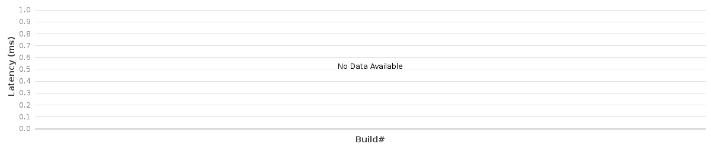
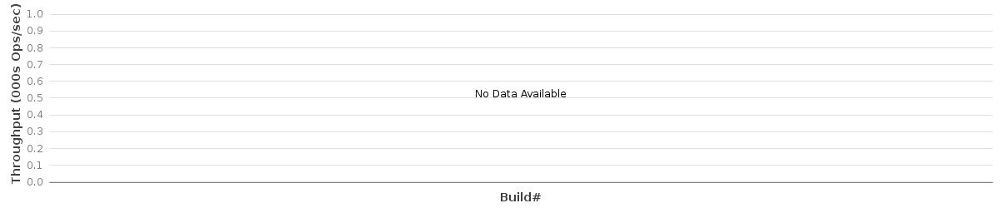

# 1.7-Performance and Scale-out

## Results at a Glance:

The purpose of this page is to track performance trend and regression through the last 20 Jenkins builds(nightly) on a subset of the full performance evaluation metrics. Refer to the regular performance test plans for test methodologies. Child pages have the full result details on the latest build. Note that results in this tracking can fluctuate from build to build, due to various of experiments and changes made in onos.

### 

### Switch-up Latency - Last 50 builds SwitchUp Latency test  (5-node cluster):

### 


### Switch-down Latency - Last 50 builds SwitchDown Latency test  (5-node cluster):

### 


### 

### Port-up Latency - Last 50 builds PortUp Latency test  (5-node cluster):


### Port-down Latency - Last 50 builds PortDown Latency test  (5-node cluster):


### Intent install Latency - Last 50 builds "IntentInstallLat" (5-node cluster; 100 intents as batch size):

```
Note: Starting from build #29, NewDistributedFlowRuleStore is used and backup is enabled.
```



### Intent withdraw Latency - Last 50 builds "IntentWithdrawLat" (5-node cluster; 100 intents as batch size):

```
Note: Starting from build #29, NewDistributedFlowRuleStore is used and backup is enabled.
```


### Intent Re-route Latency - Last 50 builds "IntentRerouteLat" (5-node cluster; 100 intents as batch size):

```
Note: Starting from build #29, NewDistributedFlowRuleStore is used and backup is enabled.
```


### Intent Throughput - Last 50 builds "IntentEventTP" test (5-node cluster with neighbors=4):

```
Note: Starting from build #81, NewDistributedFlowRuleStore is used and backup is enabled.
```


### Flow Throughput - Last 50 builds "flowTP1g" tests (5-node cluster with neighbors=4):

```
Note: Starting from build #90, NewDistributedFlowRuleStore is used and backup is enabled.
```



### Cbench - Last 50 builds "CbenchBM" (single-node, throughput mode):

cbench command: cbench -c localhost -p 6633 -m 1000 -l 20 -s 16 -M 100000 -w 10 -D 5000 -t


### Single Bench Flow Latency Test (Post) - Last 50 builds SingleBenchFlow Latency test:


### Single Bench Flow Latency Test (Del) - Last 50 builds SingleBenchFlow Latency test:


### Host add Latency - Last 50 builds HostAdd Latency test  (5-node cluster):


