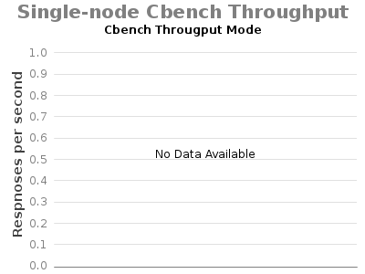

# 1.7.1: Experiment G - Single-node ONOS Cbench

System Env:

* Server: Dual XeonE5-2670 v2 2.5GHz; 64GB DDR3; 512GB SSD
* 1Gbps NIC
* JAVA\_OPTS="${JAVA\_OPTS:--Xms8G -Xmx8G}"

ONOS Apps:

* drivers, openflow-base, fwd

ONOS Config:

* cfg set org.onosproject.fwd.ReactiveForwarding packetOutOnly true

Command:

* cbench -c localhost -p 6633 -m 1000 -l 70 -s 16 -M 100000 -w 10 -D 5000 -t

 

