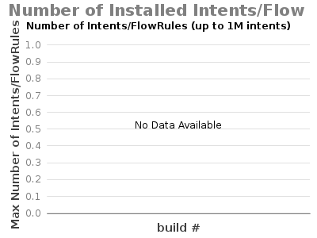

# 1.7: Experiment H - Max Intent Installation and ReRoute

System Env:

* Server: Dual XeonE5-2670 v2 2.5GHz; 64GB DDR3; 512GB SSD
* 1Gbps NIC
* JAVA\_OPTS="${JAVA\_OPTS:--Xms8G -Xmx8G}"

ONOS Apps:

* drivers, openflow

ONOS Config:

* cfg set org.onosproject.net.intent.impl.compiler.IntentConfigurableRegistrato useFlowObjectives true (when using flow objective intents compiler)

Note: Test is designed to run up to 1M intents.

Max Intent Reroute test: TBD
