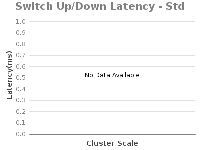
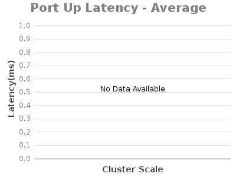
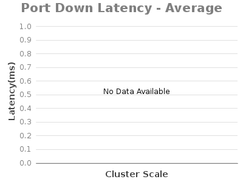

# 1.8.4: Experiment A&B - Topology (Switch, Link) Event Latency

System Env:

* Server: Dual XeonE5-2670 v2 2.5GHz; 64GB DDR3; 512GB SSD
* System clock precision is +/- 1 ms
* 1Gbps NIC
* JAVA\_OPTS="${JAVA\_OPTS:--Xms8G -Xmx8G}"

ONOS Apps:

* drivers, metrics, openflow

ONOS Config:

* cfg set org.onosproject.net.topology.impl.DefaultTopologyProvider maxEvents 1
* cfg set org.onosproject.net.topology.impl.DefaultTopologyProvider maxBatchMs 0
* cfg set org.onosproject.net.topology.impl.DefaultTopologyProvider maxIdleMs 0

Test Procedure:

* switch event generate on ONOS1 by connecting ovs switch to it;
* record tshark (tcp syn-ack) and graph event timestamp to calculate differences.

