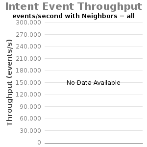
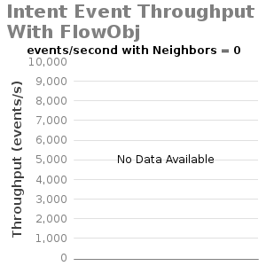
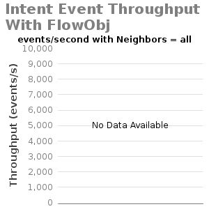

# 1.9: Experiment D - Intents Operations Throughput

System Env:

* Server: Dual XeonE5-2670 v2 2.5GHz; 64GB DDR3; 512GB SSD
* 1Gbps NIC
* JAVA\_OPTS="${JAVA\_OPTS:--Xms8G -Xmx8G}"

ONOS Apps:

* drivers, null, intentperf

ONOS Config:

* cfg set org.onosproject.store.flow.impl.DistributedFlowRuleStore backupEnabled true
* cfg set org.onosproject.net.intent.impl.IntentManager skipReleaseResourcesOnWithdrawal true
* cfg set org.onosproject.net.intent.impl.compiler.IntentConfigurableRegistrator useFlowObjectives true (when using flow objective intents compiler)

