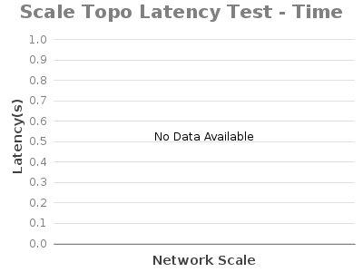

# 1.9: Experiment E - Topology Scaling Operation

System Env:

* Server: Dual XeonE5-2670 v2 2.5GHz; 64GB DDR3; 512GB SSD
* 1Gbps NIC
* JAVA\_OPTS="${JAVA\_OPTS:--Xms8G -Xmx8G}"

ONOS Apps:

* drivers, openflow

Note: We use 3-node ONOS cluster and torus Mininet topology in this test. In the figures below, scale N on x-axis means N x N torus topology. (E.g. scale 5 means 25 switches and 100 links)

