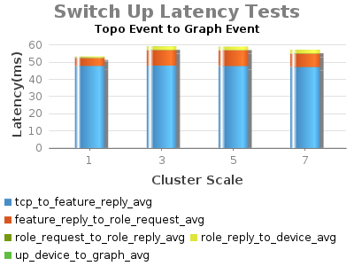
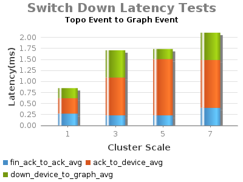
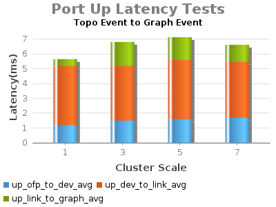
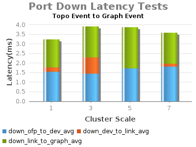

# 1.2 - Experiment A&B-Topology (Switch, Link) Event Latency

Test Env:

* Server: Dual XeonE5-2670 v2 2.5GHz; 64GB DDR3; 512GB SSD
* 1Gbps NIC
* JAVA\_OPTS="${JAVA\_OPTS:--Xms8G -Xmx8G}"
* [org.onosproject.net](http://org.onosproject.net).topology.impl.DefaultTopologyProvider  
   name=maxBatchMs, type=integer, value=0, defaultValue=50, description=Maximum number of millis for whole batch  
   name=maxEvents, type=integer, value=1, defaultValue=1000, description=Maximum number of events to accumulate  
   name=maxIdleMs, type=integer, value=0, defaultValue=10, description=Maximum number of millis between events

Test Procedure:

* switch event generate on ONOS1 by connecting ovs switch to it;
* record tshark (tcp syn-ack) and graph event timestamp to calculate differences.

| build | date |
| --- | --- |
| 138 | 2015-06-25 11:39:26.0 |

