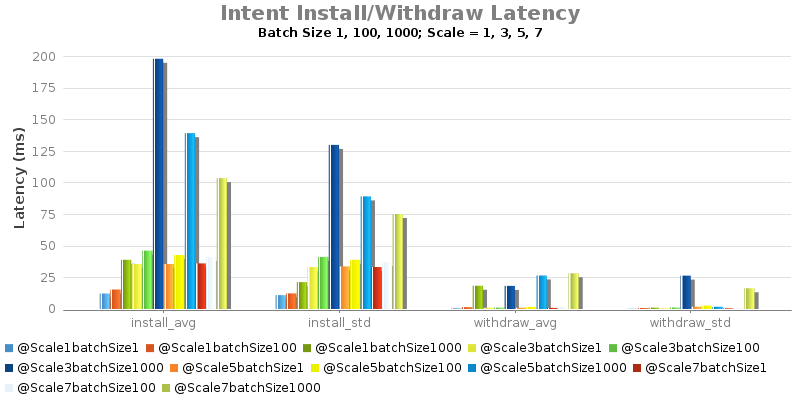
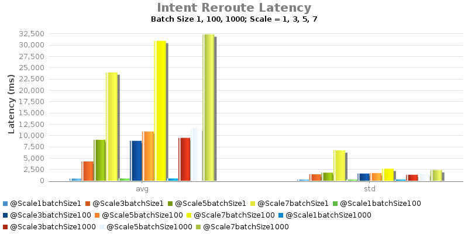

# 1.2 -  Experiment C - Intent Install/Remove/Re-route Latency

System Env:

* Server: Dual XeonE5-2670 v2 2.5GHz; 64GB DDR3; 512GB SSD
* 1Gbps NIC
* JAVA\_OPTS="${JAVA\_OPTS:--Xms8G -Xmx8G}"

Test Procedure:

* Intent batch installed from ONOS1
* Record returned response time

| commit | build | date |
| --- | --- | --- |
| f502edd5217d01543b30865c332604f65f5ff863 | 75 | 2015-06-24 13:29:20.0 |

| commit | build | date |
| --- | --- | --- |
| f502edd5217d01543b30865c332604f65f5ff863 | 78 | 2015-06-24 15:31:47.0 |

