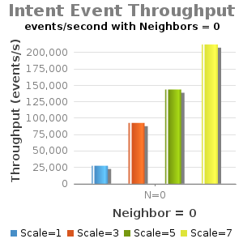
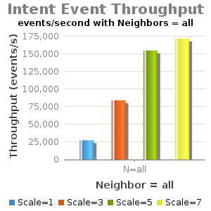

# 1.2 - Experiment D - Intents Operations Throughput

Test Env:

* Server: Dual XeonE5-2670 v2 2.5GHz; 64GB DDR3; 512GB SSD
* 1Gbps NIC
* JAVA\_OPTS="${JAVA\_OPTS:--Xms8G -Xmx8G}"
* Note: Current testing has "cfg set org.onosproject.store.flow.impl.NewDistributedFlowRuleStore backupEnabled true".

| commit | build | date |
| --- | --- | --- |
| f502edd5217d01543b30865c332604f65f5ff863 | 132 | 2015-06-24 11:14:11.0 |

