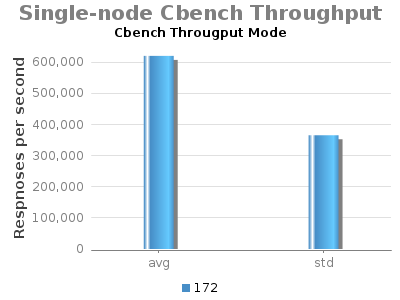

# 1.2 - Experiment G - Single-node ONOS Cbench

System Env:

* Server: Dual XeonE5-2670 v2 2.5GHz; 64GB DDR3; 512GB SSD
* 1Gbps NIC
* JAVA\_OPTS="${JAVA\_OPTS:--Xms8G -Xmx8G}"

* (no Hazelcast updateBackup flow rules)

Command: cbench command: cbench -c localhost -p 6633 -m 1000 -l 20 -s 16 -M 100000 -w 10 -D 5000  -t

Note: Current testing has "cfg set org.onosproject.fwd.ReactiveForwarding packetOutOnly true".

 

| commit | build | date |
| --- | --- | --- |
| 1f3189e2997e430eb263342f7ddf9529913b32a3 | 172 | 2015-06-23 22:05:44.0 |

 

