# Basic ONOS Tutorial

Welcome to the ONOS tutorial!

In this tutorial, you’ll complete a set of exercises designed to explain the main concepts of ONOS, our distributed network operating system. Soon, you'll understand how to use the basic features of ONOS version 1.14.0 (*Owl*). Note that some of the screenshots below may indicate an older version, but the relevant steps are still the same.

To get you started quickly, this tutorial is distributed as a preconfigured virtual machine with the needed software. Just run the VM in VirtualBox using the instructions in the next section.

# Introduction

## Pre-requisites

You will need a computer with at least 8GB of RAM and at least 20GB of free hard disk space. A faster processor or solid-state drive will speed up the virtual machine boot time, and a larger screen will help to manage multiple terminal windows.

The computer can run Windows, Mac OS X, or Linux – all work fine with VirtualBox, the only software requirement.

To install VirtualBox, you will need administrative access to the machine.

The tutorial instructions require prior knowledge of SDN in general, and OpenFlow and Mininet in particular. So please first complete the [OpenFlow tutorial](http://archive.openflow.org/wk/index.php/OpenFlow_Tutorial) and the [Mininet walkthrough](http://mininet.org/walkthrough/). Although not a requirement, completing the [FlowVisor tutorial](https://openflow.stanford.edu/display/ONL/Flowvisor) before starting this one is highly recommended. Also being familiar with [Apache Karaf](http://karaf.apache.org/)would be helpful although not entirely required.

## Stuck? Found a bug? Questions?

Email [us](mailto:onos-discuss@googlegroups.com) if you’re stuck, think you’ve found a bug, or just want to send some feedback. Please have a look at the [guidelines](../community-information/mailing-lists.md) to learn how to efficiently submit a bug report.

# Set up your environment

## Download and install required software

You will need to acquire two files: a [VirtualBox](https://www.virtualbox.org/) installer and the [ONOS tutorial OVA (for version 1.15.0)](https://drive.google.com/open?id=1JcGUJJDTtbHNnbFzC7SUK52RmMDBVUry). 

*(Here are some **slides** that can be used to accompany the tutorial:* **[PDF](https://speakerdeck.com/eueung/basic-onos-tutorial) , [HTML](https://telematika.org/remark/onos2/)***)*

After you have downloaded VirtualBox, install it, then go to the next section to verify that the VM is working on your system.

## Create Virtual Machine

Double-click on the downloaded ONOS tutorial OVA file. This will open virtual box with an import dialog. Allocate 2-3 CPUs and 4-8GB of RAM for the VM.

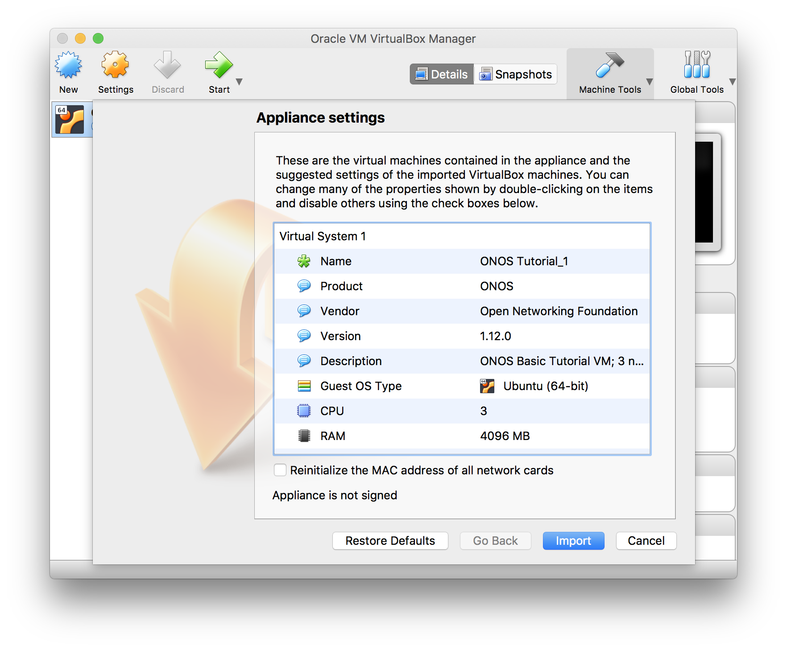

Click on import. When the import is finished start the VM and log in as ***SDN User*** (***sdn***) with password ***rocks***

## Important Command Prompt Notes

In this tutorial, commands are shown along with a command prompt to indicate the subsystem for which they are intended.

For example,

```
onos>
```

indicates that you are in the ONOS command line, whereas

```
mininet>
```

indicates that you are in mininet.

## Setup ONOS Cluster

We have provided a simple mechanism which allows you to setup (or reset) the tutorial from scratch. Simply, click on the *Setup ONOS Cluster* icon on your desktop and this will reset ONOS cluster to its initial state. It'll take a few seconds for ONOS cluster be formed. During that time you may not be able to launch the ONOS CLI. Double click the Setup ONOS Cluster icon now and wait for ONOS to start-up. When ready, you should see the following:

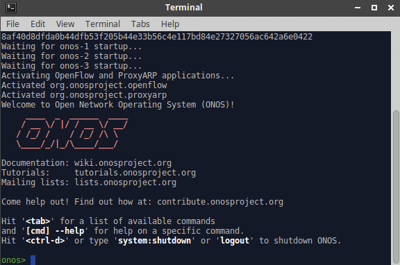

## Launch ONOS GUI

ONOS has a web-based GUI which you can launch by clicking the provided *ONOS GUI* icon. Login as user ***onos*** with password ***rocks***

***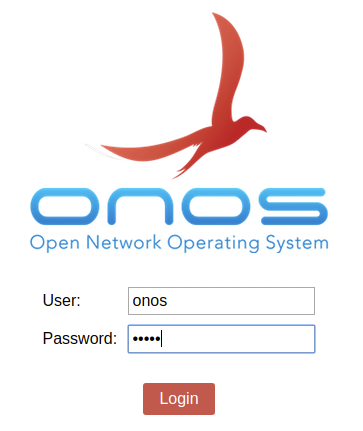***

## Start Mininet

Though the tutorial VM provides a few sample topologies, we’ll be using the same spine-leaf physical topology for all exercises. The network is comprised of two spine switches and four leaf switches with five hosts connected to each leaf. To start mininet with this topology, simply double click on the *Spine Leaf Topology* icon on your desktop. When ready to exit mininet, not now however, type *Ctrl-D* or *exit* in the mininet prompt.

The ONOS GUI should now show the switches with the display looking similar to the following:

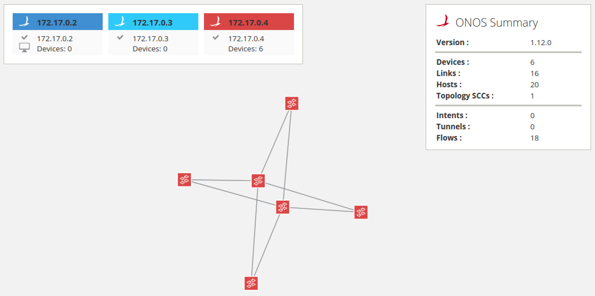

In order to display the node labels, press the ***L*** key to cycle between friendly lables, device ids and no labels. To toggle between showing and hiding hosts, you can press the ***H*** key. Press both ***L*** and ***H*** now.

Note that in the image above, all switches are now assigned mastership to the 3rd ONOS node (*172.17.0.4*), while the 1st and 2dn ONOS nodes have no devices for which they are the master. The ONOS GUI (as well as CLI) allow the user to force mastership re-balancing where the network devices will be roughly equally divided between all nodes in the ONOS cluster. To do this from the GUI, press the ***E*** key.

After toggling on host display, friendly labels and re-balancing, the display will look similar to the following:

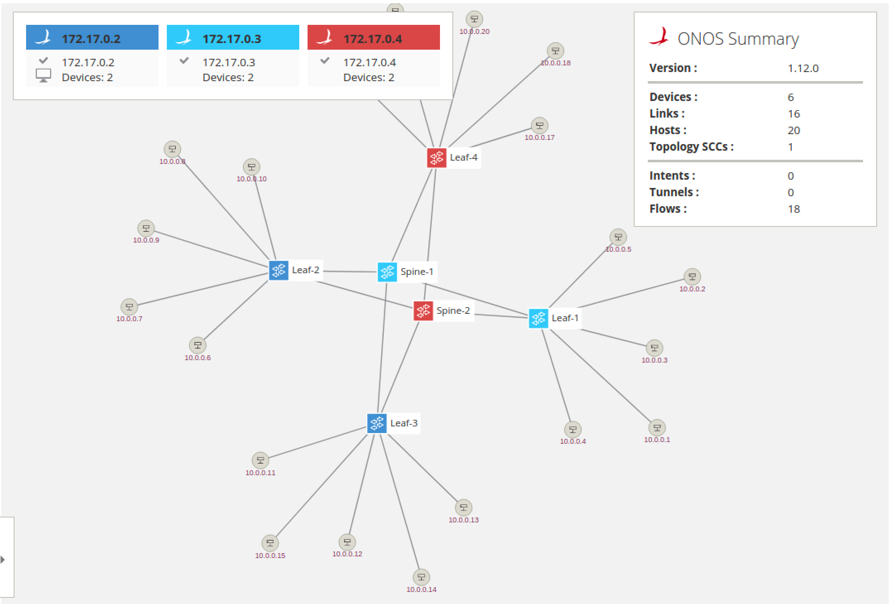

## Reactive Forwarding

In this exercise, we are going to use a sample app called *Reactive Forwarding.* It is shipped with ONOS and is a simple application that installs flows in response to every *miss* packet in that arrives at the controller.

Start by opening the ONOS CLI console by double clicking on the *ONOS CLI* icon.

### No pings? Why?

First, let's see whether two hosts can reach each other via ICMP ping. Go to your mininet prompt and type the following:

```
mininet> h11 ping -c3 h41
```

You will notice that the ping fails as shown below.

```
mininet> h11 ping -c3 h41
PING 10.0.0.19 (10.0.0.19) 56(84) bytes of data.
From 10.0.0.1 icmp_seq=1 Destination Host Unreachable
From 10.0.0.1 icmp_seq=2 Destination Host Unreachable
From 10.0.0.1 icmp_seq=3 Destination Host Unreachable
--- 10.0.0.19 ping statistics ---
3 packets transmitted, 0 received, +3 errors, 100% packet loss, time 2009ms
```

So why did the ping fail? Well, there are no flows installed on the data-plane, which forward the traffic appropriately. ONOS comes with a simple *Reactive Forwarding* app that installs forwarding flows on demand, but this application is not activated by default. To see apps that are presently active, type the *apps -a -s* command and you will see the following output:

```
onos> apps -a -s
*  36 org.onosproject.optical-model        1.12.0   Optical Network Model
*  40 org.onosproject.openflow-base        1.12.0   OpenFlow Base Provider
*  41 org.onosproject.lldpprovider         1.12.0   LLDP Link Provider
*  44 org.onosproject.hostprovider         1.12.0   Host Location Provider
*  47 org.onosproject.drivers              1.12.0   Default Drivers
* 104 org.onosproject.openflow             1.12.0   OpenFlow Provider Suite
* 288 org.onosproject.proxyarp             1.12.0   Proxy ARP/NDP
```

Note: To see all installed apps, regardless whether they are active or not, use the same command, but without the *-a* flag. You should see over 140 different apps listed when you do that.

As you can see above, there is no reactive forwarding application currently active. Let's activate it.

### Make it so, Number one

In the same ONOS CLI window, type the following to active the *Reactive Forwarding* app:

```
onos> app activate org.onosproject.fwd
Activated org.onosproject.fwd
```

Then, in a mininet window run the ping again, just this time don't limit the number of pings.

```
mininet> h11 ping h41
```

This time the ping is flowing:

```
mininet> h11 ping h41
PING 10.0.0.16 (10.0.0.16) 56(84) bytes of data.
64 bytes from 10.0.0.16: icmp_seq=1 ttl=64 time=39.6 ms
64 bytes from 10.0.0.16: icmp_seq=2 ttl=64 time=0.263 ms
64 bytes from 10.0.0.16: icmp_seq=3 ttl=64 time=0.058 ms
64 bytes from 10.0.0.16: icmp_seq=4 ttl=64 time=0.061 ms
64 bytes from 10.0.0.16: icmp_seq=5 ttl=64 time=0.065 ms
```

### Start stop start stop....

You have now seen that you can activate applications into ONOS dynamically. Actually you can also deactivate applications while they are running so, for example, let's do this. Note that you can ommit the *org.onosproject* prefix and use *fwd* for short.

```
onos> app deactivate fwd
```

Observe that the ping has now stopped. This is because when the reactive forwarding application has withdrawn any flows it has installed before it stopped. We'll talk more about this in the next section. For now, let's activate the app again.

```
onos> app activate fwd
```

...and the ping restarts 

# ONOS CLI commands

ONOS has many CLI commands. In this section, we will go through some of the most useful commands. This section may also serve as a CLI reference for you during this tutorial. While we will explain some of the ONOS CLI commands here you can find an exhaustive list by running:

```
onos> help onos
```

or more information about an individual command adding *--help* to any command. Also most commands have autocompletion to help you find the parameters quickly and easily.

#### Devices command

An SDN Controller would be nothing without devices to control. Luckily, ONOS has a convenient command to list the device currently known in the system. Running

```
onos> devices
```

will return the following information,

```
onos> devices
id=of:0000000000000001, available=true, local-status=connected 41m31s ago, role=STANDBY, type=SWITCH, mfr=Nicira, Inc., hw=Open vSwitch, sw=2.5.2, serial=None, driver=ovs, channelId=172.17.0.1:38710, locType=geo, managementAddress=172.17.0.1, name=Spine-1, protocol=OF_13
id=of:0000000000000002, available=true, local-status=connected 41m31s ago, role=STANDBY, type=SWITCH, mfr=Nicira, Inc., hw=Open vSwitch, sw=2.5.2, serial=None, driver=ovs, channelId=172.17.0.1:38728, locType=geo, managementAddress=172.17.0.1, name=Spine-2, protocol=OF_13
id=of:000000000000000b, available=true, local-status=connected 41m31s ago, role=STANDBY, type=SWITCH, mfr=Nicira, Inc., hw=Open vSwitch, sw=2.5.2, serial=None, driver=ovs, channelId=172.17.0.1:38702, locType=geo, managementAddress=172.17.0.1, name=Leaf-1, protocol=OF_13
id=of:000000000000000c, available=true, local-status=connected 41m31s ago, role=MASTER, type=SWITCH, mfr=Nicira, Inc., hw=Open vSwitch, sw=2.5.2, serial=None, driver=ovs, channelId=172.17.0.1:38730, locType=geo, managementAddress=172.17.0.1, name=Leaf-2, protocol=OF_13
id=of:000000000000000d, available=true, local-status=connected 41m31s ago, role=MASTER, type=SWITCH, mfr=Nicira, Inc., hw=Open vSwitch, sw=2.5.2, serial=None, driver=ovs, channelId=172.17.0.1:38720, locType=geo, managementAddress=172.17.0.1, name=Leaf-3, protocol=OF_13
id=of:000000000000000e, available=true, local-status=connected 41m31s ago, role=STANDBY, type=SWITCH, mfr=Nicira, Inc., hw=Open vSwitch, sw=2.5.2, serial=None, driver=ovs, channelId=172.17.0.1:38716, locType=geo, managementAddress=172.17.0.1, name=Leaf-4, protocol=OF_13
```

which consists of a device id, and a boolean value which indicates whether this devices is currently up. You also get the type of device and well as it's role relationship with this ONOS instance and other various attributes attached to each device.

#### Links command

 Similarly, the *links*command is used to list the links detected by ONOS. At the ONOS prompt run

```
onos> links
```

and you should get the following output:

```
onos> links
src=of:0000000000000001/1, dst=of:000000000000000b/1, type=DIRECT, state=ACTIVE, expected=false
src=of:0000000000000001/2, dst=of:000000000000000c/1, type=DIRECT, state=ACTIVE, expected=false
src=of:0000000000000001/3, dst=of:000000000000000d/1, type=DIRECT, state=ACTIVE, expected=false
src=of:0000000000000001/4, dst=of:000000000000000e/1, type=DIRECT, state=ACTIVE, expected=false
src=of:0000000000000002/1, dst=of:000000000000000b/2, type=DIRECT, state=ACTIVE, expected=false
src=of:0000000000000002/2, dst=of:000000000000000c/2, type=DIRECT, state=ACTIVE, expected=false
...
```

The output shows you the list of discovered links. Reported links are formatted by source device-port pair to destination device-port pair. The *type* field indicates whether the link is a direct connection between two devices or not.

#### Hosts command

A network without hosts is a little like a city without bars, it would be a ridiculously boring place. Fortunately, ONOS has the ability to list the hosts (as opposed to bars, although that would be a great feature) currently in the system.

```
onos> hosts
```

with this output:

```
onos> hosts
id=00:00:00:00:00:01/None, mac=00:00:00:00:00:01, locations=[of:000000000000000b/3], vlan=None, ip(s)=[10.0.0.1], provider=of:org.onosproject.provider.host, configured=false
id=00:00:00:00:00:02/None, mac=00:00:00:00:00:02, locations=[of:000000000000000b/4], vlan=None, ip(s)=[10.0.0.2], provider=of:org.onosproject.provider.host, configured=false
id=00:00:00:00:00:03/None, mac=00:00:00:00:00:03, locations=[of:000000000000000b/5], vlan=None, ip(s)=[10.0.0.3], provider=of:org.onosproject.provider.host, configured=false
id=00:00:00:00:00:04/None, mac=00:00:00:00:00:04, locations=[of:000000000000000b/6], vlan=None, ip(s)=[10.0.0.4], provider=of:org.onosproject.provider.host, configured=false
id=00:00:00:00:00:05/None, mac=00:00:00:00:00:05, locations=[of:000000000000000b/7], vlan=None, ip(s)=[10.0.0.5], provider=of:org.onosproject.provider.host, configured=false
id=00:00:00:00:00:06/None, mac=00:00:00:00:00:06, locations=[of:000000000000000c/3], vlan=None, ip(s)=[10.0.0.6], provider=of:org.onosproject.provider.host, configured=false
id=00:00:00:00:00:07/None, mac=00:00:00:00:00:07, locations=[of:000000000000000c/4], vlan=None, ip(s)=[10.0.0.7], provider=of:org.onosproject.provider.host, configured=false
...
```

Which displays the hosts' id as well as its mac address and where in the network it is connected.

#### Flows command

The *flows* command allows you to observe which flow entries are currently registered in the system. Flow entries may be in several states:

* **PENDING\_ADD -**The flow has been submitted and forwarded to the switch.
* **ADDED -**The flow has been added to the switch.
* **PENDING\_REMOVE -**The request to remove the flow has been submitted and forwarded to the switch.
* **REMOVED -**The rule has been removed.

So let's start some traffic by going to the mininet window and running

```
mininet> h11 ping h41
```

then in the ONOS window let's run the flows command

```
onos> flows
```

you should see the following output

```
onos> flows
deviceId=of:0000000000000001, flowRuleCount=6
    id=100007a585b6f, state=ADDED, bytes=330966, packets=4086, duration=3159, liveType=UNKNOWN, priority=40000, tableId=0, appId=org.onosproject.core, payLoad=null, selector=[ETH_TYPE:bddp], treatment=DefaultTrafficTreatment{immediate=[OUTPUT:CONTROLLER], deferred=[], transition=None, meter=[], cleared=true, StatTrigger=null, metadata=null}
    id=100009465555a, state=ADDED, bytes=330966, packets=4086, duration=3159, liveType=UNKNOWN, priority=40000, tableId=0, appId=org.onosproject.core, payLoad=null, selector=[ETH_TYPE:lldp], treatment=DefaultTrafficTreatment{immediate=[OUTPUT:CONTROLLER], deferred=[], transition=None, meter=[], cleared=true, StatTrigger=null, metadata=null}
    id=10000ea6f4b8e, state=ADDED, bytes=0, packets=0, duration=3159, liveType=UNKNOWN, priority=40000, tableId=0, appId=org.onosproject.core, payLoad=null, selector=[ETH_TYPE:arp], treatment=DefaultTrafficTreatment{immediate=[OUTPUT:CONTROLLER], deferred=[], transition=None, meter=[], cleared=true, StatTrigger=null, metadata=null}
    id=125000008756fbe, state=PENDING_ADD, bytes=0, packets=0, duration=0, liveType=UNKNOWN, priority=10, tableId=0, appId=org.onosproject.fwd, payLoad=null, selector=[IN_PORT:1, ETH_DST:00:00:00:00:00:10, ETH_SRC:00:00:00:00:00:01], treatment=DefaultTrafficTreatment{immediate=[OUTPUT:4], deferred=[], transition=None, meter=[], cleared=false, StatTrigger=null, metadata=null}
    id=1000000ea1bfb, state=ADDED, bytes=0, packets=0, duration=1097, liveType=UNKNOWN, priority=5, tableId=0, appId=org.onosproject.core, payLoad=null, selector=[ETH_TYPE:arp], treatment=DefaultTrafficTreatment{immediate=[OUTPUT:CONTROLLER], deferred=[], transition=None, meter=[], cleared=true, StatTrigger=null, metadata=null}
    id=10000021b41dc, state=ADDED, bytes=98, packets=1, duration=1097, liveType=UNKNOWN, priority=5, tableId=0, appId=org.onosproject.core, payLoad=null, selector=[ETH_TYPE:ipv4], treatment=DefaultTrafficTreatment{immediate=[OUTPUT:CONTROLLER], deferred=[], transition=None, meter=[], cleared=true, StatTrigger=null, metadata=null}
deviceId=of:0000000000000002, flowRuleCount=6
    id=1000002bbd8d4, state=ADDED, bytes=330804, packets=4084, duration=3160, liveType=UNKNOWN, priority=40000, tableId=0, appId=org.onosproject.core, payLoad=null, selector=[ETH_TYPE:lldp], treatment=DefaultTrafficTreatment{immediate=[OUTPUT:CONTROLLER], deferred=[], transition=None, meter=[], cleared=true, StatTrigger=null, metadata=null}
...
```

As you can see from the above output, ONOS provides many details about he the flows at the switches. For example each flow entry defines a selector and treatment which is the set of traffic matched by the the flow entry and how this traffic should be handled. Notice as well that each flow entry it tagged by an *appId* (application id), this *appId* identifies which application installed this flow entry. This is a useful feature because it can help an admin identify which application may be misbehaving or consuming many resources.

#### Paths command

Given a network topology, ONOS computes all the shortest paths between any two nodes.  This is especially useful for your applications to obtain path information for either flow installation or some other use. The paths command takes two arguments, both of them are devices. To make things easy for you ONOS provides CLI autocompletion by simply hitting the <TAB> key.

```
onos> paths <TAB>
of:0000000000000001   of:0000000000000002   of:000000000000000b   
of:000000000000000c   of:000000000000000d   of:000000000000000e
```

ONOS lists device options for you, thereby making it easier to find the devices you would like. For example, the output of the command below shows two paths of equal costs.

```
onos> paths of:000000000000000e of:000000000000000b
of:000000000000000e/2-of:0000000000000002/4==>of:0000000000000002/1-of:000000000000000b/2; cost=2.0
of:000000000000000e/1-of:0000000000000001/4==>of:0000000000000001/1-of:000000000000000b/1; cost=2.0
```

#### Intent Command

The intent command allows one to see what intents are stored in the system. Intents can be in several states:

* **SUBMITTED -**The intent has been submitted and will be processed soon.
* **COMPILING -**The intent is being compiled. This is a transient state.
* **INSTALLING -**The intent is in the process of being installed.
* **INSTALLED -**The intent has been installed.
* **RECOMPILING -**The intent is being recompiled after a failure.
* **WITHDRAWING -**The intent is being withdrawn.
* **WITHDRAWN -**The intent has been removed.
* **FAILED -**The intent is in a failed state because it cannot be satisfied.

For more information about Intents go [here](../guides/architecture-and-internals-guide/intent-framework.md).

```
onos> intents
id=0x0, state=INSTALLED, type=HostToHostIntent, appId=org.onlab.onos.gui
	constraints=[LinkTypeConstraint{inclusive=false, types=[OPTICAL]}]
id=0x1, state=WITHDRAWN, type=HostToHostIntent, appId=org.onlab.onos.cli
	constraints=[LinkTypeConstraint{inclusive=false, types=[OPTICAL]}]
```

*Note: You will not see any intents until some have been added. In the next section of the tutorial, you will add explicit host connectivity intent.*

The command can also tell you what type of sub-intents the intent has been compiled to:

```
onos> intents -i
id=0x2, state=INSTALLED, type=HostToHostIntent, appId=org.onlab.onos.ifwd
    constraints=[LinkTypeConstraint{inclusive=false, types=[OPTICAL]}]
    installable=[
PathIntent{id=0x4, appId=DefaultApplicationId{id=2, name=org.onlab.onos.ifwd}, 
	selector=DefaultTrafficSelector{criteria=[ETH_SRC{mac=00:00:00:00:00:0D}, ETH_DST{mac=00:00:00:00:00:07}]}, 
	treatment=DefaultTrafficTreatment{instructions=[]}, constraints=[LinkTypeConstraint{inclusive=false, types=[OPTICAL]}],	
	path=DefaultPath{src=ConnectPoint{elementId=00:00:00:00:00:0D/-1, portNumber=0},
						dst=ConnectPoint{elementId=00:00:00:00:00:07/-1, portNumber=0}, type=INDIRECT, state=ACTIVE, durable=false}},
PathIntent{id=0x5, appId=DefaultApplicationId{id=2, name=org.onlab.onos.ifwd},
	selector=DefaultTrafficSelector{criteria=[ETH_SRC{mac=00:00:00:00:00:07}, ETH_DST{mac=00:00:00:00:00:0D}]},
	treatment=DefaultTrafficTreatment{instructions=[]}, constraints=[LinkTypeConstraint{inclusive=false, types=[OPTICAL]}], 	
	path=DefaultPath{src=ConnectPoint{elementId=00:00:00:00:00:07/-1, portNumber=0}, 
						dst=ConnectPoint{elementId=00:00:00:00:00:0D/-1, portNumber=0}, type=INDIRECT, state=ACTIVE, durable=false}}]
```

For example, this host to host intent has been compiled to two path intents with the appropriate traffic selections and actions computed on your behalf.

# State your intentions

One major advantage of using intents over simply using flow entries to program your network is that intents track the state of the network and reconfigure themselves in order to satisfy your intention. For example, if link were to go down the intent framework would reroute your intent (ie. your flows) onto an alternative path. But, what if there are no alternative path? Well, in this case the intent would enter the failed state and remain there until a path becomes available. Pretty cool, eh? Let's check this out in action.

First, let's deactivate the Reactive Forwarding application though:

```
onos> app deactivate fwd
Deactivated org.onosproject.fwd
```

Next, let's add a host connectivity intent for some two end-station hosts. You can use argument completion by pressing the ***Tab*** key.

```
onos> add-host-intent 00:00:00:00:00:01/None 00:00:00:00:00:10/None
Host to Host intent submitted:
HostToHostIntent{id=0x0, key=0x0, appId=DefaultApplicationId{id=2, name=org.onosproject.cli}, priority=100, resources=[00:00:00:00:00:01/None, 00:00:00:00:00:10/None], selector=DefaultTrafficSelector{criteria=[]}, treatment=DefaultTrafficTreatment{immediate=[NOACTION], deferred=[], transition=None, meter=[], cleared=false, StatTrigger=null, metadata=null}, constraints=[LinkTypeConstraint{inclusive=false, types=[OPTICAL]}], resourceGroup=null, one=00:00:00:00:00:01/None, two=00:00:00:00:00:10/None}
```

This command will provision a path between 10.0.0.1 (h11) and 10.0.0.16 (h41) and you can see that the intent is installed.

```
onos> intents
Id: 0x0
State: INSTALLED
Key: 0x0
Intent type: HostToHostIntent
Application Id: org.onosproject.cli
Resources: [00:00:00:00:00:01/None, 00:00:00:00:00:10/None]
Treatment: [NOACTION]
Constraints: [LinkTypeConstraint{inclusive=false, types=[OPTICAL]}]
Source host: 00:00:00:00:00:01/None
Destination host: 00:00:00:00:00:10/None
```

If you still have the *h11 ping h41* command running, you will see that the ICMP pings are still working beetween the two hosts.

So now that the intent is installed, let's have a look what path it is using by using the flows command with summarized output using the *-s* flag for better readability:

```
onos> flows -s
deviceId=of:0000000000000001, flowRuleCount=3
    ADDED, bytes=429138, packets=5298, table=0, priority=40000, selector=[ETH_TYPE:bddp], treatment=[immediate=[OUTPUT:CONTROLLER], clearDeferred]
    ADDED, bytes=429138, packets=5298, table=0, priority=40000, selector=[ETH_TYPE:lldp], treatment=[immediate=[OUTPUT:CONTROLLER], clearDeferred]
    ADDED, bytes=0, packets=0, table=0, priority=40000, selector=[ETH_TYPE:arp], treatment=[immediate=[OUTPUT:CONTROLLER], clearDeferred]
deviceId=of:0000000000000002, flowRuleCount=5
    ADDED, bytes=428976, packets=5296, table=0, priority=40000, selector=[ETH_TYPE:lldp], treatment=[immediate=[OUTPUT:CONTROLLER], clearDeferred]
    ADDED, bytes=0, packets=0, table=0, priority=40000, selector=[ETH_TYPE:arp], treatment=[immediate=[OUTPUT:CONTROLLER], clearDeferred]
    ADDED, bytes=428976, packets=5296, table=0, priority=40000, selector=[ETH_TYPE:bddp], treatment=[immediate=[OUTPUT:CONTROLLER], clearDeferred]
    ADDED, bytes=32536, packets=332, table=0, priority=100, selector=[IN_PORT:1, ETH_DST:00:00:00:00:00:10, ETH_SRC:00:00:00:00:00:01], treatment=[immediate=[OUTPUT:4]]
    ADDED, bytes=32536, packets=332, table=0, priority=100, selector=[IN_PORT:4, ETH_DST:00:00:00:00:00:01, ETH_SRC:00:00:00:00:00:10], treatment=[immediate=[OUTPUT:1]]
deviceId=of:000000000000000b, flowRuleCount=5
    ADDED, bytes=214407, packets=2647, table=0, priority=40000, selector=[ETH_TYPE:bddp], treatment=[immediate=[OUTPUT:CONTROLLER], clearDeferred]
    ADDED, bytes=214407, packets=2647, table=0, priority=40000, selector=[ETH_TYPE:lldp], treatment=[immediate=[OUTPUT:CONTROLLER], clearDeferred]
    ADDED, bytes=294, packets=7, table=0, priority=40000, selector=[ETH_TYPE:arp], treatment=[immediate=[OUTPUT:CONTROLLER], clearDeferred]
    ADDED, bytes=32536, packets=332, table=0, priority=100, selector=[IN_PORT:2, ETH_DST:00:00:00:00:00:01, ETH_SRC:00:00:00:00:00:10], treatment=[immediate=[OUTPUT:3]]
    ADDED, bytes=32536, packets=332, table=0, priority=100, selector=[IN_PORT:3, ETH_DST:00:00:00:00:00:10, ETH_SRC:00:00:00:00:00:01], treatment=[immediate=[OUTPUT:2]]
deviceId=of:000000000000000c, flowRuleCount=3
    ADDED, bytes=214245, packets=2645, table=0, priority=40000, selector=[ETH_TYPE:bddp], treatment=[immediate=[OUTPUT:CONTROLLER], clearDeferred]
    ADDED, bytes=210, packets=5, table=0, priority=40000, selector=[ETH_TYPE:arp], treatment=[immediate=[OUTPUT:CONTROLLER], clearDeferred]
    ADDED, bytes=214245, packets=2645, table=0, priority=40000, selector=[ETH_TYPE:lldp], treatment=[immediate=[OUTPUT:CONTROLLER], clearDeferred]
deviceId=of:000000000000000d, flowRuleCount=3
    ADDED, bytes=210, packets=5, table=0, priority=40000, selector=[ETH_TYPE:arp], treatment=[immediate=[OUTPUT:CONTROLLER], clearDeferred]
    ADDED, bytes=214245, packets=2645, table=0, priority=40000, selector=[ETH_TYPE:bddp], treatment=[immediate=[OUTPUT:CONTROLLER], clearDeferred]
    ADDED, bytes=214245, packets=2645, table=0, priority=40000, selector=[ETH_TYPE:lldp], treatment=[immediate=[OUTPUT:CONTROLLER], clearDeferred]
deviceId=of:000000000000000e, flowRuleCount=5
    ADDED, bytes=214245, packets=2645, table=0, priority=40000, selector=[ETH_TYPE:lldp], treatment=[immediate=[OUTPUT:CONTROLLER], clearDeferred]
    ADDED, bytes=630, packets=15, table=0, priority=40000, selector=[ETH_TYPE:arp], treatment=[immediate=[OUTPUT:CONTROLLER], clearDeferred]
    ADDED, bytes=214245, packets=2645, table=0, priority=40000, selector=[ETH_TYPE:bddp], treatment=[immediate=[OUTPUT:CONTROLLER], clearDeferred]
    ADDED, bytes=32536, packets=332, table=0, priority=100, selector=[IN_PORT:2, ETH_DST:00:00:00:00:00:10, ETH_SRC:00:00:00:00:00:01], treatment=[immediate=[OUTPUT:3]]
    ADDED, bytes=32536, packets=332, table=0, priority=100, selector=[IN_PORT:3, ETH_DST:00:00:00:00:00:01, ETH_SRC:00:00:00:00:00:10], treatment=[immediate=[OUTPUT:2]]
```

We can see that the traffic flows between dpid 00:00:00:00:00:00:00:02 (Spine-2) and 00:00:00:00:00:00:00:0b (Leaf-1) and similarly between 00:00:00:00:00:00:00:02 (Spine-2) and 00:00:00:00:00:00:00:0e (Leaf-4).

Please note that the output from the tutorial and what you see may vary slightly as all alternate paths here have equal cost and therefore ONOS is free to pick either one.

You can visualize the intent using ONOS GUI by selecting the Leaf-1 node in the GUI and press the ***V*** key to show paths provisioned by intents that pass through the selected node. You should see something like this:

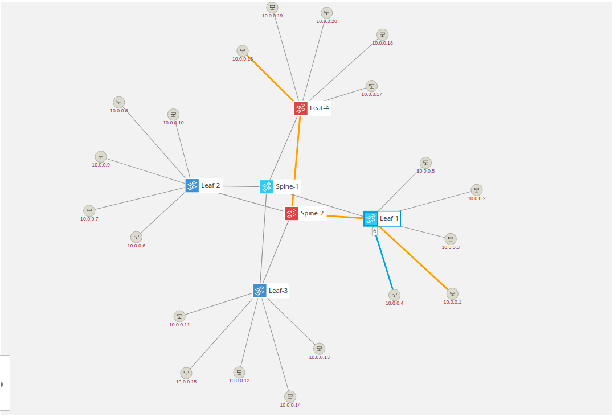

Let's see what happens if we sever the link between Spine-2 (s2) and Leaf-1 (s11), you may have to teardown the link between s1 and s11 so pay attention to the flows command output. This can be done in mininet by running:

```
mininet> link s2 s11 down
```

After this, the GUI will show the link disappear. Selecting Leaf-1 and pressing V key again will show the newly established path which leads through the other spine switch:

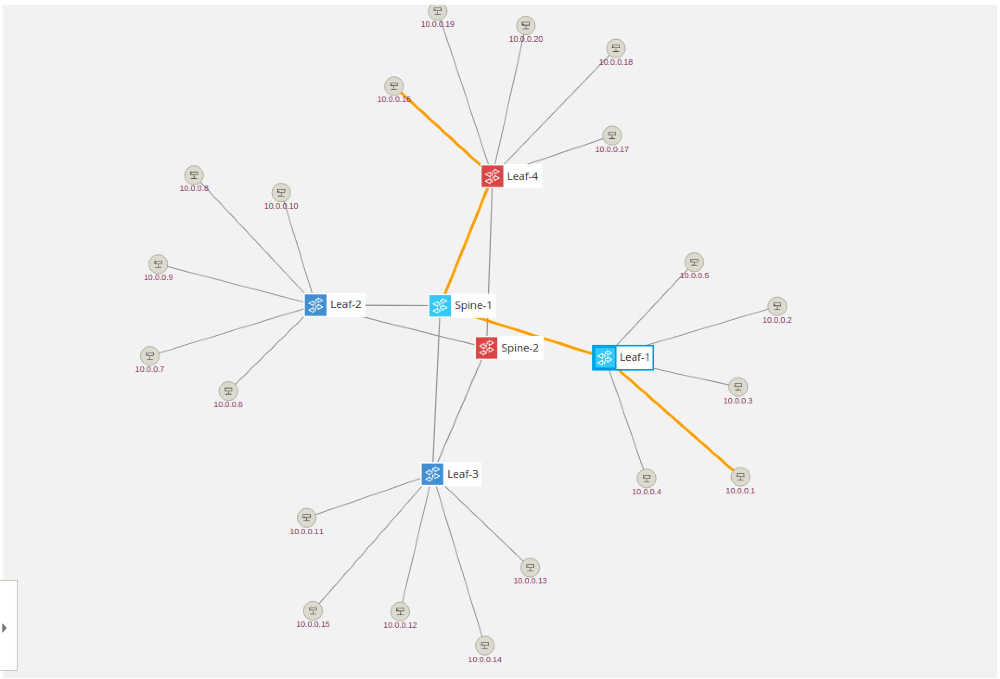

Similarly, running the *flows -s* command again will show flows have moved to pass through the other spine.

How did this happen? Well when we tore down the link between s2 and s11, ONOS detected this change and informed all compo listening to topology events that the link went down. The intent service is one such component and when it receives this information it makes sure to repair any of the intents is affected by this change by provisioning connectivity using an alternate path.

This simple example shows that using intents is more powerful than simply installing flows. Intents maintain your intention (hence the name!) while retaining the ability to install them as is possible or most efficient.

## Up down up down

If you wish you can take down more links and see what happens. Obviously, if you partition the network then no flows will be installed, sadly ONOS doesn't grow links between switches yet. You can bring up links in mininet by:

```
mininet> link s2 s11 up
```

Have fun!

# ONOS Graphical User Interface

You have already briefly seen the ONOS GUI in action. So far it was used to help you visualize the network, but the GUI also allows many more ways to visualize information about the network and its elements, in addition to provisioning several types of connectivity intents.

To open the UI simply click on the *ONOS GUI* icon on the desktop. Let's go over some of the GUI features.

## GUI Features

### Quick Help

At anytime you can pull up the GUI's cheat sheet by pressing the ***Slash*** (***/**)* key (which is **?** without the pesky shift ) and you will get an overlay pane that looks like below. You can dismiss this by pressing the ***Esc*** key. Each view, not just the topology view, provides a similar *Quick Help* overlay.

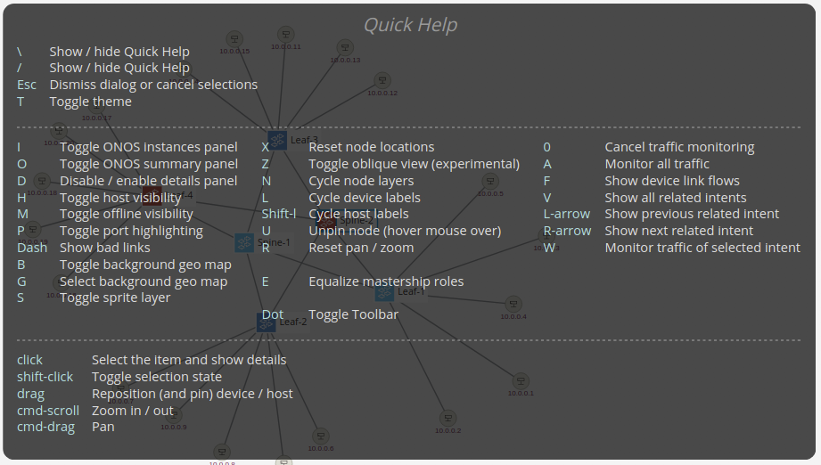

### Overview pane

The *Topology View* of the GUI comes with a very useful overview pane. It shows you a summary about the network such as version of ONOS, number of devices, links, hosts, etc. You can toggle on/off the overview pane using the ***O*** key.

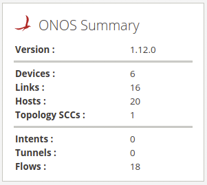

### Details pane

When you ***Left-Click*** on an element of the topology, such as a switch, host or a link, another pane appears on the right hand side below the *Overview* pane. This pane gives additional details about the selected item(s). Its display can be toggled on/off using the ***D*** key.

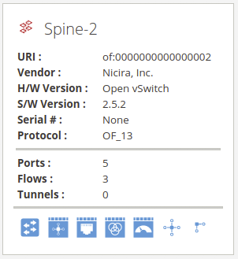

Note that the action buttons at the bottom of the *Details* pane can be used to jump to different views of the ONOS GUI for additional context. So select multiple items, hold the ***Shift*** key while you ***Left-Click***. To unselect an item hold ***Shift*** and ***Left-Click*** it to toggle off the selection. You can also Left-Click anywhere on the blank part of the *Topology View* to unselect all items.

### Instances pane

The GUI has the ability to show which ONOS instances are active. By hitting the 'i' key (it will be open by default) you will see a pane show up on the left hand side as shown below.

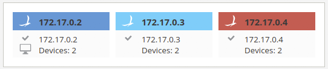

Notice that the glyphs for the switches changes color, this indicates which switches are controlled by which instance. This is useful to see at a glance which switches are controlled by which ONOS instance. The terminal glyph indicates which instance the GUI is presently connected to and the check-mark glyph indicates that the instance is in ready state, which means fully operating as part of the cluster.

### Toolbar pane

While lot of the features of the Topology View can be operating using solely the keyboard keys, a toolbar pane was provided to make it visually easier to identify all possible actions. The toolbar is located in the lower left-hand corner of the view and is hidden by default. You can toggle its display on/off using the ***Period*** (**.**) key.

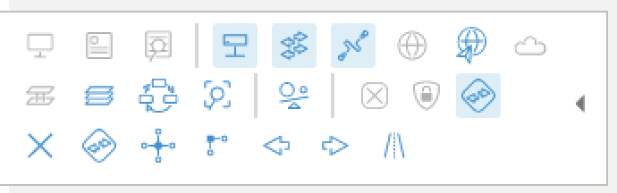

### Install Intent

Ok let's install an intent using the UI. First select two hosts by clicking on one host then shift-click on another. Let's pick 10.0.0.20 and 10.0.0.9. Now a pane will appear on the right and side of the screen as here:

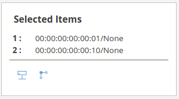

Now click on 'Create Host-to-host Flow', this actually provisions a host to host intent and lights up the path used by the intent.

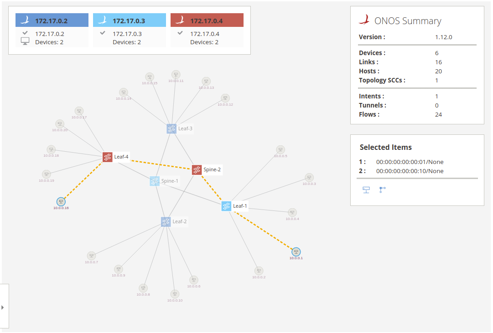

You can check that the intent was installed via the ONOS CLI *intents* command (exercise left to the reader) and verify that the two hosts can indeed reach each other using the Mininet *ping* command.

To send a more significant amount of traffic, than a mere ICMP ping, between the two hosts you can use the bgPerf mininet command as follows:

```
mininet> bgIperf h11 h41
```

You can include more than two hosts in the above command and traffic will be generated between all of them, pairwise. Before you do that, however, you should make sure that they can reach each other by creating the appropriate connectvity intents.

### Show all traffic

Another thing you can do is to visually monitor the network traffic in the UI. You can cycle between different modes, e.g. port stats in bits/s or packets/s and flow stats in bits/s or packets/s, by pressing the ***A*** key.

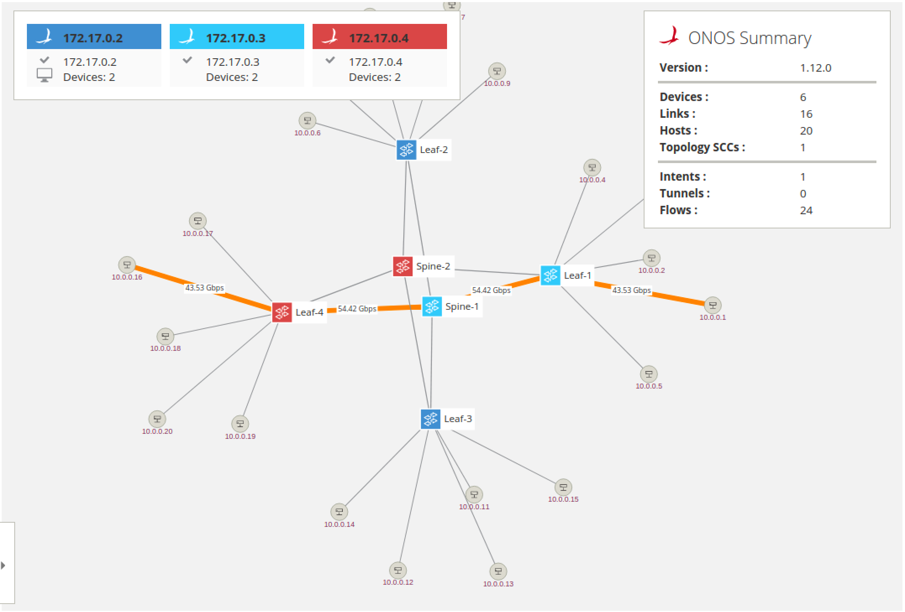

## Play on

Now you know the main features of the GUI. We encourage you to play around with it to find out what other features you can use and who knows may find a few bugs.

# Cluster Operation

Since we are running ONOS in a clustered configuration, let's see how ONOS deals with node failures.

We're going to use the ONOS CLI to shutdown the 1st instance (172.17.0.2) by issuing the *shutdown* command and answering the confirmation prompt with *yes*:

```
onos> shutdown
Confirm: halt instance root (yes/no): yes
onos> Connection to 172.17.0.2 closed by remote host.
```

After this, you should see the GUI connection fail-over to another ONOS cluster node, the device masterships to be re-assigned and the 1st node icon in the Instances pane will turn gray to indicate that the node is not reachable, similar to what is shown below:

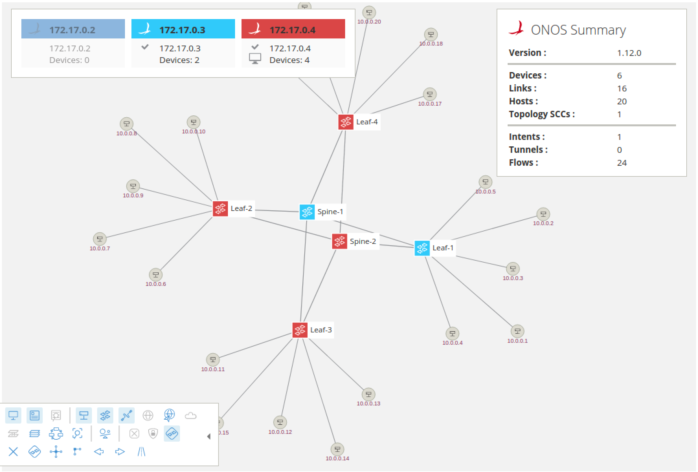

In this case, the GUI reconnected to the 3rd cluster node and the two devices previously mastered by the node which is now shutdown have been adopted by the 3rd node as well. Otherwise, all operation should proceed as normal; this includes the GUI.

Note that since the node is set to autostart, it will come back and rejoin the cluster shortly. There is nothing required on your part to do that. If you wish to rebalance the mastership again, you can use the GUI or the following CLI command:

```
onos> balance-masters
```

You can also activate the *Master Load Balancer* app to periodically re-balance the mastership automatically.

```
onos> app activate mlb
```

# UI Autolayout

One of the applications available with standard ONOS distribution (and activated by default in this tutorial setup) allows for automatic layout of the network topology in the GUI. Presently, only two layouts are supported, one for access networks (spine-leaf and variants) and the other is to return to the default force-layout that we have been using up to this point of the tutorial. To try this, you can type the following from the ONOS CLI:

```
onos> topo-layout access
```

Afterwards, you should see the GUI change display to resemble a more familiar depiction of the spine-leaf fabric as show below:

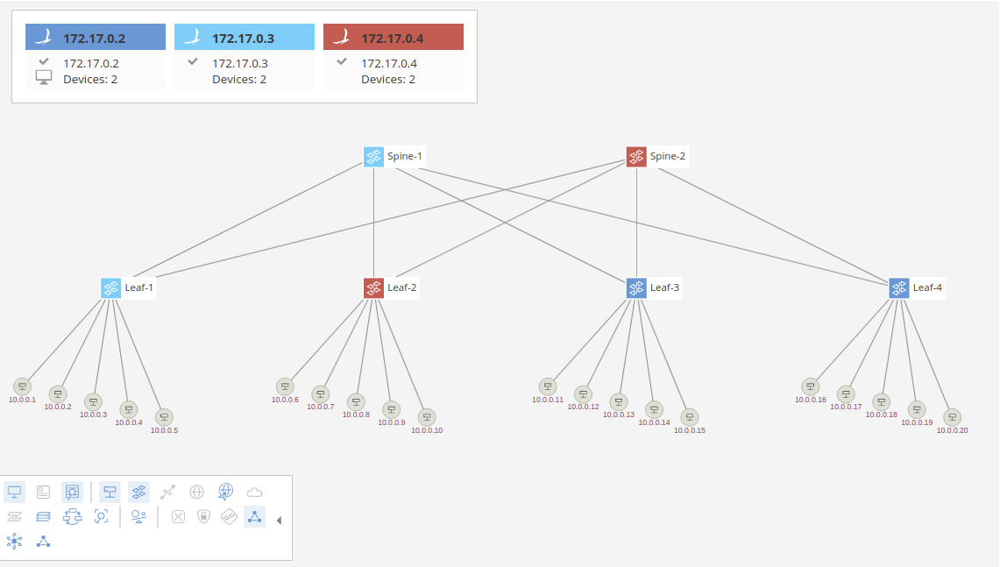

You can of course also switch between different layouts using the provided GUI overlay that can be activated in the *Topology View* toolbar.

# Exploring Further

Here we just scratched the surface of what ONOS can do in terms of controlling a network. We highly encourage you to continue using ONOS and perhaps start developing your own applications. Find out how to get started in [this tutorial](template-application-tutorial.md).

---

[Return To : Tutorials and Walkthroughs](../tutorials.md)

---
