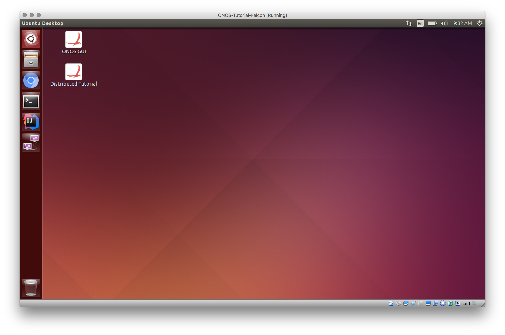
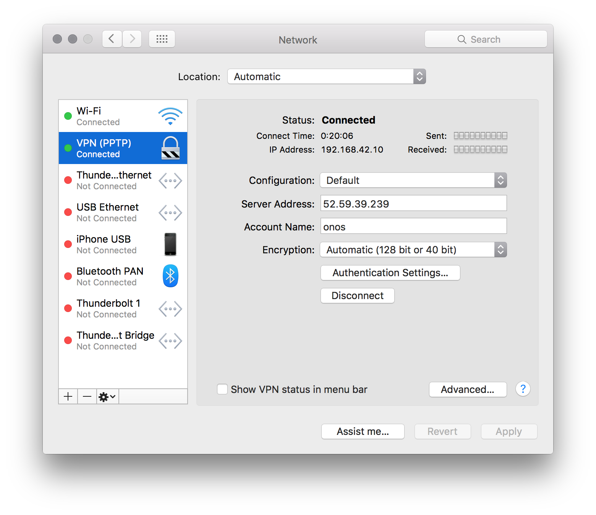
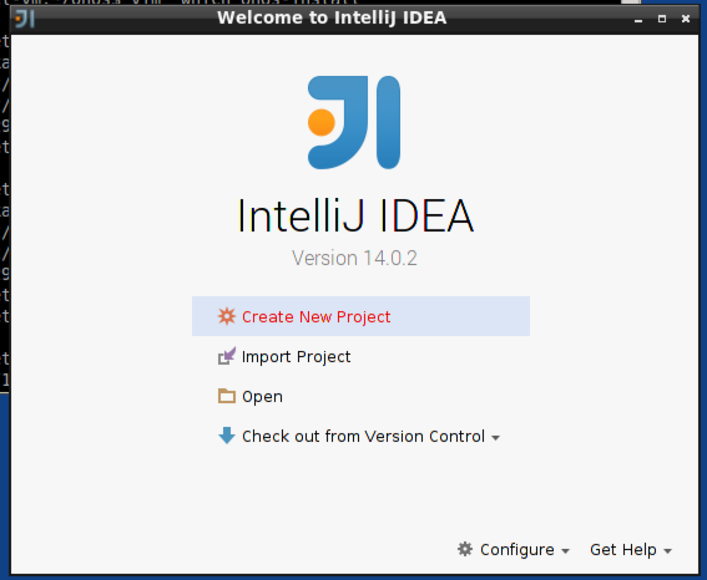
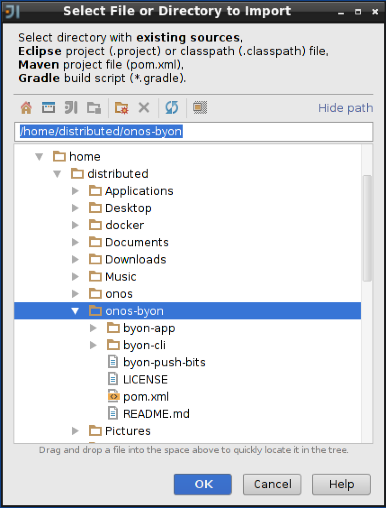
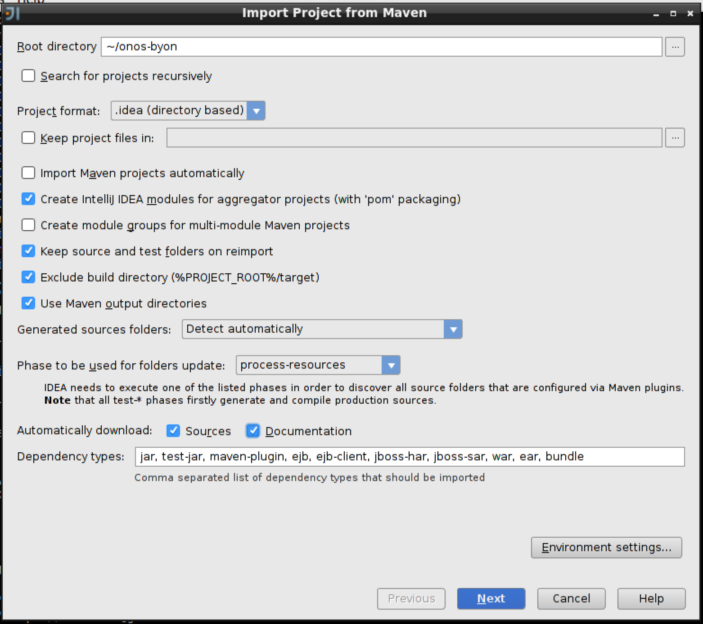
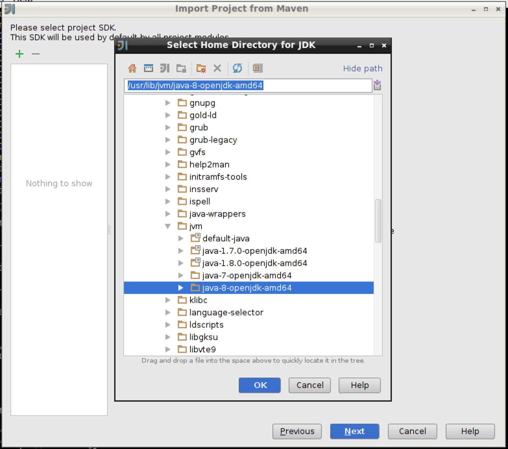

# Distributed ONOS Tutorial

**This applies to the obsolete Junco (1.9) release**

Please see [Cluster Configuration in Owl (1.14)](../guides/administrator-guide/installing-and-running-onos/forming-a-cluster/cluster-configuration-in-owl-1.14.md) for an updated guide. For an up-to-date tutorial for ONOS see the [NG-SDN tutorial](https://github.com/opennetworkinglab/ngsdn-tutorial)

**Welcome to the Distributed ONOS Tutorial.**

In this tutorial, you will learn to write a distributed ONOS application. The application you will be writing is called BYON (Build Your Own Network). This tutorial will teach you how to implement an ONOS service, an ONOS store, and how to use parts of the CLI and Northbound API. 

*(Here are some **slides** that can be used to accompany the tutorial:* **[Slides](https://docs.google.com/presentation/d/1sKmbCmndgGlWE4lqZxb8FmR_1so7Ul4ELb80sWV2qck/edit?usp=sharing)***)*

# Introduction

## Pre-requisites

You will need a computer with at least 2GB of RAM and at least 5GB of free hard disk space. A faster processor or solid-state drive will speed up the virtual machine boot time, and a larger screen will help to manage multiple terminal windows.

The computer can run Windows, Mac OS X, or Linux – all work fine with VirtualBox, the only software requirement.

To install VirtualBox, you will need administrative access to the machine.

The tutorial instructions require prior knowledge of SDN in general, and OpenFlow and Mininet in particular. So please first complete the [OpenFlow tutorial](http://archive.openflow.org/wk/index.php/OpenFlow_Tutorial) and the [Mininet walkthrough](http://mininet.org/walkthrough/). Also being familiar with [Apache Karaf](http://karaf.apache.org/)would be helpful although not entirely required.

## Stuck? Found a bug? Questions?

Email [us](mailto:onos-discuss@googlegroups.com) if you’re stuck, think you’ve found a bug, or just want to send some feedback. Please have a look at the [guidelines](../community-information/mailing-lists.md) to learn how to efficiently submit a bug report.

# Set up your environment

## Install required software

You will need to acquire two files: a [VirtualBox](https://www.virtualbox.org/) installer and the latest Tutorial VM from the [Downloads](../downloads.md) page. 

After you have downloaded VirtualBox, install it, then go to the next section to verify that the VM is working on your system.

## Create Virtual Machine

Double-click on the downloaded tutorial zipfile. This will give you an OVF file. Open the OVF file, this will open virtual box with an import dialog. **Make sure you provision your VM with 4GB of RAM and if possible 4 CPUs**, if not 2 CPUs should be ok.


Click on import. When the import is finished start the VM and you will be automatically logged in to a running desktop session as show below:



## Important Command Prompt Notes

In this tutorial, commands are shown along with a command prompt to indicate the subsystem for which they are intended.

For example,

```
onos>
```

indicates that you are in the ONOS command line, whereas

```
mininet>
```

indicates that you are in mininet.

## Connecting to your tutorial cell

Obtain the IP address of the tutorial cell on from your instructor and setup a PPTP VPN connection using `onos` as a user and `onos` as password. The method to this will vary depending on the operating system of the developer machine. The example below shows the setup on OS/X:



Then connect to the ONOS Cluster VPN.

## Verifying that ONOS is deployed

Now let's quickly run some tests to make sure everything is ok. Let's start by openning a new terminal window and connecting to the ONOS cli by typing `onos`

```
onos@onos-tutorial:~$ onos
Logging in as karaf
Welcome to Open Network Operating System (ONOS)!
     ____  _  ______  ____     
    / __ \/ |/ / __ \/ __/   
   / /_/ /    / /_/ /\ \     
   \____/_/|_/\____/___/     
                               
Documentation: wiki.onosproject.org      
Tutorials:     tutorials.onosproject.org 
Mailing lists: lists.onosproject.org     
Come help out! Find out how at: contribute.onosproject.org 
Hit '<tab>' for a list of available commands
and '[cmd] --help' for help on a specific command.
Hit '<ctrl-d>' or type 'system:shutdown' or 'logout' to shutdown ONOS.
onos>
```

You should drop into the cli. Now open another terminal window and start mininet as shown:

```
onos@onos-tutorial:~$ cd onos-byon && ./startmn.sh
...
...
mininet>
```

Now let's see if we have switches that are connected to ONOS:

```
onos> devices
id=of:0000000100000001, available=true, role=MASTER, type=SWITCH, mfr=Nicira, Inc., hw=Open vSwitch, sw=2.1.3, serial=None, protocol=OF_10
id=of:0000000100000002, available=true, role=STANDBY, type=SWITCH, mfr=Nicira, Inc., hw=Open vSwitch, sw=2.1.3, serial=None, protocol=OF_10
id=of:0000000200000001, available=true, role=MASTER, type=SWITCH, mfr=Nicira, Inc., hw=Open vSwitch, sw=2.1.3, serial=None, protocol=OF_10
id=of:0000000200000002, available=true, role=STANDBY, type=SWITCH, mfr=Nicira, Inc., hw=Open vSwitch, sw=2.1.3, serial=None, protocol=OF_10
id=of:0000000300000001, available=true, role=MASTER, type=SWITCH, mfr=Nicira, Inc., hw=Open vSwitch, sw=2.1.3, serial=None, protocol=OF_10
id=of:0000000300000002, available=true, role=STANDBY, type=SWITCH, mfr=Nicira, Inc., hw=Open vSwitch, sw=2.1.3, serial=None, protocol=OF_10
id=of:0000010100000000, available=true, role=STANDBY, type=SWITCH, mfr=Nicira, Inc., hw=Open vSwitch, sw=2.1.3, serial=None, protocol=OF_10
id=of:0000010200000000, available=true, role=STANDBY, type=SWITCH, mfr=Nicira, Inc., hw=Open vSwitch, sw=2.1.3, serial=None, protocol=OF_10
id=of:0000020100000000, available=true, role=MASTER, type=SWITCH, mfr=Nicira, Inc., hw=Open vSwitch, sw=2.1.3, serial=None, protocol=OF_10
id=of:0000020200000000, available=true, role=STANDBY, type=SWITCH, mfr=Nicira, Inc., hw=Open vSwitch, sw=2.1.3, serial=None, protocol=OF_10
id=of:0000030100000000, available=true, role=STANDBY, type=SWITCH, mfr=Nicira, Inc., hw=Open vSwitch, sw=2.1.3, serial=None, protocol=OF_10
id=of:0000030200000000, available=true, role=MASTER, type=SWITCH, mfr=Nicira, Inc., hw=Open vSwitch, sw=2.1.3, serial=None, protocol=OF_10
id=of:1111000000000000, available=true, role=STANDBY, type=SWITCH, mfr=Nicira, Inc., hw=Open vSwitch, sw=2.1.3, serial=None, protocol=OF_10
id=of:2222000000000000, available=true, role=STANDBY, type=SWITCH, mfr=Nicira, Inc., hw=Open vSwitch, sw=2.1.3, serial=None, protocol=OF_10
```

 You can also see which switches are connected to each instance of the ONOS cluster:

```
onos> masters
172.17.0.2: 5 devices
  of:0000000100000001
  of:0000000200000001
  of:0000000300000001
  of:0000020100000000
  of:0000030200000000
172.17.0.3: 2 devices
  of:0000000100000002
  of:0000000300000002
172.17.0.4: 7 devices
  of:0000000200000002
  of:0000010100000000
  of:0000010200000000
  of:0000020200000000
  of:0000030100000000
  of:1111000000000000
  of:2222000000000000
```

The number of switches per ONOS instance may be different for you because mastership is simply obtained by the first controller which handshakes with the switch. If you would like to rebalance the switch-onos ratio simply run:

```
onos> balance-masters
```

And now the output of the masters command should give you something similar to this:

```
onos> masters
172.17.0.2: 5 devices
  of:0000000100000001
  of:0000000200000001
  of:0000000300000001
  of:0000020100000000
  of:0000030200000000
172.17.0.3: 4 devices
  of:0000000100000002
  of:0000000300000002
  of:0000020200000000
  of:1111000000000000
172.17.0.4: 5 devices
  of:0000000200000002
  of:0000010100000000
  of:0000010200000000
  of:0000030100000000
  of:2222000000000000
```

At this point, you multi-instance ONOS deployment is functional. Let's move on to writing some code.

# Writing 'Build Your Own Network'

We are now going to start building BYON. BYON is a service which allows you to spawn virtual networks in which each host is connected to every other host of that virtual network. Basically, each virtual network contains a full mesh of the hosts that make it up.

## Lab 1: Importing and building an application

We have downloaded some starter code in the ~/onos-byon directory. It contains a root pom.xml file for the project, as well as a initial implementation of the CLI bundle. We can start by importing the entire project into IntelliJ.

First start IntelliJ by double clicking on the IntelliJ icon on your desktop. When you get prompted with the following window.



Select "Import Project" and import the onos-byon project.



Import the project from external model, and select "Maven".

And now make sure you check "Sources" and "Documentation" in the Automatically download section:



And click 'Next' and click next as well on the following window. Now, make sure you pick Java 8 in the next window by first clicking on the green '+' sign and selecting 'java-8-openjdk-amd64' and click 'ok' followed by 'Next'.



Finally click on 'Finish'. You should see the byon source tree on the left sidebar.

Next, we can return to a tutorial to build the project.

```
onos@onos-tutorial:~/onos-byon$ mci
[INFO] Scanning for projects...
...
[INFO] byon .............................................. SUCCESS [1.104s]
[INFO] ------------------------------------------------------------------------
[INFO] BUILD SUCCESS
[INFO] ------------------------------------------------------------------------
[INFO] Total time: 6.719s
[INFO] Finished at: Fri Dec 12 14:28:16 PST 2014
[INFO] Final Memory: 30M/303M
[INFO] ------------------------------------------------------------------------
onos@onos-tutorial:~/onos-byon$
```

*mci* is an alias for *mvn clean install*. Now, that your project has successfully built your project let's push it up to the ONOS cluster..

```
onos@onos-tutorial:~/onos-byon$ onos-app $OC1 install target/byon-1.0-SNAPSHOT.oar
{"name":"org.onos.byon","id":39,"version":"1.0-SNAPSHOT","description":"Build Your Own Network App","origin":"Apps-R-Us LLC, Inc. GmbH","permissions":"[]","featuresRepo":"mvn:org.onos.byon/byon/1.0-SNAPSHOT/xml/features","features":"[byon]","state":"INSTALLED"}
```

The *onos-app* command will take the *oar* file that is generated during the build and push it into the specified ONOS instance. The command can also activate the application if you replace *install*with *install!* as well as separately activate, deactivate, and uninstall the application. Every time you update your code you simply need to run *onos-app $OC1 reinstall! target/byon-1.0-SNAPSHOT.oar* and the new application will be loaded and started in the remote ONOS instances.

Let's check that everything works by heading into ONOS and running a couple commands:

```
onos@onos-tutorial:~/onos-byon$ onos -w
Logging in as karaf
Welcome to Open Network Operating System (ONOS)!
     ____  _  ______  ____  
    / __ \/ |/ / __ \/ __/   
   / /_/ /    / /_/ /\ \      
   \____/_/|_/\____/___/     
                              
Hit '<tab>' for a list of available commands
and '[cmd] --help' for help on a specific command.
Hit '<ctrl-d>' or type 'system:shutdown' or 'logout' to shutdown ONOS.
onos> apps -s
...
 37 org.onos.byon 1.0.SNAPSHOT Build Your Own Network App
```

The application has been successfully installed, but it has not yet been activated. Next, we will activate it:

```
onos> app activate org.onos.byon
onos> apps -s
...
* 37 org.onos.byon 1.0.SNAPSHOT Build Your Own Network App
```

The star next to the application indicates that it has been activated. We can try running the list-networks command to display the one fake network that is hard coded in the starter code.

```
onos> list-networks 
my-network
```

Congratulations! You have successfully built, installed and activated the byon application.

## Lab 2: Connect the Manager to the Store

In this part, we are going to implement some of the NetworkManager's methods using the provided store. The store will be used to store the service's network state; however, the implementation that is provided is not distributed. We will build a better store in a later part.

The NetworkManager is going to have to use the store (that we are going to build) to store information therefore we are going to need a reference on a NetworkStore:

```
@Reference(cardinality = ReferenceCardinality.MANDATORY_UNARY)
protected NetworkStore store;
```

There are six methods in the NetworkManager that should make calls to the network store. They are marked with "TODO Lab 2" in the starter code.

For example in the *getNetworks()* method, we will want to replace:

```
return ImmutableSet.of("my-network"); // TODO remove this line before starting lab 2
```

with a call to the store:

```
return store.getNetworks();
```

Next, let's verify that everything works.

First, you will need to compile byon again with *mci* and run *onos-app $OC1 reinstall! target/byon-1.0-SNAPSHOT.oar*again to get your latest bundle loaded into the ONOS docker instances.

Now at an ONOS shell, let's try some of the commands.

```
onos> list-networks 
onos> create-network test
Created network test    
onos> add-host test 00:00:00:00:00:01/-1
Added host 00:00:00:00:00:01/-1 to test   
onos> add-host test 00:00:00:00:00:02/-1
Added host 00:00:00:00:00:02/-1 to test
onos> list-networks 
test
	00:00:00:00:00:01/-1
	00:00:00:00:00:02/-1
```

## Lab 3: Add intents to allow traffic to flow in the virtual networks

In order to be able to use many of ONOS' services, the caller must supply an Application ID. An application ID allows ONOS to identify who is consuming which resources as well as track applications. To achieve this, we ask the CoreService for an application ID in the activate method. You should use the *appId* when constructing the intents for this part.

We will also need to get a reference to the IntentService. The reference will automatically be injected when the application is loaded after you uncomment the two lines near the top of the NetworkManager.

When *addHost()*is called, we will need to create an intent between the host and all other hosts that already exist in the network.

You should only to add the intents if this is the first time that the host is added, so be sure to check the store's return value. **true** indicates that the add was successful i.e. this is the first time.

For this exercise, we will be using *HostToHostIntent*s and you can build one like this:

```
Intent intent = HostToHostIntent.builder()
                                .appId(appId)
                                .key(generateKey(network, src, dst))
                                .one(src)
                                .two(dst)
                                .build();
intentService.submit(intent);
```

Make sure to submit a HostToHostIntent between the newly added host, and all other hosts that are already in the virtual network.

It's time to make sure that everything works; build with *mci* and run *onos-app $OC1 reinstall! target/byon-1.0-SNAPSHOT.oar*

```
onos> create-network test2
Created network test2    
onos> add-host test2 00:00:00:00:00:01/-1
Added host 00:00:00:00:00:01/-1 to test2   
onos> add-host test2 00:00:00:00:00:02/-1
Added host 00:00:00:00:00:02/-1 to test2
onos> list-networks 
test2
	00:00:00:00:00:01/-1
	00:00:00:00:00:02/-1
onos> intents
id=0x0, state=INSTALLED, type=HostToHostIntent, appId=org.onos.byon
    constraints=[LinkTypeConstraint{inclusive=false, types=[OPTICAL]}]
```

Now check in mininet that you can actually communicated between the two hosts that you added to your virtual network.

 

```
mininet> h1 ping h2
PING 10.0.0.2 (10.0.0.2) 56(84) bytes of data.
64 bytes from 10.0.0.2: icmp_seq=1 ttl=64 time=21.4 ms
64 bytes from 10.0.0.2: icmp_seq=2 ttl=64 time=0.716 ms
64 bytes from 10.0.0.2: icmp_seq=3 ttl=64 time=0.073 ms
```

## Lab 4: Implementing removal of hosts from a virtual network

When a host is removed from a network or a network is removed entirely, we need to remove the intent related to that host or network from the *IntentService*. There are Lab 4 TODOs in the *removeHost()*and *removeNetwork()*methods. The starter code also contains a *removeIntents()* method that you will need to complete. In this method, you will need to get the intents from the *IntentService*, filter the relevant ones to remove, and then instruct the *IntentService* to withdrawn them. Note: For your convenience, we have provided a helper method, *matches()*, that can be used to filter the relevant intents.

Next, we will need to construct some CLI commands so that you can test your work, specifically, one command to remove hosts and another to remove networks.

Start by creating two files in the byon-cli package **'****RemoveHostCommand.java'**. This CLI command is simple and very similar to the add host CLI command, so do this now as an exercise. When you have written this command, you will need to add the following XML to the '**shell-config.xml**' under resources.

```
<command>
	<action class="org.onos.byon.cli.RemoveHostCommand"/>
    <completers>
		<ref component-id="networkCompleter"/>
        <ref component-id="hostIdCompleter"/>
        <null/>
	</completers>
</command>
```

Once again if you recompile your code and use onos-app update your application on the ONOS instances. You should now be able to add and remove networks as well as hosts. Try it out!

Now, you should have a fairly complete implementation of the BYON app, but it will only work from one instance. (Try running list-networks on another instance! It will not show you any networks.)

## Lab 5: Upgrading the store to make it distributed

The starter implementation of the *DistributedNetworkStore* uses a *ConcurrentMap* to store information about the virtual networks. This map only stores the data locally, and it knows nothing about other instances in the cluster. We will be replacing the map with a *ConsistentMap* which is cluster-aware, and one of the distributed primitives provided by ONOS.

Before we can instantiate a *ConsistentMap*, we need to get a reference to the *StorageService*; you can do this by uncommented in the *StorageService* reference near the top of the *DistributedNetworkStore* class.

First, start by defining a couple fields:

```
 	/*
     * TODO Lab 5: Replace the ConcurrentMap with ConsistentMap
     */
    private Map<String, Set<HostId>> networks;
    private ConsistentMap<String, Set<HostId>> nets;
```

Once you change the *ConcurrentMap* to a *ConsistentMap*, we will need to update the way the map is created in the *activate()* method. Here is how we can ask the storage service for a *ConcurrentMap*:

```
	 /*
      * TODO Lab 5: Replace the ConcurrentHashMap with ConsistentMap
      *
      * You should use storageService.consistentMapBuilder(), and the
      * serializer: Serializer.using(KryoNamespaces.API)
      */
      nets = storageService.<String, Set<HostId>>consistentMapBuilder()
                .withSerializer(Serializer.using(KryoNamespaces.API))
                .withName("byon-networks")
                .build();

      networks = nets.asJavaMap();
```

Now that you the *networks* field is a normal java map that is backed by a distributed map you do not have to change any code at all. And actually you can ignore all the lab 5 todos. 

Next, let's recompile your application and push it to the ONOS cluster. You should now be able to create, update, and delete networks from any node, and your distributed store will the application running on all instances in sync. Open a few terminals and test this on the different instances. 

## Lab 6: Network Events

Components in ONOS can use events to asynchronously notify other components when their state has changed. We will demonstrate how this can be done by creating a new event type, *NetworkEvent*, to notify listeners when a virtual network has been updated. These events will be fired by the distributed store and forwarded by the manager to listeners in the peer ONOS instance. 

Let's start by inspecting the **NetworkEvent** class:

```
public class NetworkEvent extends AbstractEvent<NetworkEvent.Type, String> {

    enum Type {
        NETWORK_ADDED,
        NETWORK_REMOVED,
        NETWORK_UPDATED
    }

    public NetworkEvent(Type type, String subject) {
        super(type, subject);
    }

}
```

Let's also inspect the provided abstraction for listeners capable of receiving network events, which is the **NetworkListener** class:

```
public interface NetworkListener extends EventListener<NetworkEvent> {}
```

With ONOS being a clustered system, it needs to allow managers to learn about events that may have occurred on other cluster nodes. For this reason, in every ONOS subsystem the events are generated within the distributed stores and then are passed to the respective manager components via **StoreDelegate** interface. Upon receiving the event via the delegate interface, the manager can then take local action and then disseminate the event to its event listeners.

Let's inspect the provided **NetworkStoreDelegate** interface:

```
public interface NetworkStoreDelegate extends StoreDelegate<NetworkEvent> {}
```

To enable the store/manager delegate relationship, we need to make the existing store interface extend the abstract **Store** interface as shown below. It basically states that the **NetworkStore** is capable of having a **NetworkStoreDelegate** to which it will send **NetworkEvent** notifications:

```
public interface NetworkStore extends Store<NetworkEvent, NetworkStoreDelegate> {
```

And since we changed the interface of the **Store** we will have to make sure that the implementation, namely **DistributedNetworkStore**, properly adheres the revised contract. The **AbstractStore** base class provides methods for setting delegate and for posting events to that delegate.

```
public class DistributedNetworkStore extends AbstractStore<NetworkEvent, NetworkStoreDelegate>
```

The *ConsistentMap* will already generate notifications when updates are made locally and remotely, so we can mostly leverage that feature to regenerate our events.

To do this, we will need to create a *MapEventListener<String, Set<HostId>>* class in the **DistributedNetworkStore**.

```
private class InternalListener implements MapEventListener<String, Set<HostId>> {
    @Override
    public void event(MapEvent<String, Set<HostId>> mapEvent) {
        final NetworkEvent.Type type;
        switch (mapEvent.type()) {
            case INSERT:
                type = NETWORK_ADDED;
                break;
            case UPDATE:
                type = NETWORK_UPDATED;
                break;
            case REMOVE:
            default:
                type = NETWORK_REMOVED;
                break;
        }
        notifyDelegate(new NetworkEvent(type, mapEvent.key()));
    }
}
```

We will need to construct an instance of the InternalListener.

```
private final InternalListener listener = new InternalListener();
```

This listener will need to be added and removed to the *networks* map during activation and deactivation respectively.

Alright, so now that the stores emit events the managers should be made to receive them. For this we are going to have to add a reference on the EventDeliveryService an ListenerRegistry to keep track of listeners and NetworkStoreDelegate as shown in the code snippet below.

```
	@Reference(cardinality = ReferenceCardinality.MANDATORY_UNARY)
	protected EventDeliveryService eventDispatcher;

    private final ListenerRegistry<NetworkEvent, NetworkListener>
            listenerRegistry = new ListenerRegistry<>();

    private final NetworkStoreDelegate delegate = new InternalStoreDelegate();
```

Then we need to add a couple lines in the activate in order to register our Event type for our listeners and set our delegate.

```
 eventDispatcher.addSink(NetworkEvent.class, listenerRegistry);
 store.setDelegate(delegate);
```

and vice versa deactivate

```
eventDispatcher.removeSink(NetworkEvent.class);
store.unsetDelegate(delegate);
```

Finally add the methods to add listeners and dispatch events coming from the store:

```
    @Override
    public void addListener(NetworkListener listener) {
        listenerRegistry.addListener(listener);
    }

    @Override
    public void removeListener(NetworkListener listener) {
        listenerRegistry.removeListener(listener);
    }

    private class InternalStoreDelegate implements NetworkStoreDelegate {
        @Override
        public void notify(NetworkEvent event) {
            eventDispatcher.post(event);
        }
    }
```

To test this, you will need to create a new component that registers to the NetworkEvents with the NetworkService. We will leave this as an extra credit exercise.

Make sure to use the *@Component* annotation to start an instance of the class automatically.You will also want to register and deregister with the NetworkService in the activate and deactivate methods of your component.

Finally, build and push the app to the ONOS cluster. You should try to test your implementation. When you add and remove networks and/or hosts you should see this being reflected on the other ONOS instances.

Furthermore, you add, remove, or update a network you should see the following line in the ONOS log. You can get the ONOS log by running:

```
distributed@mininet-vm:~/ $ ol
```

And you should see a line that look like:

```
INFO  | event-dispatch-0 | NetworkEventMonitor    | 187 - org.onos.byon.monitor - 1.0.0.SNAPSHOT | NetworkEvent{time=<time&date>, type=NETWORK_ADDED, subject=test}
```

# Conclusion

Congratulations! You have learned how to develop an ONOS distributed application on ONOS.

# Source Code Download

If you wish to have access to the full source code with the complete solution, and without downloading the entire tutorial VM, you can download the source code directly from GitHub as follows:

```
git clone https://github.com/bocon13/onos-byon.git && cd onos-byon && git checkout solution
```
