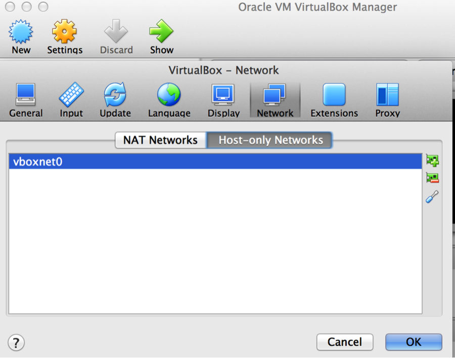
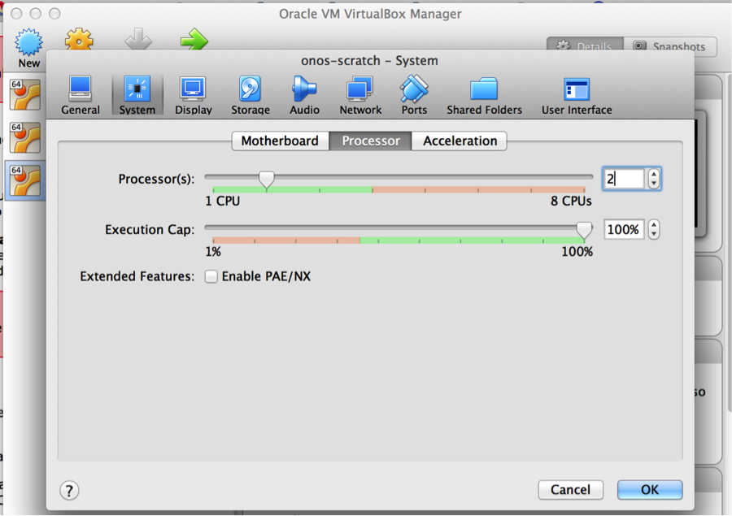
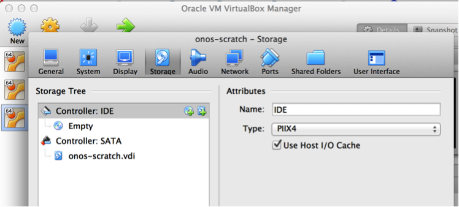
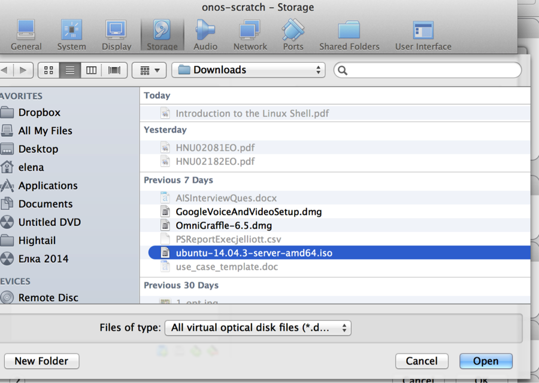
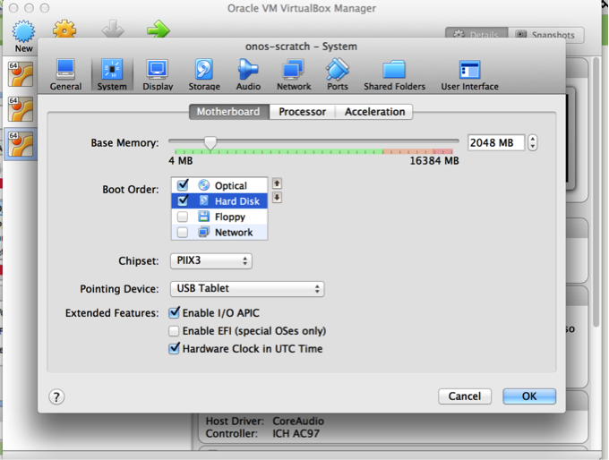
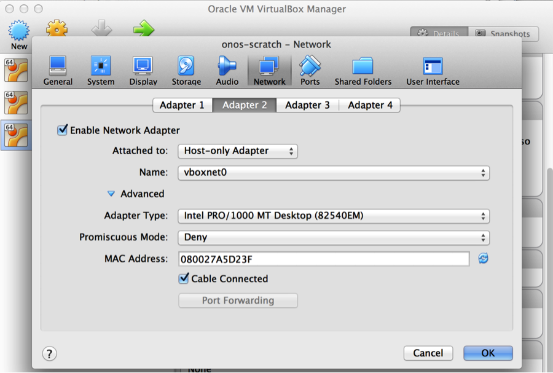

# ONOS from Scratch

**Contents of this page are obsolete. Please refer to [Getting Started with ONOS screencast](screencasts/getting-started-developing-with-onos.md) and [Building ONOS](#) instead.**

## Overview

If you have come across [Installing and Running ONOS](https://wiki.onosproject.org/display/ONOS/Installing+and+Running+ONOS), you'll notice that there are several ways to install and run ONOS. This tutorial focuses on showing you one of several useful deployment methods - ONOS packaged from source, and deployed in an Ubuntu VirtualBox VM using Windows, Linux or Mac OS X as an operation system on your computer.

By completing this tutorial, in addition to learning how to create your ONOS lab environment you will understand how to:

* Use *cell definitions* to configure the ONOS build environment to customize the ONOS package
* Configure which modules the ONOS binary loads by default
* Install ONOS on a VM using the onos-install utility
* Access the CLI and monitor ONOS remotely

### Conventions

Commands at the shell of the ONOS VM begin with $ (or sdn@onos-scratch:~$)

```
$ sudo -s
#
```

The commands at the build machine shell begin with build:~$: (or sdn@build:~$)

```
build:~$ sudo -s
build:~#
```

## 1. Prerequisites and Setup for the Tutorial

You need a build machine for packaging ONOS and for running your Ubuntu Server ONOS VM. The build machine should be running a UNIX-like OS. In this tutorial you will create a build VM in VirtualBox named Build that is running Ubuntu 14.04, 64-bit Desktop.

You can create the two virtual machines using the virtualization software of your choice, but in this case we use [VirtualBox](https://www.virtualbox.org). This tutorial assumes you are using [VirtualBox](https://www.virtualbox.org/wiki/Downloads) (free open source virtualiztion software).

**Setup needed**:

* Install [Oracle VirtualBox virtualization software](https://www.virtualbox.org/wiki/Downloads)
* Create a Virtual Machine 1 – onos-scratch VM - [Ubuntu Server 14.04 TLS 64 bit](http://www.ubuntu.com/download/server)
* Create a Virtual Machine 2 – Build VM running [Ubuntu 14.04 TLS 64 bit desktop](http://www.ubuntu.com/download/desktop)

### **1. Install and prepare VirtualBox**

This link will guide you through installing VirtualBox if you do not have it installed:<http://www.wikihow.com/Install-Ubuntu-on-VirtualBox>

Add Host-only Networks vboxnet0 adapter in VirtualBox if it doesn’t have it:

Go to **VirtualBox Preferences > Network**, select Host-only Networks tab, and:

* click the green symbol with the + sign on the right to add host-only network
* click the blue tool icon on the right to edit host-only network and verify that dhcp is enabled.



### **2.** **Prepare the Build VM and ONOS VM**

#### Create onos-scratch VM

* Download [Ubuntu Server 14.04 LTS 64-bit](http://www.ubuntu.com/download/server) from [Ubuntu.com](http://Ubuntu.com)
* Create an Ubuntu onos-scratch VM in VirtualBox using this image, with the following settings:

* + 2GB RAM
  + 2 processors
  + At least 5GB disk space
  + Two network interfaces, Adapter 1 attached to *NAT*, and Adapter 2 attached to *host-only* Adapter set to vboxnet0. Configure both to use DHCP.
  + This tutorial calls the VM *onos-scratch*.
* In VirtualBox:

1. Select New
2. Name: onos-scratch, type: Linux
3. Hard disk: Create a virtual hard disk now; select the default VDI for disk type; dynamically allocated
4. Add the second processor:



* #### Install Ubuntu

  + When the VM is created, attach the downloaded Ubuntu 14.04 LTS 64-bit ISO file to it: go to VM’s settings and click the “Storage” tab, add optical drive to the Controller: IDE by clicking the CD/DVD icon with the green plus sign.  

    

* + Browse to the downloaded ISO file:  
      
    

* + Click on the System tab**.** Choose boot order and keep CD/DVD on the top as first priority.

    

* + Add the 2nd Network Adapter and attach it to Host-only Adapter:  

    

* + Start the onos-scratch VM and install Ubuntu.   
      
    More help here: <http://www.wikihow.com/Install-Ubuntu-on-VirtualBox> **During the Ubuntu installation:**

* + - create a user named ***sdn***, with password ***rocks***, and confirm that you want to use this password. This will be the primary account used for this tutorial.
    - when prompted to encrypt the disk, select **No**
    - For partitioning the disk, select **Guided - use entire disk** and follow with the defaults provided.
    - For configuring proxy information, follow what best suits your environment.
    - when prompted to install additional software (Software Install) choose **OpenSSH server**.

#### **Once the onos-scratch VM starts up:**

Log into your new VM as *sdn* and give the user passwordless *sudo* privileges. Run sudo visudo, and add the following line to the end of the file:

```
sdn ALL=(ALL) NOPASSWD:ALL
```

Then, update the package repository:

```
$ sudo apt-get update
```

You should also be able to verify that it has two network interfaces, **eth0**, **eth1 and lo**:

```
$ ifconfig -a
eth0      Link encap:Ethernet  HWaddr 08:00:27:15:7e:e1  
          inet addr:10.0.2.15  Bcast:10.0.2.255  Mask:255.255.255.0
          inet6 addr: fe80::a00:27ff:fe15:7ee1/64 Scope:Link
          UP BROADCAST RUNNING MULTICAST  MTU:1500  Metric:1
          RX packets:35 errors:0 dropped:0 overruns:0 frame:0
          TX packets:43 errors:0 dropped:0 overruns:0 carrier:0
          collisions:0 txqueuelen:1000 
          RX bytes:3535 (3.5 KB)  TX bytes:3749 (3.7 KB)
 
eth1      Link encap:Ethernet  HWaddr 08:00:27:b7:18:47  
          inet addr:192.168.56.101  Bcast:192.168.56.255  Mask:255.255.255.0
          inet6 addr: fe80::a00:27ff:feb7:1847/64 Scope:Link
          UP BROADCAST RUNNING MULTICAST  MTU:1500  Metric:1
          RX packets:157 errors:0 dropped:0 overruns:0 frame:0
          TX packets:48 errors:0 dropped:0 overruns:0 carrier:0
          collisions:0 txqueuelen:1000 
          RX bytes:19323 (19.3 KB)  TX bytes:7379 (7.3 KB)
 
lo        Link encap:Local Loopback  
          inet addr:127.0.0.1  Mask:255.0.0.0
          inet6 addr: ::1/128 Scope:Host
          UP LOOPBACK RUNNING  MTU:65536  Metric:1
          RX packets:0 errors:0 dropped:0 overruns:0 frame:0
          TX packets:0 errors:0 dropped:0 overruns:0 carrier:0
          collisions:0 txqueuelen:0 
          RX bytes:0 (0.0 B)  TX bytes:0 (0.0 B)
```

If eth1 doesn't have UP as an attribute, manually run DHCP client (this should also bring the interface up):

```
$ sudo dhclient eth1
```

Or manually assign IP and bring the interface up:

```
$ sudo ifconfig eth1 <IP address> up
```

#### **Create a build VM**

* Download [Ubuntu 14.04 LTS 64-bit desktop from Ubuntu.com](http://www.ubuntu.com/download/desktop)
* **Create a new VM**. In VirtualBox:

* + Name: build, type: Linux:
    - Select 2GB of RAM
    - Hard disk: take the defaults: 8 GB and Create a virtual hard disk now
    - Hard disk file type: VDI
    - Storage on physical hard disk: Dynamically allocated
    - File location and size: type "build" for the name - select at least 10 GB for the size of the virtual hard disk for the build VM
  + Click on settings for the build VM:
    - Storage: Controller IDE – click on the disk with a + sign symbol to add an optical drive. Choose disk: browse to the location of the downloaded iso file.
    - Add a 2nd network adapter for host-only network (see the screenshot in the section for Creating onos-scratch VM.)
    - System: Motherboard tab – uncheck floppy, move optical to the top in the Boot Order box.
  + Install Ubuntu (use the same credentials as for the first Ubuntu VM). When the installation completes, power the VM on and login.
* **Generate a SSH public key** on your build machine if you hadn't done so in the past.  
  Login to the build machine and run the following command:

  ```
  build:~$ ssh-keygen -t rsa
  ```

  The default options and no password are fine for this tutorial.
* **Verify connectivity.** From the build machine you should be able to SSH to the onos-scratch VM using the IP address assigned to eth1:

  ```
  build:~$ ssh -l sdn 192.168.56.101
  ```

  If the ssh connection failed make sure that the openssh-server is installed by running:

  ```
  $ sudo apt-get install openssh-server
  ```

  Check that you can ping the onos-scratch VM by IP from the build machine and reverse, for example:

  ```
  sdn@build:~$ ping 192.168.56.101
  ```

  **Close the ssh connection** to the onos-scratch VM by typing exit.

## 2. Install required software

### On the build machine

#### Install **Git**:

```
build:~$ sudo apt-get install git-core
```

#### Install **Karaf, Maven**:

Create two directories called ~/Downloads and ~/Applications. Download the [Karaf 3.0.5](https://downloads.onosproject.org/third-party/apache-karaf-3.0.5.tar.gz) and [Maven 3.3.9](http://archive.apache.org/dist/maven/maven-3/3.3.9/binaries/apache-maven-3.3.9-bin.tar.gz) binaries (the tar.gz versions of both) into ~/Downloads and extract it to ~/Applications. Keep the tar archives in ~/Downloads; we'll need that later.

```
build:~$ cd; mkdir Downloads Applications
build:~$ cd Downloads
build:~$ wget http://archive.apache.org/dist/karaf/3.0.5/apache-karaf-3.0.5.tar.gz
build:~$ wget http://archive.apache.org/dist/maven/maven-3/3.3.9/binaries/apache-maven-3.3.9-bin.tar.gz
build:~$ tar -zxvf apache-karaf-3.0.5.tar.gz -C ../Applications/
build:~$ tar -zxvf apache-maven-3.3.9-bin.tar.gz -C ../Applications/
```

#### Next, install **Oracle Java 8**:

```
build:~$ sudo apt-get install software-properties-common -y
build:~$ sudo add-apt-repository ppa:webupd8team/java -y
build:~$ sudo apt-get update
build:~$ sudo apt-get install oracle-java8-installer oracle-java8-set-default -y
```

It will ask you to acknowledge the license; do so when prompted.  
The second step above may prompt for the installation of *python-software-properties*. If prompted, do so.

#### Clone the **ONOS source**:

Now let’s copy a repository into a new onos directory under the home directory on the build machine.

navigate to the home directory by issuing this command:

```
build:~$ cd ~
build:~$ git clone https://gerrit.onosproject.org/onos
```

This will create a directory called onos, with the source code in it.

### On the onos-scratch VM

The VM only requires Java 8 - follow the instructions for Java 8 above performed on the build VM.

## **3. Set up your build environment**

### Environment variables

First off, you will need to export several environment variables. The ONOS source comes with a sample bash\_profile that can set these variables for you.

This file can be sourced from the interactive portion of .bashrc, or .bash\_aliases (or .profile if /bin/sh is bash) of user sdn, by adding the following line to it at the end:

```
. ~/onos/tools/dev/bash_profile
```

**Warning:** technically any bash-specific code should not go in *.profile*. If you have a Debian-based system (e.g. Raspbian) where *.profile* may be executed by a shell that is not bash (e.g. */bin/sh* is `dash` or some other POSIX-like shell), make sure you put the above line in *.bash\_aliases* or the interactive portion of *.bashrc* rather than *.profile* to avoid problems (such as `startx` not working on Raspbian.)

Here is how:

On the **build VM**, Edit the .bashrc file (by typing the command below)

```
sdn@build:~$ nano ~/.bashrc
```

Add the line below at the end of the file:

```
. ~/onos/tools/dev/bash_profile
```

Press Ctrl-X to exit and Yes to save changes.

Once the line is added, source the file you just modified (or just log out and log back in): or run this command:

```
sdn@build:~$ . ~/.bashrc
```

Once you run the above command, you will see in the output of the *env* command that several new variables, such as *ONOS\_ROOT, OCI,* and *KARAF\_ROOT*, have been set*.*

Using a different user name or group

Make sure you also setup ONOS\_USER If you used a user name other than "sdn" during the Ubuntu installation. You can also customize the ONOS\_GROUP (typically, the user name and group name will be identical.)

```
$ export ONOS_USER=<username>
$ export ONOS_GROUP=<groupname>
```

#### Building ONOS

Edit  *~/Applications/apache-karaf-3.0.5/etc/org.apache.karaf.features.cfg* file by appending the following line to *featuresRepositories*:

```
build:~$ nano ~/Applications/apache-karaf-3.0.5/etc/org.apache.karaf.features.cfg
```

locate the *featuresRepositories* and append this line (will need a comma before appending the text to separate from the previous value)

```
mvn:org.onosproject/onos-features/1.5.0-SNAPSHOT/xml/features
```

Save and close the file. Now we are ready to build ONOS with Maven:

```
build:~$ cd ~/onos
build:~$ mvn clean install  # or use the alias 'mci'
```

Now we are ready to start customizing, creating, and installing ONOS packages.

If previous version of ONOS is running, the service should be stopped (*sudo service onos stop*) before building with *mvn*. Otherwise, the test on *onlab.nio* package would fail with "address already in use" error.

## 4. Create a custom cell definition

### A quick intro to cells

Under ONOS terminology, a ***cell*** is a collection of environment variables that are used:

* by the utility scripts included with ONOS, including the ones that we are about to talk about
* for telling the packaging process how we want to customize our ONOS package

Cells make it easy to use the utility scripts to package, configure, install, and run ONOS. Here we will create an ONOS package that, when installed and launched, starts up a single-instance (non-clustering) ONOS instance that uses the intent-based forwarding application.

### Create a cell definition file

A *cell* is defined in a *cell definition file*. We will create the following cell definition file called *tutorial* in *${ONOS\_ROOT}/tools/test/cells/* :

```
sdn@build:~$ nano onos/tools/test/cells/tutorial
```

```
# ONOS from Scratch tutorial cell

# the address of the VM to install the package onto
export OC1="192.168.56.101"

# the default address used by ONOS utilities when none are supplied
export OCI="192.168.56.101"

# the ONOS apps to load at startup
export ONOS_APPS="drivers,openflow,fwd,proxyarp,mobility"

# the Mininet VM (if you have one)
export OCN="192.168.56.102"

# pattern to specify which address to use for inter-ONOS node communication (not used with single-instance core)
export ONOS_NIC="192.168.56.*"
```

Note that:

* ***OC1*** and ***OCI*** are set to the address of eth1 in our VM (onos-scratch VM)
* ***ONOS\_APPS*** indicates the ONOS applications we want to activate, including OpenFlow protocol, reactive forwarding (fwd), proxy ARP, and mobility.

### Applying a cell

This cell can be applied to your build environment with the cell command:

```
build:~$ cell tutorial
```

Now any ONOS package you will build will take up the ONOS\_APPS setting. Additionally, if you need to create packages with other configurations (i.e. different applications or install targets), all you need to do is to apply a different cell definition to your environment before package creation and deployment.

If you want to work with multiple terminals on the build machine, you should apply the cell to each new terminal you have, if you want the onos-\* scripts (from the Create and Deploy the package sections below) to work from all of them.

You can also use the vicell utility to create and edit your cell file. For example, to create a new cell file:

```
$ vicell -c -a mycell
```

the above command opens a new file named "mycell" in *${ONOS\_ROOT}/tools/test/cells/* either in the editor specified by the EDITOR env variable, or vi otherwise. When you exit out of the editor, the cell is automatically created and then applied to your session.

See vicell -h for the list of options.

## 5. Package and deploy ONOS

### Passwordless VM access

For convenience, before we can deploy anything to our VM, we will configure paswordless login to the VM **from our build machine** with onos-push-keys:

```
build:~$ onos-push-keys 192.168.56.101
sdn@192.168.56.101's password:
```

Older versions of the utility will ask you to authenticate multiple times; newer versions will require you to enter the password just once.

This tutorial deals with only 1 VM, but if you want to create a cluster of ONOS, cloning the 1st VM, *onos-patch-vm* script can be used to set the hostname, etc. to the cloned VM.

```
build:~$ onos-patch-vm $OC2 onos-scratch2
192.168.56.102: onos-scratch2
```

### Creating the package

To create an ONOS binary, run onos-package (or op, for short):

```
build:~$ onos-package
-rw-rw-r--  1 onosuser  onosuser  33395409 Dec  4 16:12 /tmp/onos-1.5.1.onosuser.tar.gz
```

This creates a tar archive in */tmp* .

### **Deploying the package**

We can now deploy it to our VM:

```
build:~$ onos-install -f $OC1
onos start/running, process 2028
```

Once onos-install returns with the last message in the code block above, we can try logging on from our build machine:

```
build:~$ onos $OC1
Logging in as karaf
Welcome to Open Network Operating System (ONOS)!
     ____  _  ______  ____  
    / __ \/ |/ / __ \/ __/   
   / /_/ /    / /_/ /\ \      
   \____/_/|_/\____/___/     


Documentation: wiki.onosproject.org
Tutorials:     tutorials.onosproject.org
Mailing lists: lists.onosproject.org


Come help out! Find out how at: contribute.onosproject.org
                              
Hit '<tab>' for a list of available commands
and '[cmd] --help' for help on a specific command.
Hit '<ctrl-d>' or type 'system:shutdown' or 'logout' to shutdown ONOS.
onos>
```

We are now actually logged into the ONOS CLI of the instance that we have deployed on the VM.

Use apps to list all installed applications. The one with asterisk sign indicates that it is activated (running).

```
onos> apps -a -s
*   6 org.onosproject.drivers              1.5.1.SNAPSHOT Default device drivers
*  35 org.onosproject.hostprovider         1.5.1.SNAPSHOT ONOS host location provider.
*  50 org.onosproject.sdnip                1.5.1.SNAPSHOT SDN-IP peering application
*  56 org.onosproject.lldpprovider         1.5.1.SNAPSHOT ONOS LLDP link provider.
*  78 org.onosproject.openflow-base        1.5.1.SNAPSHOT OpenFlow protocol southbound providers
*  82 org.onosproject.openflow             1.5.1.SNAPSHOT OpenFlow southbound meta application
*  94 org.onosproject.proxyarp             1.5.1.SNAPSHOT Proxy ARP/NDP application.
onos>
```

Note that there will be many more modules than you have configured - these are part of the ONOS OpenFlow and core components. Refer to [Appendix C : Source Tree Organization](../guides/developer-guide/appendix-c-source-tree-organization.md) to see descriptions of the modules.

You can log out (detach) from the CLI with logout, or **Ctrl-D**.

The argument *$OC1* can be replaced with *$OCI*, or even omitted; when omitted, the scripts will fall back to using the value stored in *OCI*.

### Deploy on Mac OS X

On Ubuntu, onos-install uses the upstart/initctl system to start and stop onos semi-automatically.

OS X manages daemons using launchd/launchctl, which onos-install doesn't currently support, so we need to specify "nostart" (-n):

```
onos-install -fn $OC1
```

and start ONOS manually using

```
/opt/onos/apache-karaf-$KARAF_VERSION/bin/karaf clean
```

## What’s next?

* Now that you've got the basics of a development environment, try a hand at creating an application in the [Template Application Tutorial](template-application-tutorial.md).
* Learn more about the installation process in [Installing and Running ONOS](https://wiki.onosproject.org/display/ONOS/Installing+and+Running+ONOS).
* Learn more about cells in [Test Environment Setup](https://wiki.onosproject.org/display/ONOS/Test+Environment+Setup).

---

[Return To : Tutorials and Walkthroughs](../../tutorials-and-walkthroughs-9832212.md)

---
