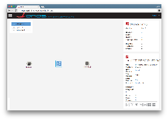
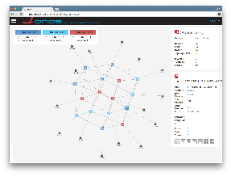
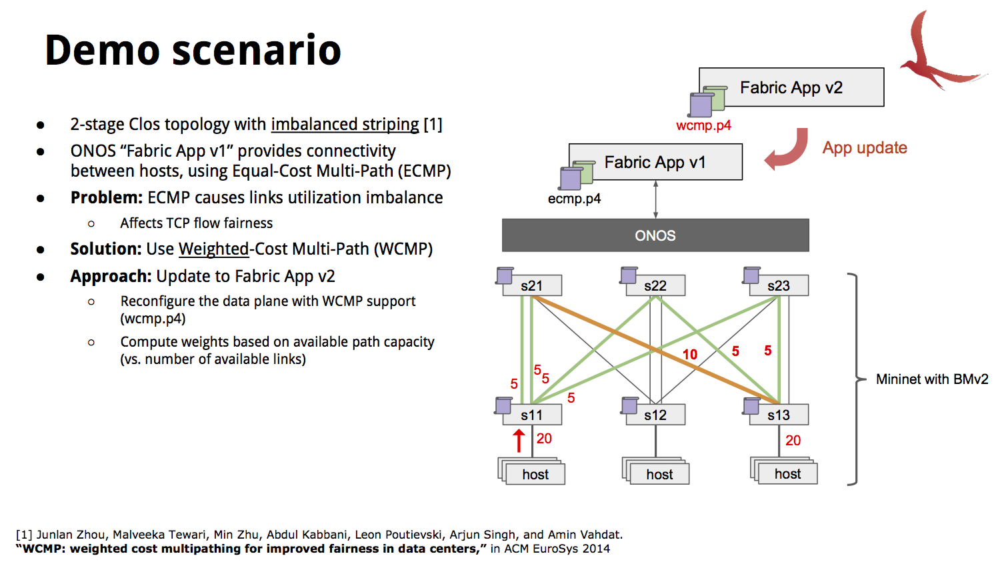

# P4 Experimental Support via BMv2 (outdated)

The content of this page is outdated and is left here for historical purposes only

**Support for P4 devices is now available via P4Runtime.** [Check this page for more information.](../community-information/brigades/p4-brigade.md)

Support for BMv2 and P4 as described here won't be available anymore starting from ONOS 1.11 (Loon). Instead, the recently started [P4 Brigade](../community-information/brigades/p4-brigade.md) is working on official support for P4-enabled devices via P4Runtime. Please subscribe to the [brigade's mailing list](../community-information/brigades/p4-brigade.md) to receive updates.

If you still want to to try the P4 support as described on this page please make sure to use ONOS 1.6 (Goldeneye).

[P4](http://www.p4.org) is a domain-specific language designed to allow programming of protocol-independent packet processors. [Behavioral Model v2](https://github.com/p4lang/behavioral-model) (BMv2) is the reference P4 software switch. Support for BMv2 has been included in ONOS starting from the 1.6 (Goldeneye) release with 2 goals: i) provide the research community with a platform to experiment with P4-based applications and ii) define a common groundwork to support programmable data planes in the next versions of ONOS.

This document will guide you through the necessary steps to program a network of BMv2 (virtual) devices using ONOS. This document assumes you are already familiar with ONOS, P4 and BMv2. In other words, we assume you already know how to build and run ONOS, write a P4 program, build and run BMv2. If this is not the case, **here's a list of pointers to refresh your knowledge:**

* [What's ONOS?](#)
* [ONOS Administrator Guide](../guides/administrator-guide.md)
* [ONOS Developer Guide](../guides/developer-guide.md)
* [P4 white paper](http://www.sigcomm.org/sites/default/files/ccr/papers/2014/July/0000000-0000004.pdf)
* [P4 language specification](http://p4.org/spec/)
* [BMv2 slides at 2016 P4 workshop](http://schd.ws/hosted_files/2016p4workshop/9f/Barefoot%2C%20Antonin%2C%20P4%20workshop%202016.pdf)

## Contributors

Carmelo Cascone <[carmelo@onos-ambassadors.org](mailto:carmelo@onos-ambassadors.org)>

## Table of Contents

## Features at a Glance

By using ONOS 1.6, you'll be able to program and control a network of BMv2 devices with all the benefits of a logically centralized SDN platform. The following features are currently supported:

* Device discovery: connection / disconnection events
* JSON configuration swap
* Packet-ins and packet-outs
* Match-action table population (via flow rules, flow objectives, or intents)
* Port statistics collection
* Flow statistics collection

## Overview

The figure below sketches the high-level workflow and architecture of the BMv2 support in ONOS (click to zoom).


On the northbound, ONOS provides a new Java API called "BMv2 Device Context Service" that can be used by applications to specify at runtime the JSON configuration of a given BMv2 device. Match-action tables can be populated using existing northbound APIs such as flow rule, flow objective or intents, with native support for non-standard P4 match and actions via ONOS extension selectors and treatments. Eventually, the BMv2 service API will be merged into the core northbound API in the next versions of ONOS as a device-independent API for programmable data planes.

On the southbound, ONOS speaks with BMv2 using [Thrift](https://thrift.apache.org). This project has been based on a fork of the official BMv2 repository, called *onos-bmv2.*We customized the BMv2 “simple\_switch” target in order to support SDN-like control features such as sending of "hello" messages and packet-in events to a remote controller, and primitives to transmit packets over a given port similarly to OpenFlow packet-outs. The source code of onos-bmv2 is available [here](https://github.com/opennetworkinglab/onos-bmv2).

### BMv2 Device Context

In order to enforce a given BMv2 JSON configuration on a network node, ONOS applications need to provide a *BMv2 Device Context*. Device contexts are used to bind together in a Java class a JSON configuration and an *Interpreter*. The latter is used by ONOS to “understand” a given P4 program. Indeed, it provides a mapping between ONOS objects and program-specific P4 objects (e.g. headers, actions, table names, etc.), allowing existing services and apps (e.g. host tracking, LLDP discovery, ARP proxy, reactive forwarding, etc.) to work with virtually any P4 program.

#### Interpreter

The [Interpreter interface](https://github.com/opennetworkinglab/onos/blob/onos-1.6/protocols/bmv2/api/src/main/java/org/onosproject/bmv2/api/context/Bmv2Interpreter.java) defines 3 types of mapping:

1. ONOS table ID ↔ P4 table name
2. Criterion's type ↔ P4 header instance’s field name
3. Flow rule's treatment instance → BMv2 action instance

Applications are expected to provide an implementation of such interface. While for *criteria*ONOS wording to refer to the match fields of a flow rule

]]>and tables it is possible to specify a 1-to-1 relationship through a Java map, for instructions the same is not possible or at least it's not convenient. The reason is that instructions in ONOS are modeled after OpenFlow actions (which are protocol-dependent), while flow rule *treatments*ONOS wording to refer to the ensemble of actions to be applied as a consequence of a flow table match]]>are defined as a list of multiple instructions. In P4 instead, actions are defined as a compound of low-level protocol-independent primitives (not expressible using ONOS instructions), and, most important, P4 allows to specify only one action per table entry. Extracting the "meaning" of a given treatment instance and mapping it to a P4 action is not straightforward and it's usually program-specific. That’s why we expect a P4 programmer using ONOS to write its own interpretation logic (i.e. Java code) that can map a given treatment instance to a BMv2 action instance.

#### "Default" Context

When devices connect for the first time to ONOS a “default” context is automatically applied, triggering a device configuration swap. Such a context is used to provide a minimum set of data plane capabilities for basic ONOS services and apps to work (e.g. link and host discovery). The default context is based on a [default.json](https://github.com/opennetworkinglab/onos/blob/onos-1.6/protocols/bmv2/ctl/src/main/resources/default.json) BMv2 configuration, (compiled from [default.p4](https://github.com/ccascone/onos-p4-dev/blob/master/p4src/default.p4)) and a [default interpreter implementation.](https://github.com/opennetworkinglab/onos/blob/onos-1.6/protocols/bmv2/ctl/src/main/java/org/onosproject/bmv2/ctl/Bmv2DefaultInterpreterImpl.java)

#### FAQ Regarding Interpreters

* *Do I necessarily need to write an interpreter for my P4 program?*No, interpreters are optional, meaning that a context can be created with an “empty” interpreter. In this case, you can’t expect other ONOS services to work with that given context. When not using an Interpreter or when creating flow rules based on non-standard match or actions, developers can use BMv2 [extension treatments and selectors](#P4ExperimentalSupportviaBMv2(outdated)-extensions).
* *Do I need to provide a mapping for all the headers and actions defined in my P4 program?*No, you can provide a mapping for only some of them. The general advice is to provide a mapping for those criteria and treatments used by other ONOS services and applications that your application depends on. Most of the times, you can re-use the [default interpreter](https://github.com/opennetworkinglab/onos/blob/onos-1.6/protocols/bmv2/ctl/src/main/java/org/onosproject/bmv2/ctl/Bmv2DefaultInterpreterImpl.java) (provided that you write your own P4 program as an extension to [default.p4](https://github.com/ccascone/onos-p4-dev/blob/master/p4src/default.p4))

### Non-standard Match and Actions

BMv2 extension selectors and treatments can be used to express flow rules with match fields or actions for which either a mapping is not provided by the interpreter, or for which such a mapping is not possible using standard ONOS types. The following code example shows how to create a flow rule that uses these extensions. Header fields and actions can be referenced using the same name used in the P4 program, while the BMv2 configuration is needed by the extension builder to properly format the values according to the specific P4 program (e.g. generate the appropriate byte representation of a given match field).

**Code example of BMv2 extension selectors and treatments**

```
ApplicationId myAppId = ...;
DeviceId myDeviceId = ...;
Bmv2DeviceContext myContext = ...;

Bmv2Configuration myConfiguration = myContext.configuration();

Ip4Prefix dstPrefix = Ip4Prefix.valueOf("192.16.184.0/24");

ExtensionSelector extSelector = Bmv2ExtensionSelector.builder()
        .forConfiguration(myConfiguration)
        .matchExact("standard_metadata", "ingress_port", 10)
        .matchLpm("ipv4", "dstAddr", dstPrefix.address().toOctets(), dstPrefix.prefixLength())
        .build();

ExtensionTreatment extTreatment = Bmv2ExtensionTreatment.builder()
        .forConfiguration(myConfiguration)
        .setActionName("next_hop")
        .addParameter("nhop_id", 4)
        .build();

FlowRule rule = DefaultFlowRule.builder()
        .forDevice(myDeviceId)
        .fromApp(myAppId)
        .forTable(0)
        .withSelector(DefaultTrafficSelector.builder()
                              .extension(extSelector, myDeviceId)
                              .build())
        .withTreatment(DefaultTrafficTreatment.builder()
                               .extension(extTreatment, myDeviceId)
                               .build())
        .build();
```

## Developers Guide

### ONOS+P4 Development Environment (onos-p4-dev)

To make it easy for you to get started, we prepared a repository with all you need to build and run a Mininet network of BMv2 devices that connect to ONOS. It includes:

* Scripts to build onos-bmv2 (ONOS fork of BMv2) and p4c-bmv2 (P4 compiler for BMv2)
* Mininet custom file `bmv2.py` to use onos-bmv2 inside Mininet
* Example P4 programs to get started
* Various utility commands to quickly debug a BMv2 network in Mininet

Follow the instructions at this link to get started:

* <https://github.com/ccascone/onos-p4-dev>

Exporting environment variables in the shell profile

To get the most from the tools and instructions discussed in the following sections,  it is highly recommended that you add this line to your shell configuration profile (*.bash\_aliases*, *.profile*, etc.):

```
source /<path>/<to>/onos-p4-dev/tools/bash_profile
```

#### Environment Variables

Thee following variables are automatically set when invoking the shell configuration script:

* `$BMV_PY`: path to the Mininet custom file `bmv2.py`
* `$BMV2_EXE`: path to the `simple_switch` target executable to use when running Mininet with `bmv2.py`
* `$BMV2_JSON`: path to the JSON configuration to use when running Mininet with bmv2.py. By default this variable points to an ["empty" dummy program](https://github.com/ccascone/onos-p4-dev/blob/master/p4src/empty.p4).

#### Commands

The following commands are exported by the shell configuration script and can be used to quickly access debugging tools when running Mininet with bmv2.py. They all take only 1 argument, the BMv2 device ID that is assigned by Mininet (automatically or manually when coding your Mininet script).

* `p4cli`: starts the native BMv2 runtime CLI
* `p4log`: shows the log of the BMv2 instance
* `p4db`: starts the BMv2 debugger
* `p4nmsg`: starts the BMv2 event logger

### Walktrough

This walkthrough demonstrates the necessary steps and commands to run a network of BMv2 devices in Mininet, connected to ONOS.

1. **Build and run ONOS**. This [how-to screencast](https://youtu.be/B9PlKvTqjKQ?list=PL81XNiHUXTja8J7qohgWQ57nqmdrSSoig) is a good starting point to build and run ONOS locally on your development machine, for any other information please refer to the [ONOS Developer Guide](../guides/developer-guide.md).

   Important! Build using Maven

   We are transitioning our build system from Maven to BUCK. Most of ONOS 1.6 modules can be build using BUCK expect for the bmv2 modules which are built by Maven. Hence, be sure to build ONOS using the command:

   ```
   $ mvn clean install
   ```
2. **Activate the BMv2 drivers**. This will activate the whole BMv2 southbound subsystem, including the BMv2 providers, controller, and distributed services. In the ONOS command line type:

   ```
   onos> app activate org.onosproject.drivers.bmv2
   ```
3. Check that both the **BMv2 providers and drivers have been loaded successfully**. On the ONOS command line, type:

   ```
   onos> app -s -a
   ```

   You should see an output similar to this (depending on your startup apps defined in `$ONOS_APPS`)

   ```
   *   8 org.onosproject.bmv2                 1.6.1.SNAPSHOT BMv2 Providers
   *  18 org.onosproject.drivers              1.6.1.SNAPSHOT Default Device Drivers
   *  19 org.onosproject.drivers.bmv2         1.6.1.SNAPSHOT BMv2 Drivers
   *  26 org.onosproject.openflow-base        1.6.1.SNAPSHOT OpenFlow Provider
   *  27 org.onosproject.hostprovider         1.6.1.SNAPSHOT Host Location Provider
   *  28 org.onosproject.lldpprovider         1.6.1.SNAPSHOT LLDP Link Provider
   *  29 org.onosproject.openflow             1.6.1.SNAPSHOT OpenFlow Meta App
   *  41 org.onosproject.fwd                  1.6.1.SNAPSHOT Reactive Forwarding App
   *  80 org.onosproject.proxyarp             1.6.1.SNAPSHOT Proxy ARP/NDP App
   ```
4. **Start Mininet** using the custom file `bmv2.py` included in `onos-p4-dev`. On your Mininet VM (the same where you have cloned `onos-p4-dev`) shell, type:

   ```
   $ sudo -E mn --custom $BMV2_PY --switch onosbmv2 --controller remote,ip=192.168.57.1,port=40123
   ```

   This will run a simple Mininet topology with 2 hosts connected to a BMv2 switch, to use a different topology please refer to the [Mininet guide](http://mininet.org/walkthrough/#changing-topology-size-and-type). The`-E` argument in sudo ensures that all environment variables are exported to the root user, including `$BMV2_EXE` and `$BMV2_JSON`. `$BMV2_PY` is used to point to the location of the Mininet custom file `bmv2.py`. All these variables are exported automatically by the `onos-p4-dev` shell configuration script. In our case, ONOS is running on a machine reachable from the Mininet VM at the IP address `192.168.57.1`. Be sure to use the correct IP address of your ONOS instance. `40123` is the default listening port of the BMv2 controller in ONOS. If successful, the output of the previous command should be similar to this:

   ```
   *** Creating network
   *** Adding controller
   *** Adding hosts:
   h1 h2
   *** Adding switches:
   s1
   *** Adding links:
   (h1, s1) (h2, s1)
   *** Configuring hosts
   h1 h2
   *** Starting controller
   c0
   *** Starting 1 switches
   s1
   Starting BMv2 target: /home/mininet/p4/onos-bmv2/targets/simple_switch/simple_switch --device-id 1 -i 1@s1-eth1 -i 2@s1-eth2 --thrift-port 38400 --log-console -Lwarn /home/mininet/p4/p4src/build/empty.json -- --controller-ip 192.168.57.1 --controller-port 40123
   *** Starting CLI:
   mininet>
   ```
5. **Check that the BMv2 switch is running**. On the Mininet VM shell, type:

   ```
   $ p4log 1
   Calling target program-options parser
   Adding interface s1-eth1 as port 1
   Adding interface s1-eth2 as port 2
   ```

   This command shows the log of the BMv2 instance with device ID 1 (look for `--device-id` in the Mininet startup output).

   Running BMv2 for the first time

   Be aware that when running BMv2 for the first time after building it, it may take a while (up to 30 seconds) before the software switch process is executed and the log file written.

   Another way to check if the switch is running is by using the native BMv2 runtime CLI. In this case, you can use the `p4cli` command to print some switch information:

   ```
   $ echo "switch_info" | p4cli 1
   Obtaining JSON from switch...
   Done
   Control utility for runtime P4 table manipulation
   RuntimeCmd:
   device_id                : 1
   thrift_port              : 38400
   notifications_socket     : ipc:///tmp/bmv2-1-notifications.ipc
   elogger_socket           : None
   debugger_socket          : None
   ```
6. **Check that the BMv2 switch has successfully connected to ONOS**. On the ONOS command line, check the output of the following command.

   ```
   onos> devices
   id=bmv2:192.168.57.100:45674#1, available=true, role=NONE, type=SWITCH, mfr=p4.org, hw=bmv2, sw=1.0.0, serial=n/a, driver=bmv2-thrift, bmv2JsonConfigMd5=aefbfbd1543efbfbdefbfbdefbfbd121defbfbdefbfbd3468efbfbd76, bmv2ProcessInstanceId=-1811218096, protocol=bmv2-thrift
   ```

   From the output, we can see that our BMv2 switch is connected (`available=true`), along with the MD5 sum of the JSON configuration currently deployed (`bmv2JsonConfigMd5)` and a unique ID of the BMv2 process instance (`bmv2ProcessInstanceId`). The latter is assigned automatically at switch boot and is used by ONOS to distinguish between different executions of similar BMv2 instances (i.e. with the same device ID and MD5 sum) and to detect a potential state change of a device (e.g. a reboot after a crash of the BMv2 process), in which case ONOS will promptly re-establish network state (e.g. re-install flow rules).

   The MD5 sum you see here is the one of the default.json configuration that is deployed on each BMv2 switch when they first connect to ONOS.

   You can also use the [ONOS web GUI](../guides/administrator-guide/interacting-with-onos/the-onos-web-gui.md) to explore your network. Point your browser to `http://localhost:8181/onos/ui/login.html` and authenticate yourself using username `karaf` and password `karaf`. You should be able to see something similar to this (click to zoom):

   
7. **Check that the 2 hosts can ping each other**. On the Mininet VM shell, use the `pingall` command and chek the output:

   ```
   mininet> pingall
   *** Ping: testing ping reachability
   h1 -> h2
   h2 -> h1
   *** Results: 0% dropped (2/2 received)
   ```

   If the hosts can't ping this is probably due to the fact that the "Reactive Forwarding" application is not running. Refer to the previous step to check the list of active apps, if not running you can do so by typing the following on the ONOS command line:

   ```
   onos> app activate org.onosproject.fwd
   ```

   Make sure that also the following applications are running: `hostprovider,``lldpprovider`, and `proxyarp`

### Using Mininet with `bmv2.py` and `onos.py`

`bmv2.py` can be used in conjunction with `onos.py`, the latter is a Mininet custom file that allows to start up a complete emulated ONOS network in a single VM - including a ONOS cluster, modeled control network, and data network. For more information about `onos.py` please refer to the [official guide](../guides/developer-guide/development-environment-setup/development-workflow-options/mininet-and-onos.py-workflow.md).

To emulate a network of BMv2 devices controlled by a ONOS cluster you can use the following command (assuming you have cloned the ONOS repository in your home folder):

```
$ cd ~/onos/tools/dev/mininet
$ sudo -E mn --custom onos.py,bmv2.py --controller onos,3 --switch onosbmv2 --topo torus,4,4
```

In this case, we are emulating a network of BMv2 devices with a 4x4 torus topology controlled by a 3-nodes ONOS cluster. `onos.py` and `bmv2.py` are distributed in the ONOS repository under `tools/dev/mininet`, for this reason, we can avoid using the environment variable `$BMV2_PY.`



### ECMP / WCMP Demo Application

ONOS 1.6 comes with 2 demo applications that use a P4 data plane. These applications provide an example of how to program BMv2 with a specific P4 program and how to control it to provide different load balancing schemes, namely Equal-Cost Multi-Path (ECMP) via `ecmp.p4` and Weighted-Cost Multi-Path (WCMP) via `wcmp.p4`. These applications can be found under `apps/bmv2-demo`. We also provide a [python script](https://github.com/opennetworkinglab/onos/blob/master/tools/test/topos/bmv2-demo.py) to run a Mininet topology to test these 2 applications.



1. **Start the Mininet demo script**. In the Mininet VM shell type:

   ```
   $ cd ~/onos/tools/test/topos/
   $ sudo -E python bmv2-demo.py
   ```

   This command will start a topology as the one depicted above along with a 3-node ONOS cluster.
2. **Make sure to activate the BMv2 drivers and deactivate any forwarding applications such as ReactiveForwarding**. In the ONOS CLI, type

   ```
   onos> app activate org.onosproject.drivers.bmv2
   onos> app deactivate org.onosproject.fwd
   ```
3. **Activate the ECMP fabric app**. In the ONOS CLI type:

   ```
   onos> app activate org.onosproject.bmv2-ecmp-fabric
   ```

   This app will program the data plane (i.e. set the BMv2 JSON configuration) with [ecmp.p4](https://github.com/ccascone/onos-p4-dev/blob/master/p4src/ecmp.p4) and install the necessary flow rules to provide connectivity between hosts. To check that there is connectivity, use the `pingall` command in the Mininet shell. If ping fails for some or all hosts, check the ONOS log for any error.
4. **Start multiple traffic flows between any 2 hosts**. We recommend using `iperf` or `iperf3`. If you have `iperf3` installed in your Mininet VM, the `bmv2-demo.py` script will automatically start a `iperf3` server on each host. In this case, to start iperf3 client traffic from h1 to h3, in the Mininet shell type:

   ```
   mininet> h1 iperf3 -c h3 -b200k -P100 -t1000 | grep SUM
   ```

   This will start 100 TCP flows from h1 to h3, each one capped at 200kbps, for 1000 seconds, showing a summary of traffic sent for each second.
5. **On the ONOS web GUI, activate the port stats traffic overlay by pressing the key ‘q’**. You should be able to see the effect of ECMP with all flow being equally distributed (depending on the hash of each flow) among the 4 leaf-spine links.
6. **While traffic is flowing, you can “hot-swap” the ECMP app with the one using WCMP.** This will re-program the data plane with [wcmp.p4](https://github.com/ccascone/onos-p4-dev/blob/master/p4src/wcmp.p4), update flow rules and deactivate the ECMP app. On the ONOS CLI type:

   ```
   onos> app activate org.onosproject.bmv2-wcmp-fabric
   ```

   Modify flow rule poll frequency

   To reduce the down time due to the BMv2 JSON configuration swap and flow rule update, we suggest adjusting the flow rule polling frequency to 5 seconds. In the ONOS CLI type:

   ```
   onos> cfg set org.onosproject.net.flow.impl.FlowRuleManager fallbackFlowPollFrequency 5
   ```
7. To see the effects of WCMP, repeat step 5.

## Known Issues

* When running a cluster with multiple instances of ONOS, a stack overflow Java exception will be thrown by `Bmv2TableEntryService`. This is due to a known bug of the Kryo serializer. This issue has been already [fixed](https://gerrit.onosproject.org/#/c/10233/) and is available in the latest `master` and `onos-1.6` branch.
* The current [Bmv2FlowRuleTranslator implementation](https://github.com/opennetworkinglab/onos/blob/master/protocols/bmv2/ctl/src/main/java/org/onosproject/bmv2/ctl/Bmv2FlowRuleTranslatorImpl.java) is able to translate only a few types of criterions (IN\_PORT, ETH\_SRC, ETH\_DST, ETH\_TYPE) to BMv2 match keys of only ternary type. Seeking community help to implement translation for other criterion types and to other BMv2 match types (exact, LPM, valid, etc.). Get in touch if interested.

---
