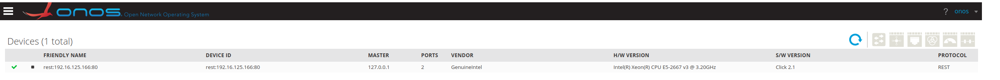
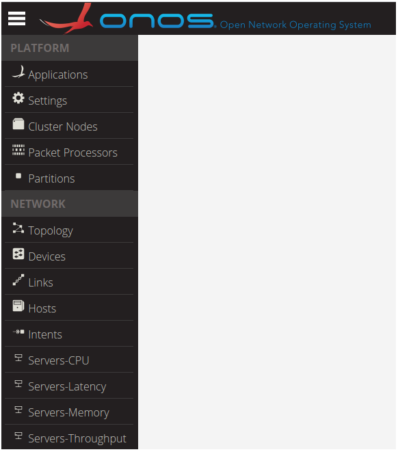
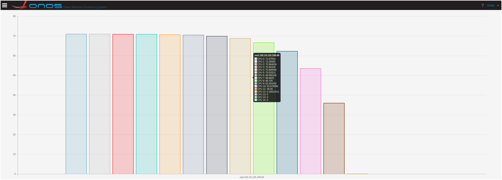

# Server Device Driver Tutorial

# Overview

This tutorial describes how ONOS manages resources, such as Central Processing Units (CPUs), CPU caches, main memory, and Network Interface Cards (NICs), on commodity servers.

# Contributors

| Name | Organization | Role | Email |
| --- | --- | --- | --- |
| Georgios P. Katsikas | KTH Royal Institute of Technology & UBITECH | Post Doctoral Researcher | [katsikas@kth.se](mailto:katsikas@kth.se) |
| Tom Barbette | KTH Royal Institute of Technology | Post Doctoral Researcher | [barbette@kth.se](mailto:barbette@kth.se) |

## Table of Contents

# Controller Side

The ONOS control plane is extended with the [server device driver](https://github.com/opennetworkinglab/onos/tree/master/drivers/server), which is part of the ONOS drivers sub-system.

The server device driver exploits ONOS's REST-based Southbound Controller (i.e., RestSBController) to register server devices as REST-based devices.

As such, every commodity server registered to ONOS (through the server device driver) is represented as a RestServerSBDevice, which extends ONOS's RestSBDevice.

The extensions of RestServerSBDevice are related to the CPU, CPU cache, main memory, and NIC resources present in commodity servers (but potentially not present in other REST-based devices).

The server device driver provides services to the [Metron control plane application](https://github.com/gkatsikas/onos/tree/metron-ctrl/apps/metron), which uses the ONOS northbound interface to translate JSON-based NFV service chain

descriptions to **real code** that can be deployed on commodity servers through the server device driver. The next section describes the software module that runs on the server-side;

this module interacts with the server device driver in order to realize the controller's instructions.

# Server Side

At the server side we need a process that is able to communicate with the server device driver using a REST-based channel (i.e., HTTP messages).

A complete implementation of the data plane side of a server device can be found [here](https://github.com/tbarbette/fastclick/tree/metron).

# Communication Protocol

In this section we present the communication protocol between the server device driver (control plane) and a commodity server (data plane).

## Server Device Registration

First, each server must "register" with the controller using the [onos-netcfg](https://github.com/opennetworkinglab/onos/blob/a7be50dc8856d223d49ef3157f763461cade2a8c/tools/package/runtime/bin/onos-netcfg) script as follows:

|  |
| --- |
| `onos-netcfg <ONOS-IP> device-description.json` |

Assuming that the IP address of the server is 192.168.1.1 and the server is equipped with an Intel Xeon E5-2667 v3 processor, an example JSON file "device-description.json" is provided below:

```
{  
    "devices":
```

```
    {  
        "rest:192.168.1.1:80":
```

```
        {  
            "rest":
```

```
            {  
                "username": "server",  
                "password": "",  
                "ip": "192.168.1.1",  
                "port": 80,  
                "protocol": "http",  
                "url": "",  
                "testUrl": "",  
                "manufacturer": "GenuineIntel",  
                "hwVersion": "Intel(R) Xeon(R) CPU E5-2667 v3 @ 3.20GHz",  
                "swVersion": "Click 2.1"  
            },  
            "basic":
```

```
            {  
                "driver": "rest-server"  
            }  
        }  
    }  
}
```

## Server Device Handshaker

Once the server agent is invoked it will automatically try to connect to the controller.

However, the driver allows explicit connect and disconnect messages.

To connect to a server agent you must issue the following HTTP post request:

|  |
| --- |
| `curl -X POST --data 'connect' --header "Content-Type: application/json" http://serverIp/metron/server_connect` |

To disconnect from a server agent you must issue the following HTTP post request:

|  |
| --- |
| `curl -X POST --data 'disconnect' --header "Content-Type: application/json" http://serverIp/metron/server_disconnect` |

## Controller Configuration

The server device driver can monitor/modify the controller's information on a server on the fly.

To get the associated controller of a certain server, one could issue the following HTTP GET command:

|  |
| --- |
| `curl -X GET --header "Content-Type: application/json" http://serverIp/metron/controllers` |

An example response follows:

```
{  
  
    "controllers":  
    [  
        {  
            "ip":"192.16.125.167",  
            "port":80,  
            "type":"tcp"  
        }  
    ]  
}  
  
A similar result could be achieved using the ONOS CLI as follows:
```

|  |
| --- |
| `onos:device-controllers rest:serverIp:serverPort` |

To set a (set of) controller(s) to a certain server, one could issue the following HTTP POST command:

|  |
| --- |
| `curl -X POST --data '{"controllers":[{"ip":"192.168.125.7","port":80,"type":"tcp"},{"ip":"192.168.125.8","port":80,"type":"tcp"}]}' --header "Content-Type: application/json" http://serverIp/metron/controllers` |

If the command succeeds it returns: success

A similar result could be achieved using the ONOS CLI as follows:

|  |
| --- |
| `onos:device-controllers rest:serverIp:serverPort tcp:192.168.125.7:80 tcp:192.168.125.8:80` |

Finally, to delete a (set of) controller(s) from a server, one could issue an HTTP DELETE command to the resource 'delete\_controllers' or an ONOS CLI command as follows:

|  |
| --- |
| `onos:device-setcontrollers --remove rest:serverIp:serverPort tcp:192.168.125.7:80 tcp:192.168.125.8:80` |

## Server System Operations

The driver supports a system-related operation which returns the time of the server as follows:

|  |
| --- |
| `curl -X GET --header "Content-Type: application/json" http://serverIp/metron/server_time` |

An example response follows:

```
{  
    "time":1591261221344620712  
}  
  
A similar result could be achieved using the ONOS CLI as follows:
```

|  |
| --- |
| `onos:device-time rest:serverIp:serverPort` |

A reboot operation is also offered by this ONOS behavior, but the server driver does not implement it.

## Server Device Discovery

Upon a successful registration of your server device, the server device driver issues resource discovery commands to the server in order to discover:

* the CPUs available on this server as well as their statistics;
* the CPU cache hierarchy of the server;
* the main memory modules of the server along with relevant statistics;
* the ports (i.e., NICs) available on this server as well as their statistics; and
* any flow rule entries installed in this server's NIC(s).

The resource discovery command issued by the device driver hits the following resource path on the server:

|  |
| --- |
| `curl -X GET --header "Content-Type: application/json" http://serverIp/metron/server_resources` |

A server with 2 Intel CPU cores in one socket, 16 GB of DDR4 DRAM, and a single-port Mellanox 100 GbE NIC might provide the following response:

```
{  
    "id":"metron:server:000001",  
    "serial":"4Y6JZ42",  
    "manufacturer":"GenuineIntel",  
    "hwVersion":"Intel(R) Xeon(R) CPU E5-2667 v3 @ 3.20GHz",  
    "swVersion":"Click 2.1",  
    "cpus":  
    [  
        {  
            "physicalId":0,  
            "logicalId":0,  
            "socket":0,  
            "vendor":"GenuineIntel",  
            "frequency":3200  
        },  
        {  
            "physicalId":1,  
            "logicalId":1,  
            "socket":0,  
            "vendor":"GenuineIntel",  
            "frequency":3200  
        }  
    ],  
    "cpuCacheHierarchy":  
    {  
        "sockets": 1,  
        "cores": 2,  
        "levels": 3,  
        "cpuCaches":  
        [  
            {  
                "vendor": "GenuineIntel",  
                "level": "L1",  
                "type": "Data",  
                "policy": "Set-Associative",  
                "sets": 64,  
                "ways": 8,  
                "lineLength": 64,  
                "capacity": 32768,  
                "shared": 0  
            },  
            {  
                "vendor": "GenuineIntel",  
                "level": "L1",  
                "type": "Instruction",  
                "policy": "Set-Associative",  
                "sets": 64,  
                "ways": 8,  
                "lineLength": 64,  
                "capacity": 32768,  
                "shared": 0  
            },  
            {  
                "vendor": "GenuineIntel",  
                "level": "L2",  
                "type": "Data",  
                "policy": "Set-Associative",  
                "sets": 512,  
                "ways": 8,  
                "lineLength": 64,  
                "capacity": 262144,  
                "shared": 0  
            },  
            {  
                "vendor": "GenuineIntel",  
                "level": "L3",  
                "type": "Data",  
                "policy": "Set-Associative",  
                "sets": 16384,  
                "ways": 20,  
                "lineLength": 64,  
                "capacity": 20971520,  
                "shared": 1  
            }  
        ]  
    },  
    "memoryHierarchy":  
    {  
        "modules":  
        [  
            {  
                "type": "DDR4",  
                "manufacturer": "00CE00B300CE",  
                "serial": "40078A0C",  
                "dataWidth": 64,  
                "totalWidth": 72,  
                "capacity": 16384,  
                "speed": 2133,  
                "speedConfigured": 2133  
            }  
        ]  
    },  
    "nics":  
    [  
        {  
            "name":"fd0",  
            "id":0,  
            "vendor":"Unknown",  
            "driver":"net_mlx5",  
            "speed":"100000",  
            "status":"1",  
            "portType":"fiber",  
            "hwAddr":"50:6B:4B:43:88:CB",  
            "rxFilter":["flow"]  
        }  
    ]  
}
```

Note that the unit of frequency field in each CPU is in MHz, while the unit of the speed field in each NIC is in Mbps.

To indicate that a NIC is active, one must set the status field to 1.

Also, each server must advertise a list of ways with which its NIC(s) can be programmed.

This is done by filling out a list of strings in the rxFilter field of each NIC.

Currently, the server device driver supports 4 programmability modes as follows:

* **flow**: Refers to the Flow Dispatcher (e.g., [Intel's Flow Director](https://software.intel.com/en-us/articles/setting-up-intel-ethernet-flow-director)) component of modern NICs following the format of [DPDK's Flow API](https://doc.dpdk.org/guides/prog_guide/rte_flow.html). In this mode the server device driver can send explicit flow rules to a server's NIC(s) in order to perform traffic classification (e.g., match the values of a packet's header field), modification (e.g., drop a packet), and dispatching (e.g., place a packet into a specific hardware queue associated with a CPU core)
* **mac**: Refers to the Medium Access Control (MAC)-based Virtual Machine Device queues (VMDq) (e.g., [Intel's VMDq](https://www.intel.com/content/www/us/en/virtualization/vmdq-technology-paper.html)) component of modern NICs. In this mode, a server associates a set of (virtual) MAC addresses with a set of CPU cores. Input packets' destination MAC address field is matched against these values and upon a successful match, the packet is redirected to the respective CPU core.
* **vlan**: Refers to the Virtual Local Area (VLAN) identifier (ID)-based VMDq (e.g., [Intel's VMDq](https://www.intel.com/content/www/us/en/virtualization/vmdq-technology-paper.html)) component of modern NICs. In this mode, a server associates a set of VLAN IDs with a set of CPU cores. Input packets' VLAN ID field is matched against these values and upon a successful match, the packet is redirected to the respective CPU core.
* **rss**: Refers to the Receive-Side Scaling (RSS) (e.g., [Intel's RSS](https://www.intel.com/content/dam/support/us/en/documents/network/sb/318483001us2.pdf)) component of modern NICs. In this mode, the server's NIC applies a hash function to certain header field values of incoming packets, in order to identify the CPU core that is going to undertake the processing of each packet.

In the example above the server advertised Flow Dispatcher as a candidate mode for packet dispatching.

## Server Device Monitoring

Once a server's resources are properly discovered by the server device driver, periodic CPU, main memory, and NIC monitoring of these resources takes place.

The CPU, main memory, and NIC monitoring command issued by the device driver hits the following resource path on the server:

|  |
| --- |
| `curl -X GET --header "Content-Type: application/json" http://serverIp/metron/server_stats` |

A server with 2 Intel CPU cores, 16 GB of DDR4 DRAM, and a single-port Mellanox 100 GbE NIC might provide the following response:

```
{  
     "busyCpus":2,  
     "freeCpus":0,  
     "cpus":  
     [  
         {  
             "id":0,  
             "load":0,  
             "queue":0,  
             "busy":true,  
             “throughput”:  
             {  
                 “average”: 5000,  
                 “unit”: “mbps  
             },  
             “latency”:  
             {  
                 “min”: 5000,  
                 “median”: 6000,  
                 “max”: 7000,  
                 “unit”: “ns”  
             }  
         },  
         {  
             "id":1,  
             "load":0,  
             "queue":1,  
             "busy":true,  
             “throughput”:  
             {  
                 “average”: 4000,  
                 “unit”: “mbps  
             },  
             “latency”:  
             {  
                 “min”: 5500,  
                 “median”: 6100,  
                 “max”: 7400,  
                 “unit”: “ns”  
             }  
        },
```

```
    ],  
    "memory":  
    {  
        "unit": "kBytes",  
        "used": 8388608,  
        "free": 8388608,  
        "total": 16777216  
    },
```

```
    "nics":  
    [
```

```
        {  
            "name":"fd0",  
            "id":0,  
            "rxCount":"1000",  
            "rxBytes":"64000",  
            "rxDropped":"0",  
            "rxErrors":"0",  
            "txCount":"1000",  
            "txBytes":"64000",  
            "txErrors":"0"  
        },  
    ]  
}
```

Note that throughput and latency statistics per core are optional fields.

## NIC Rule Installation

A server with NICs in mode "flow" allows the server device driver to manage its rules.

To install a NIC rule on a server's NIC with instance name fd0, associated with CPU core 0, the device driver issues the following HTTP POST command to the server:

|  |
| --- |
| `curl -X POST --data '{"rules":[{"id":"5057dd63-93ea-42ca-bb14-8a5e37e214da", "rxFilter": {"method":"flow"}, "nics": [{"name":"fd0", "cpus": [{"id":0, "rules": [{ "id": 54324671113440126, "content":"ingress pattern eth type is 2048 \/ src is 192.168.100.7 dst is 192.168.1.7 \/ udp src is 53 \/ end actions queue index 0 \/ end"}]}]}]}]}' --header "Content-Type: application/json" http://serverIp/metron/rules` |

```
For your convenience the same rule is visualized below in a more user-friendly JSON format:  
{
```

```
    "rules":
```

```
    [
```

```
        {
```

```
            "id": "5057dd63-93ea-42ca-bb14-8a5e37e214da",
```

```
            "rxFilter":
```

```
            {
```

```
                "method": "flow"
```

```
            },
```

```
            "nics":
```

```
            [
```

```
                {
```

```
                    "name": "fd0",
```

```
                    "cpus":
```

```
                    [
```

```
                        {
```

```
                            "id":0,
```

```
                            "rules":
```

```
                            [
```

```
                                {
```

```
                                    "id": 54043196136729470,
```

```
                                    "content":"ingress pattern eth type is 2048 / src is 192.168.100.7 dst is 192.168.1.7 / udp src is 53 / end actions queue index 0 / count / end"
```

```
                                }
```

```
                            ]
```

```
                        }
```

```
                    ]
```

```
                }
```

```
            ]
```

```
        }
```

```
    ]
```

```
}
```

Note that the "content" field contains a rule (with unique ID 54043196136729470) that follows the [DPDK Flow API](https://doc.dpdk.org/guides/prog_guide/rte_flow.html), as the NIC on this server is bound to a DPDK driver.

The example rule matches packets with source IP address 192.168.100.7, destination IP address 192.168.1.7, and source UDP port 53.

The action of this rule redirects the matched packets to hardware queue with index 0.

This queue is associated with CPU core 0, as indicated by the "id" field in the "cpus" attribute.

## NIC Rule Monitoring

The server device driver also performs periodic NIC rule monitoring, for those NICs in mode "flow".

The NIC rule monitoring command issued by the device driver hits the following resource path on the server:

|  |
| --- |
| `curl -X GET --header "Content-Type: application/json" http://serverIp/metron/rules` |

A server with 1 NIC rule in NIC with name fd0 (associated with CPU core 0) might respond as follows:

```
{  
    "rules":  
    [  
        {  
            "id":"5057dd63-93ea-42ca-bb14-8a5e37e214da",  
            "rxFilter":
```

```
            {  
                "method":"flow"  
            },  
            "nics":  
            [  
                {  
                    "name":"fd0",  
                    "cpus":  
                    [  
                        {  
                            "id":0,  
                            "rules":  
                            [  
                                {  
                                    "id":54043196136729470,
```

```
                                    "content":"ingress pattern eth type is 2048 / ipv4 src is 192.168.100.7 dst is 192.168.1.7 / udp src is 53 / end actions queue index 0 / end"  
                                }  
                            ]  
                        }  
                    ]  
                }  
            ]  
        }  
    ]
```

}

## NIC Rule Deletion

To delete the above rule (once it has successfully been installed) with unique ID 54043196136729470, the server device driver needs to hit the following path:

|  |
| --- |
| `HTTP DELETE: http://serverIp/metron/rules_delete/`54043196136729470 |

To delete multiple rules at once, you should append a comma-separated rule IDs as follows:

|  |
| --- |
| `HTTP DELETE: http://serverIp/metron/rules_delete/54043196136729470,54043196136729471` |

## NIC Table Statistics

To retrieve statistics related to a server's NIC tables, the server device driver needs to hit the following path:

|  |
| --- |
| `curl -X GET --header "Content-Type: application/json" http://serverIp/metron/rules_table_stats` |

```
A server with 2 NICs and 3 rules installed in the first NIC might respond as follows:  
{  
    "nics":  
    [  
        {  
            "id":0,  
            "table":  
            [  
                {  
                    "id":0,  
                    "activeEntries":3,  
                    "pktsLookedUp":0,  
                    "pktsMatched":0  
                }  
            ]  
        }  
        {  
            "id":1,  
            "table":  
            [  
                {  
                    "id":0,  
                    "activeEntries":0,  
                    "pktsLookedUp":0,  
                    "pktsMatched":0  
                }  
            ]  
        }  
    ]  
}
```

## NIC Port Administration

To enable a NIC port, the server device driver needs to issue the following HTTP post command to a server:

|  |
| --- |
| `curl -X POST --data '{"port":0, "portStatus":"enable"}' --header "Content-Type: application/json" http://serverIp/metron/nic_ports` |

If the command succeeds it returns: success

A similar result could be achieved using the ONOS CLI as follows:

|  |
| --- |
| `onos:portstate rest:serverIp:serverPort nicID enable` |

Similarly, to disable a NIC port, the server device driver needs to issue the following HTTP post command to a server:

|  |
| --- |
| `curl -X POST --data '{"port":0, "portStatus":"disable"}' --header "Content-Type: application/json" http://serverIp/metron/nic_ports` |

If the command succeeds it returns: success

A similar result could be achieved using the ONOS CLI as follows:

|  |
| --- |
| `onos:portstate rest:serverIp:serverPort nicID disable` |

## NIC Queue Configuration

The server device driver can also provide NIC queue configuration information through the following HTTP GET command:

|  |
| --- |
| `curl -X GET --header "Content-Type: application/json" http://serverIp/metron/nic_queues` |

An example response of a server with 1 100GbE NIC and 2 queues follows:

```
{  
    "nics":  
    [  
        {  
            "id":0,  
            "queues":  
            [  
                {  
                    "id":0,  
                    "type":"MAX",  
                    "maxRate":"100000"  
                },  
                {  
                    "id":1,  
                    "type":"MAX",  
                    "maxRate":"100000"  
                }  
            ]  
        }  
    ]  
}
```

This ONOS behavior also offers two additional methods, i.e., add/delete queue, but the server driver does not implement these methods.

# Server Driver User Interface

Once a server device is registered with ONOS (through the server device driver), the device view of the ONOS UI will visualize this device.

Note that the server device driver currently supports only the legacy ONOS GUI. There is a plan to support GUI2 soon.

An example is shown in the Figure below:



The server device driver will soon provide a User Interface (UI) which will visualize important statistics of commodity servers managed by this driver.

The statistics include per-core CPU utilization, main memory, and optionally throughput and latency. Throughput and latency are optional at the device side, the driver's UI will show zero-initialized values if these statistics are not advertised by the devices.

To access the server device driver's UI click on the Menu button (top left corner on the ONOS UI), then select one of the tabs "Servers-CPU", "Servers-Latency", "Servers-Memory", or "Servers-Throughput"  at the bottom of the list in Section "Network" as shown in the figure below:



The figure below visualizes the CPU utilization of an example commodity server (with device ID rest:192.16.125.166:80) with 16 CPU cores. In this example figure, CPU cores 0-12 exhibit some load, as shown in the y-axis (load ranges from 0 to 100%).



The figure below visualizes the main memory utilization of an example commodity server (with device ID rest:192.16.125.168:80).


# Research Behind the Server Device Driver

The server device driver was implemented as part of the [Metron](https://www.usenix.org/system/files/conference/nsdi18/nsdi18-katsikas.pdf) research project, which was published at the [15th USENIX Symposium on Networked Systems Design and Implementation (NSDI ’18)](https://www.usenix.org/conference/nsdi18).

Metron realizes NFV service chains at the speed of the underlying hardware.

[Metron's control plane](https://github.com/gkatsikas/onos/tree/metron-ctrl/apps/metron) is implemeted as an ONOS app, which uses the server device driver to manage chained packet processing pipelines (also known as chained network functions or service chains) running on commodity servers.

[Metron's data plane](https://github.com/tbarbette/fastclick/tree/metron) extends [FastClick](https://github.com/tbarbette/fastclick), which in turn uses [DPDK](https://dpdk.org/) as an underlying high performance network I/O subsystem.

If you use the server device driver or Metron in your research, please cite our paper as follows:

```
@inproceedings{katsikas-metron.nsdi18,
	author       = {Katsikas, Georgios P. and Barbette, Tom and Kosti\'{c}, Dejan and Steinert, Rebecca and Maguire Jr., Gerald Q.},
	title        = {{Metron: NFV Service Chains at the True Speed of the Underlying Hardware}},
	booktitle    = {15th USENIX Conference on Networked Systems Design and Implementation (NSDI 18)},
	series       = {NSDI'18},
	year         = {2018},
	isbn         = {978-1-931971-43-0},
	pages        = {171--186},
	numpages     = {16},
	url          = {https://www.usenix.org/system/files/conference/nsdi18/nsdi18-katsikas.pdf},
	address      = {Renton, WA},
	publisher    = {USENIX Association}
}
```
