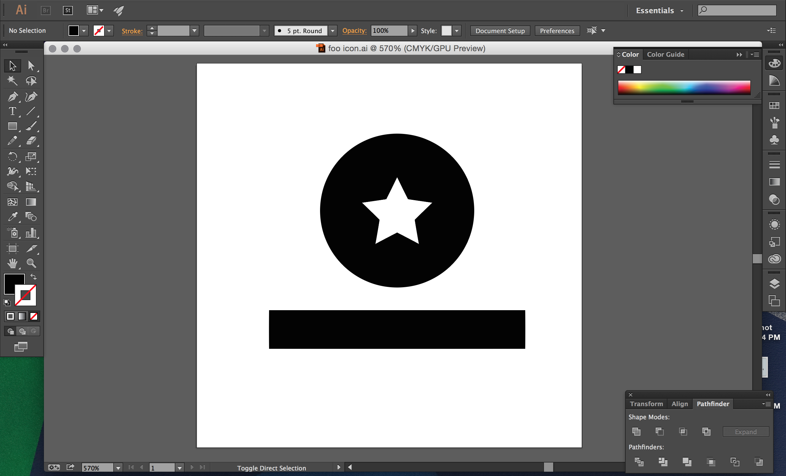
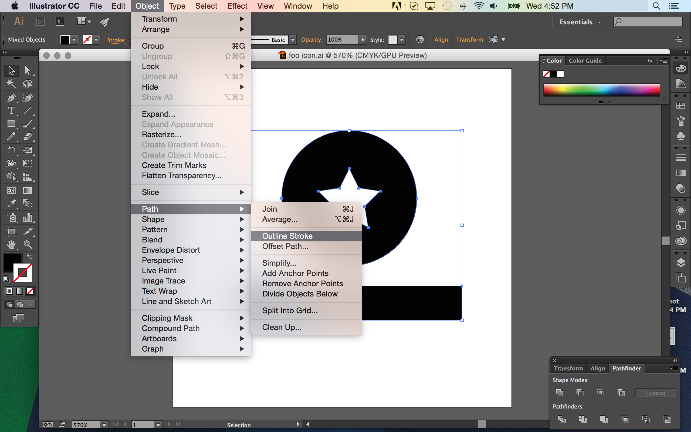
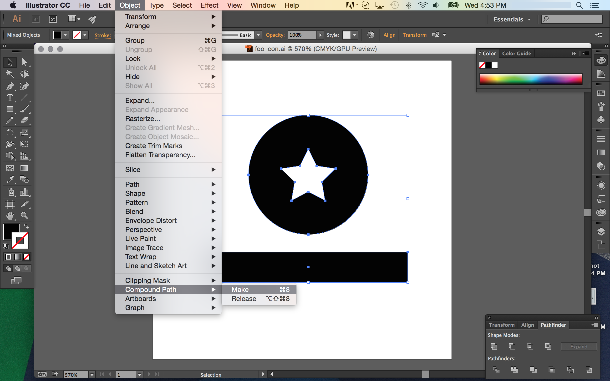
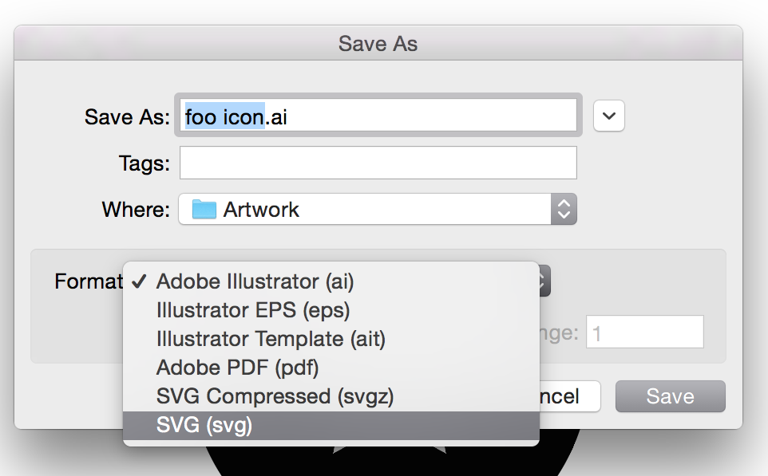
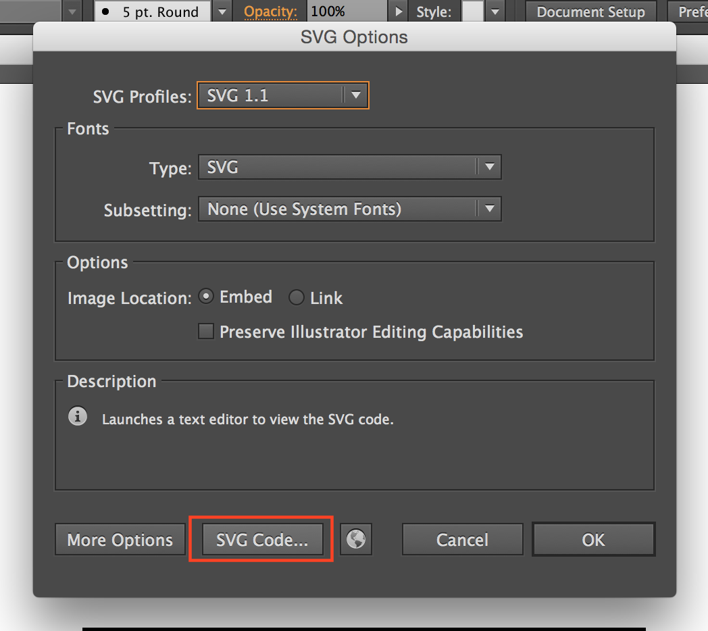
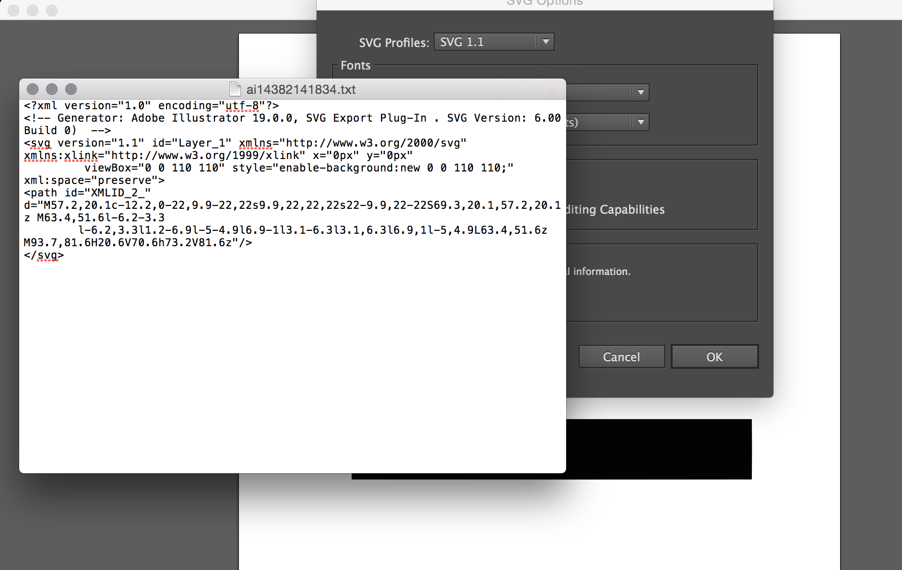
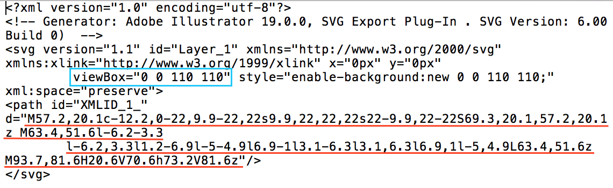
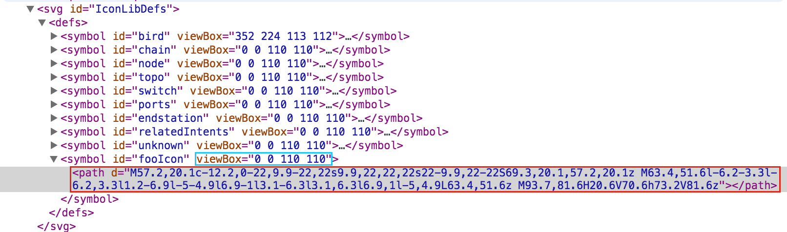
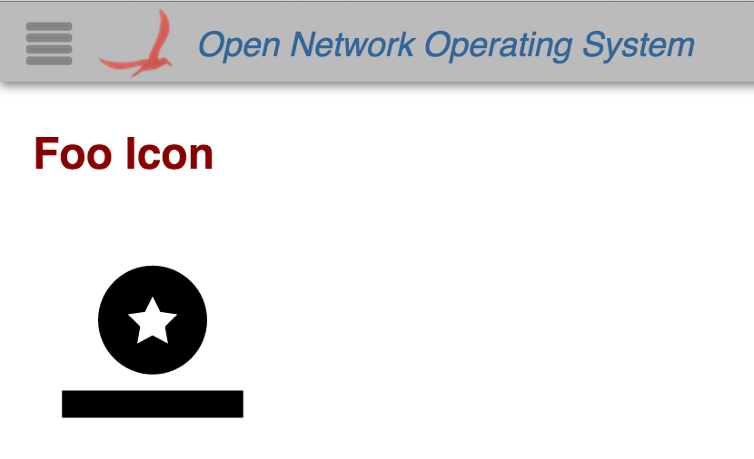

# UI View - Defining a Custom Glyph

Overview

The GUI uses glyphs in many of its views. Glyphs are an abstraction of the [SVG path element](http://www.w3.org/TR/SVG/paths.html) and are useful because they can scale without any loss of quality. The ONOS GUI has a [Glyph API](../../guides/developer-guide/appendix-f-web-ui-framework-libraries/web-ui-client-side-framework-libraries/ui-service-glyphservice.md) for installing and using glyphs, which we will be referencing in this tutorial. By the end of this tutorial, you will be able to create, install, and use your own custom glyph in your application.

See also, information on [creating your own application views](../web-ui-tutorials.md).

# Creating your Glyph

Before you can use a glyph that doesn't come with the ONOS GUI, you need to create it.

## Path Data

The ONOS GUI uses [path data](http://www.w3.org/TR/SVG/paths.html) defined in the [defs element](https://developer.mozilla.org/en-US/docs/Web/SVG/Element/defs) for all of its glyphs.

*The ONOS GUI only uses single paths – not rectangles, strokes, circles, or anything else.*One path definition has to be used for the entire glyph. (Obtaining path data is covered later.)

The structure of SVG path data is below.

```
<svg>
	<defs>
		<symbol id="play" viewBox="0 0 10 10">
			<path d="M2.5,2l5.5,3l-5.5,3z"></path>
		</symbol>
	</defs>
</svg>
```

The string after `d=` in the path element is the definition of the path within the given symbol's `viewBox`. It specifies how this element is to be drawn inside of the `viewBox`. See [this tutorial](http://sarasoueidan.com/blog/svg-coordinate-systems/) about the differences between different viewBox sizes.

## Creating a Single-Path Glyph in Adobe Illustrator

A great way to make a single-path glyph is in Adobe Illustrator. If you are designing your own glyph and don't have an SVG copy of it yet, you can get one.

First, create your glyph. ***All glyphs should be drawn in a square canvas.*** Make sure shapes are "cut out" of other shapes. Below it looks like there is a white star on a circle, but it is actually a circle with the star shape cut out of it, using the "minus front" option in the Pathfinder menu.



If you have any strokes that need to be preserved, you can go to the Object --> Path --> Outline Stroke option to turn your strokes into shapes for paths.



In order to make your glyph all one path, select the entire image with Cmd-A or Ctrl-A and then go to Object --> Compound Path --> Make (or Cmd-8). Now your glyph is all one path.

> Make sure you do this after you are done editing it – this flattens the image!



Now, you can save your glyph. Make sure you save it as an SVG.



When you press "Save" it will bring up a dialogue window for the settings for your SVG, seen below. You can click "More Options" to set how much decimal precision you want, and other options. The defaults should be fine though, so you can press "SVG Code..." which will open up the SVG code for your glyph in a text editor.



Save this text file somewhere memorable, since you'll need it for the next section.



## Getting Path Data from SVGs

You can get path data from any SVG. SVG files can be opened with text editors, and if the glyph is already **one path**, then you can just get the data directly from the SVG.



Underlined in red is the single path used in for the glyph, and the viewBox is outlined in blue. Save this text file in a memorable place, because you will need the path and viewBox strings later.

# Installing your Glyph

Now you have the two pieces you need (the path data and the viewBox) to add a glyph to the library. Installing a glyph for use has three stages:

1. Registering
2. Loading
3. Using

> I **strongly** recommend you do all of these stages in an [Angular directive](https://docs.angularjs.org/guide/directive), since they manipulate the DOM.

## Registering the Glyph with the Glyph Library

First, you need an object with key-value pairs for the viewbox and path data. Since we are just registering one glyph, we will use the [registerGlyphs](../../guides/developer-guide/appendix-f-web-ui-framework-libraries/web-ui-client-side-framework-libraries/ui-service-glyphservice.md) function, where we define a custom viewbox for each glyph. ([registerGlyphSet](../../guides/developer-guide/appendix-f-web-ui-framework-libraries/web-ui-client-side-framework-libraries/ui-service-glyphservice.md) would also work but since we are only registering one glyph it makes more sense to use the other function.)

```
var fooData = {
	// the viewbox is the same name as the icon, prefixed with an underscore:
	_fooIcon: '0 0 110 110',
	// the path data (concatenated so it fits nicely on the screen)
	fooIcon: 'M57.2,20.1c-12.2,0-22,9.9-22,22s9.9,22,' +
			'22,22s22-9.9,22-22S69.3,20.1,57.2,20.1z M63.4,51.6l-' +
			'6.2-3.3l-6.2,3.3l1.2-6.9l-5-4.9l6.9-1l3.1-6.3l3.1,' +
			'6.3l6.9,1l-5,4.9L63.4,51.6z M93.7,81.6H20.6V70.6h73.' +
			'2V81.6z'
};
```

Now that we have the object containing our glyph, we can load it using the [registerGlyphs](../../guides/developer-guide/appendix-f-web-ui-framework-libraries/web-ui-client-side-framework-libraries/ui-service-glyphservice.md) function. Below is shown the directive I am using to the load the glyph.

```
angular.module('ovSample', [])
// we inject the GlyphService
.directive('fooIcon', ['GlyphService', function (gs) {
    return {
        restrict: 'A', // this directive is an attribute
        link: function (scope, elem, attrs) {
            // define our glyph
			var fooData = {
                _fooIcon: '0 0 110 110',
                fooIcon: 'M57.2,20.1c-12.2,0-22,9.9-22,22s9.9,22,' +
                '22,22s22-9.9,22-22S69.3,20.1,57.2,20.1z M63.4,51.6l-' +
                '6.2-3.3l-6.2,3.3l1.2-6.9l-5-4.9l6.9-1l3.1-6.3l3.1,' +
                '6.3l6.9,1l-5,4.9L63.4,51.6z M93.7,81.6H20.6V70.6h73.' +
                '2V81.6z'
            };
			// register our glyph data
            gs.registerGlyphs(fooData, false);
        }
    };
}]);
```

Note that we are giving the `fooData` object, as well as specifying `false` for the overwrite parameter. This means that all of the other glyphs defined in the GUI will be preserved upon registering the new glyph.

## Loading the Glyph Definition

Now that we have registered the glyph, we need to load the glyph into the <defs> element so that it can be used as a symbol.

To do this, add this line after `gs.registerGlyphs(fooData, false);`

```
gs.loadDefs(d3.select('defs'), ['fooIcon'], true);
```

This line is selecting the globally shared defs element to load the glyph into and then actually loading it. The second argument is an array of the names of the glyphs that we want to load, and `true` specifies that we want to preserve the old symbol definitions upon loading the new glyphs.

This will create a symbol definition in the defs element, as shown below.



Notice that both the viewBox and the path data have been loaded as a symbol.

## Using your Glyph

Now that we have our glyph loaded as a symbol, we can use it where ever we want with [addGlyph](../../guides/developer-guide/appendix-f-web-ui-framework-libraries/web-ui-client-side-framework-libraries/ui-service-glyphservice.md).

```
gs.addGlyph(d3.select(elem[0]), 'fooIcon', 150);
```

The base addGlyph takes three arguments – the SVG in which you want the glyph to be added to, the name of the glyph, and the size of one side in pixels (remember that all glyphs are square).

In this example, we have a directive that is the attribute of an SVG element, so we are selecting the element the directive is on to add the glyph to.

# Putting it all Together

Here's what your final custom glyph code may look like:

## HTML

```
<div id="ov-sample">
    <h2>Foo Icon</h2>
    <br>
    <svg foo-icon></svg>
</div>
```

## Javascript

```
angular.module('ovSample', [])
    .directive('fooIcon', ['GlyphService', function (gs) {
        return {
            restrict: 'A',
            link: function (scope, elem, attrs) {
                var fooData = {
                    _fooIcon: '0 0 110 110',
                    fooIcon: 'M57.2,20.1c-12.2,0-22,9.9-22,22s9.9,22,' +
                    '22,22s22-9.9,22-22S69.3,20.1,57.2,20.1z M63.4,51.6l-' +
                    '6.2-3.3l-6.2,3.3l1.2-6.9l-5-4.9l6.9-1l3.1-6.3l3.1,' +
                    '6.3l6.9,1l-5,4.9L63.4,51.6z M93.7,81.6H20.6V70.6h73.' +
                    '2V81.6z'
                };
                gs.registerGlyphs(fooData, false);
                gs.loadDefs(d3.select('defs'), ['fooIcon'], true);
                gs.addGlyph(d3.select(elem[0]), 'fooIcon', 150);
            }
        };
    }]);
```

## Final Result



Your icon can be styled using CSS. It is a <use> element classed as "glyph".

Tada!
