# Web UI Tutorial - Creating a Custom View

# Overview

An application can create their own custom views and have them integrated into the ONOS web GUI. This tutorial walks you through the process of developing such a view. A fictitious company, *"Meowster, Inc."* is used throughout the examples. This tutorial assumes you have created a top level directory and changed into it:

```
$ mkdir meow
$ cd meow
```

We also assume that your environment has sourced in the ONOS tools (scripts), as described [here](../../guides/administrator-guide/installing-and-running-onos.md).

# Application Set Up

The quickest way to get started is to use the maven archetypes to create the application source directory structure and fill it with template code. (More details can be [found here](../template-application-tutorial.md)). We are going to create a sample application, which we will call, unsurprisingly, "sample":

(0) Create a working directory

```
$ mkdir sample
$ cd sample
```

(1) Create the main application

```
$ onos-create-app app org.meowster.app.sample meowster-sample
```

When asked for the version, accept the suggested default: 1.0-SNAPSHOT, and press enter.

When asked to confirm the properties configuration, press enter.

```
groupId: org.meowster.app.sample
artifactId: meowster-sample
version: 1.0-SNAPSHOT
package: org.meowster.app.sample
```

This archetype has laid the base application code down, in a directory named *meowster-sample*. Next we will fold in UI components from an overlay archetype...

(2) Overlay the UI additional components

*Note, the only difference between this command and the last is changing the **app** keyword to **ui**...*

```
$ onos-create-app ui org.meowster.app.sample meowster-sample
```

When asked for the version, accept the suggested default: 1.0-SNAPSHOT, and press enter.

When asked to confirm the properties configuration, press enter.

(3) Modify the *pom.xml* file to correctly label our ONOS application:

```
$ cd meowster-sample
$ vi pom.xml
```

(3a) Change the description:

```
<description>Meowster Sample ONOS App</description>
```

(3b) In the *<properties>* section (just below the description), change the app name and origin:

```
<onos.app.name>org.meowster.app.sample</onos.app.name>
<onos.app.origin>Meowster, Inc.</onos.app.origin>
```

Everything else in the *pom.xml* file should be good to go.

## Import into IntelliJ, if you wish

You can import the application source into *IntelliJ* as a new project*.*

Start by selecting *File --> New --> Project from Existing Sources...*

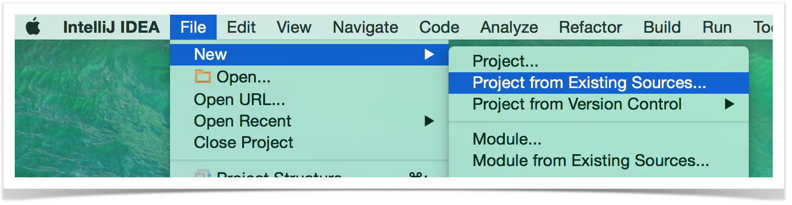

Then navigate to the top level *pom.xml* file and press *OK*:

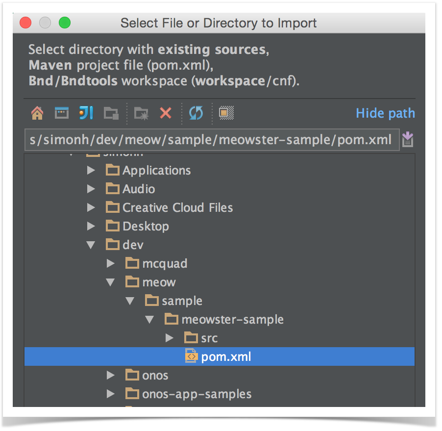

On the next screen, you might wish to checkmark the following two items:

* *Search for projects recursively*
* *Import Maven projects automatically*

...since they are not selected by default.

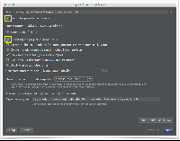

IntelliJ should find the 1.0-SNAPSHOT:

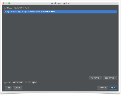

If presented with a choice of Java versions, select 1.8:

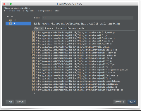

Finally, finish with the name of the project:

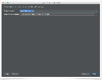

Once the project loads, you should finally see a directory structure like this:

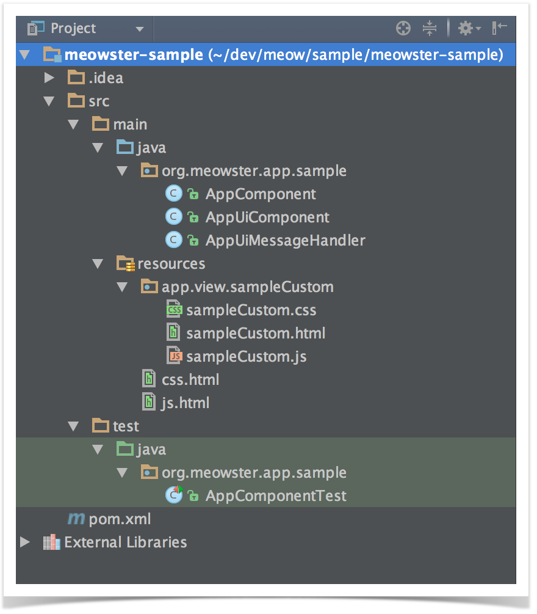

# Building and Installing the App

From the top level project directory (the one with the *pom.xml* file) build the project:

```
$ mvn clean install
```

Note that your application is bundled as an **.oar** (**O**NOS **A**pplication A**R**chive) file in the target directory, and installed into your local maven repository:

```
...
[INFO] Installing /Users/simonh/dev/meow/sample/meowster-sample/target/meowster-sample-1.0-SNAPSHOT.oar to
  /Users/simonh/.m2/repository/org/meowster/app/sample/meowster-sample/1.0-SNAPSHOT/meowster-sample-1.0-SNAPSHOT.oar
...
```

Assuming that you have ONOS running on your local machine, you can install (and activate) the app from the command line:

```
$ onos-app localhost install! target/meowster-sample-1.0-SNAPSHOT.oar
```

You should see some JSON output that looks something like this:

```
{
  "name":"org.meowster.app.sample",
  "id":39,
  "version":"1.0.SNAPSHOT",
  "description":"Meowster Sample ONOS App",
  "origin":"Meowster, Inc.",
  "permissions":"[]",
  "featuresRepo":"mvn:org.meowster.app.sample/meowster-sample/1.0-SNAPSHOT/xml/features",
  "features":"[meowster-sample]",
  "state":"ACTIVE"
}
```

(*Note that the above has been formatted for readability; what you will see will be more smushed together.)*

After refreshing the GUI in your web browser, the navigation menu should have an additional entry:

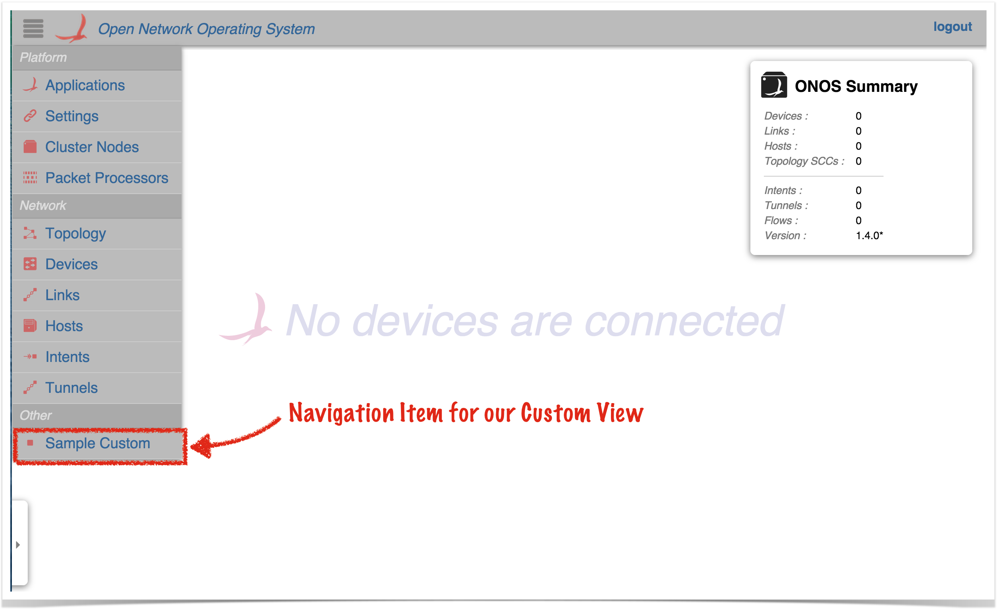

Clicking on this item should navigate to the injected sample custom view:

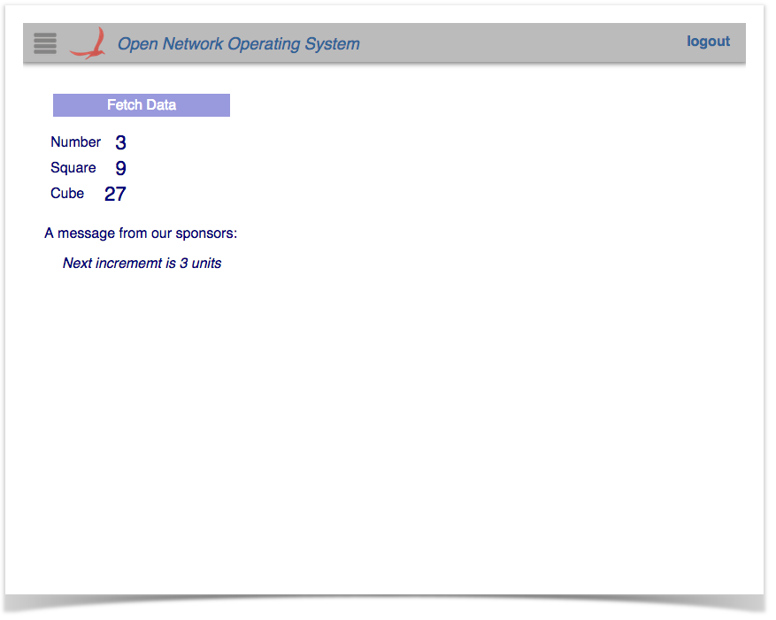

Clicking on the *Fetch Data* button with the mouse, or pressing the space-bar, will update the view with new data.

Note that pressing slash (/) will display the "Quick Help" panel:

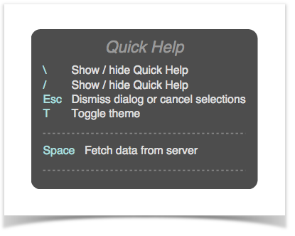

As you will see in the code (in a later section), we created a key-binding with the space-bar (to fetch data); it is thus listed in the quick help panel.

Also of note: pressing the ***T*** key will toggle the "theme" between *light* and *dark*:

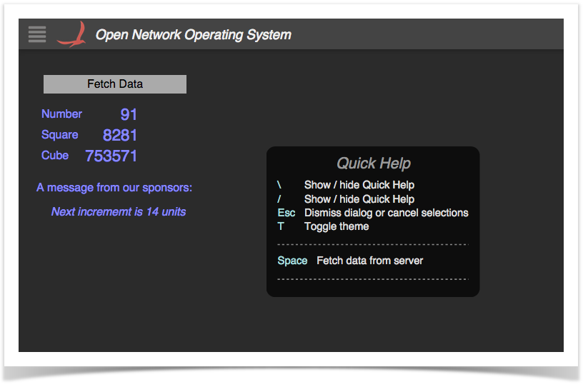

Now that we have our application built and our custom view installed, let's take a look at the code that makes this happen...

# Custom Views in Brief

To create a custom view requires both client-side and server-side resources; the client-side consists of HTML, JavaScript, and CSS files, and the server-side consists of Java classes.

* The HTML file defines the structure of the custom view, and indicates to Angular where values need to be injected.
* The JavaScript file creates the Angular controller for the view, and defines code that drives the view.
* The CSS file defines custom styling.
* The server-side Java code:
  + registers the view with the GUI framework
  + receives requests from the client, fetches data, and sends the information back to the client

# Description of Template Files - Server Side

This section gives a brief introduction to the files generated by the archetype.

## AppComponent

This is the base Application class and may be used for non-UI related functionality (not addressed in this tutorial).

## AppUiComponent

This is the base class for UI functionality. The salient features to note are introduced below.

(1) Reference to the [UiExtensionService](https://github.com/opennetworkinglab/onos/blob/master/core/api/src/main/java/org/onosproject/ui/UiExtensionService.java):

```
@Reference(cardinality = ReferenceCardinality.MANDATORY_UNARY)
protected UiExtensionService uiExtensionService;
```

Provides access to the *UI Extension Service*, so that we can register our "view".

(2) List of application view descriptors, defining which categories the views appear under in the GUI navigation pane, the internal identifiers for the views, and the corresponding display text:

```
private static final String VIEW_ID = "sampleCustom";
private static final String VIEW_TEXT = "Sample Custom";
...
private final List<UiView> uiViews = ImmutableList.of(
        new UiView(UiView.Category.OTHER, VIEW_ID, VIEW_TEXT)
);
```

Note that our application only contributes a single view, though more could be defined here if needed.

(3) Declaration of a [UiMessageHandlerFactory](https://github.com/opennetworkinglab/onos/blob/master/core/api/src/main/java/org/onosproject/ui/UiMessageHandlerFactory.java) to generate message handlers on demand. The example factory generates a single handler each time, *AppUiMessageHandler*, described below:

```
private final UiMessageHandlerFactory messageHandlerFactory =
        () -> ImmutableList.of(
                new AppUiMessageHandler()
        );
```

Generally, there should be one message handler for each contributed view.

(4) Declaration of a [UiExtension](https://github.com/opennetworkinglab/onos/blob/master/core/api/src/main/java/org/onosproject/ui/UiExtension.java), configured with the previously declared UI view descriptors and message handler factory:

```
protected UiExtension extension =
        new UiExtension.Builder(getClass().getClassLoader(), uiViews)
                .resourcePath(VIEW_ID)
                .messageHandlerFactory(messageHandlerFactory)
                .build();
```

(5) Activation and deactivation callbacks that register and unregister the UI extension at the appropriate times:

```
@Activate
protected void activate() {
    uiExtensionService.register(extension);
    log.info("Started");
}

@Deactivate
protected void deactivate() {
    uiExtensionService.unregister(extension);
    log.info("Stopped");
}
```

## AppUiMessageHandler

This class extends [UiMessageHandler](https://github.com/opennetworkinglab/onos/blob/master/core/api/src/main/java/org/onosproject/ui/UiMessageHandler.java) to implement code to handle events from the (client-side) sample custom view.

Salient features to note:

(1) implement *[createRequestHandlers()](https://github.com/opennetworkinglab/onos/blob/master/core/api/src/main/java/org/onosproject/ui/UiMessageHandler.java#L75)* to provide request handler implementations for specific event types from our view:

```
@Override
protected Collection<RequestHandler> createRequestHandlers() {
    return ImmutableSet.of(
            new SampleCustomDataRequestHandler()
    );
}
```

There should be a request handler class for each event type generated by our view. In this case we only have to deal with a single event, so we only have one handler.

(2) define *SampleCustomDataRequestHandler* class to handle "sampleCustomDataRequest" events from the client.

```
private static final String SAMPLE_CUSTOM_DATA_REQ = "sampleCustomDataRequest";
...
private final class SampleCustomDataRequestHandler extends RequestHandler {
    private SampleCustomDataRequestHandler() {
        super(SAMPLE_CUSTOM_DATA_REQ);
    }
    ...
}
```

Note that this class extends [RequestHandler](https://github.com/opennetworkinglab/onos/blob/master/core/api/src/main/java/org/onosproject/ui/RequestHandler.java), which defines an abstract *process()* method to be implemented by subclasses.

The constructor takes the name of the event to be handled; at run time, an instance of this handler is bound to the event name, and the *process()* method invoked each time such an event is received from the client.

(3) implement *process()* method:

```
private static final String SAMPLE_CUSTOM_DATA_RESP = "sampleCustomDataResponse";

private static final String NUMBER = "number";
private static final String SQUARE = "square";
private static final String CUBE = "cube";
private static final String MESSAGE = "message";
private static final String MSG_FORMAT = "Next incrememt is %d units";

private long someNumber = 1;
private long someIncrement = 1;
...
 
@Override
public void process(long sid, ObjectNode payload) {
    someIncrement++;
    someNumber += someIncrement;
    log.debug("Computing data for {}...", someNumber);

    ObjectNode result = objectNode();
    result.put(NUMBER, someNumber);
    result.put(SQUARE, someNumber * someNumber);
    result.put(CUBE, someNumber * someNumber * someNumber);
    result.put(MESSAGE, String.format(MSG_FORMAT, someIncrement + 1));
    sendMessage(SAMPLE_CUSTOM_DATA_RESP, 0, result);
}
```

The *process* method is invoked every time a "sampleCustomDataRequest" event is received from the client.

The *sid* parameter (sequence ID) is deprecated.

The *payload* parameter provides the payload of the request event, which in this particular case carries no data.

The method creates and populates an *ObjectNode* instance with data to be (transformed into JSON and) shipped off back to the client.

# Description of Template Files - Client Side

Note that the directory naming convention must be observed for the files to be placed in the correct location when the archive is built. Since our view has the unique identifier "sampleCustom", its client source files should be placed under the directory ***~/src/main/resources/app/view/sampleCustom***.

| ~/src/main/resources/ | app/view/ | sampleCustom/ |
| --- | --- | --- |
| client files | client files for UI views | client files for "sampleCustom" view |

There are three files here:

* *sampleCustom.html*
* *sampleCustom.js*
* *sampleCustom.css*

Note the convention to name these files using the identifier for the view; in this case "sampleCustom".

## sampleCustom.html

This is an HTML snippet for the sample custom view, providing the view's structure. Note that this HTML markup is injected into the Web UI by [Angular](https://docs.angularjs.org/api), to make the view "visible" when the user navigates to it.

Let's describe the different parts of the file in sections...

### Outer Wrapper

```
<!-- partial HTML -->
<div id="ov-sample-custom">
    ...
</div>
```

The outer <div> element defines the contents of our custom "view". It should use a dash-delimited *id* of the internal identifier for the view, prefixed with "ov". So, in our example, *"sampleCustom"* becomes *"ov-sample-custom"*. ("ov" stands for "ONOS view").

### Button Panel

We have defined a <div> to create a "button panel" at the top of the view:

```
<div class="button-panel">
    <div class="my-button" ng-click="getData()">
        Fetch Data
    </div>
</div>
```

Note that we have used Angular's ***ng-click*** attribute in the button <div> to instruct Angular to invoke the *getData()* function (defined on our "scope", see later), whenever the user clicks on the <div>.

### Data Panel

We have defined a <div> to create a "data panel" below the button panel:

```
<div class="data-panel">
    <table>
        <tr>
            <td> Number </td>
            <td class="number"> {{data.number}} </td>
        </tr>
        <tr>
            <td> Square </td>
            <td class="number"> {{data.square}} </td>
        </tr>
        <tr>
            <td> Cube </td>
            <td class="number"> {{data.cube}} </td>
        </tr>
    </table>

    <p>
        A message from our sponsors:
    </p>
    <p>
        <span class="quote"> {{data.message}} </span>
    </p>
</div>
```

Note the use of Angular's double-braces ***{{ }}*** for variable substitution. For example, the expression ***{{data.number}}*** is replaced by the current value of the *number* property of the *data* object stored on our "scope" (see later).

## sampleCustom.js

This file defines the view controller, and provides callback functions to drive the view.

Again, we will examine the different parts of the code in sections:

### Outer Wrapper

An anonymous function invocation is used to wrap the contents of the file, to provide private scope (keeping our variables and functions out of the global scope):

```
// js for sample app custom view
(function () {
    'use strict';

    ...
}()); 
```

### Variables

Variables are declared to hold injected references (console logger, scope, services...), and configuration "constants":

```
// injected refs
var $log, $scope, wss, ks;

// constants
var dataReq = 'sampleCustomDataRequest',
    dataResp = 'sampleCustomDataResponse';
```

Note that the request and response event strings follow the convention of using the view ID as a prefix. This guarantees that our event names will be distinct from those of any other view.

### Defining the Controller

We'll skip over the helper functions for the moment and focus on the controller:

```
angular.module('ovSampleCustom', [])
    .controller('OvSampleCustomCtrl', 
    [ '$log', '$scope', 'WebSocketService', 'KeyService',
 
    function (_$log_, _$scope_, _wss_, _ks_) { 
        ...
    }]);
```

The first line here registers our "ovSampleCustom" module with angular, (the empty array states that our module is not dependent on any other module). Again, note the naming convention in play; the module name should start with "ov" (lowercase) followed by the identifier for our view, in continuing camel-case.

The *controller()* function is invoked on the returned module reference to define our controller. The first argument – "*OvSampleCustomCtrl*" – is the name of our controller. Once again, the convention is to start with "Ov" (uppercase 'O') followed by the identifier for our view (continuing camel-case), followed by "Ctrl". The second argument is an array...

All the elements of the array (except the last) are the names of services to be injected into our controller function at run time. Angular uses these to bind the actual services to the specified parameters of the controller function (the last item in the array).

Inside our controller function, we start by saving injected references inside our closure, so that they are available to other functions:

```
$log = _$log_;
$scope = _$scope_;
wss = _wss_;
ks = _ks_;
```

We also initialize our state; our map of event handlers, and the initial cached "data" from the server.

```
var handlers = {};
$scope.data = {};
```

Next, we need to tell the *WebSocketService* which callback function to invoke when a "sampleCustomDataResponse" event arrives from the server:

```
handlers[dataResp] = respDataCb;
wss.bindHandlers(handlers);
```

The callback function (one of the helper methods we skipped earlier) has the job of setting our scope variable *data* to be the payload of the event, (which is passed in as the first parameter to the function), and then prodding angular to re-process, (so, for example, the {{ }} substitutions get updated with the new data):

```
function respDataCb(data) {
    $scope.data = data;
    $scope.$apply();
}
```

See the [Web Socket Service](../../guides/developer-guide/appendix-f-web-ui-framework-libraries/web-ui-client-side-framework-libraries/ui-service-websocketservice.md) for further details on event handler binding.

Next up, we add our keybindings:

```
addKeyBindings();
```

.. delegating to another of the previously skipped functions:

```
function addKeyBindings() {
    var map = {
        space: [getData, 'Fetch data from server'],
 
        _helpFormat: [
            ['space']
        ]
    };
 
    ks.keyBindings(map);
}
```

The map entries use well-known logical keys to identify the keystroke (in this example 'space' for the space-bar), with a value being a two-element array; the first element is a callback function reference, and the second element is the text to display in the Quick Help panel, for the corresponding key.

The *\_helpFormat* key is a special value that is used by the [Quick Help Service](../../guides/developer-guide/appendix-f-web-ui-framework-libraries/web-ui-client-side-framework-libraries/ui-service-quickhelpservice.md) to lay out the definition of bound keystrokes; each sub-array in the main array is a "column" in the panel; the entries in each sub-array define the order in which the keys are listed.

See the [Key Service](../../guides/developer-guide/appendix-f-web-ui-framework-libraries/web-ui-client-side-framework-libraries/ui-service-keyservice.md) for more information about binding keystrokes to actions, and for further information on the *\_helpFormat* array.

The *getData()* function tells the *WebSocketService* to send the data request event to the server:

```
function getData() {
    wss.sendEvent(dataReq);
}
```

Since no second parameter is provided for the *sendEvent()* call, the web socket service defaults to sending an empty payload along with the event.

Remember the ***ng-click*** attribute in the "button" div in our HTML snippet? Well, here we set the function reference on our scope, to bind to that element's click handler:

```
// custom click handler
$scope.getData = getData;
```

To populate our view the first time it is loaded, we need to send an event to the server explicitly:

```
// get data the first time...
getData();
```

When our view is destroyed (when the user navigates to some other view), we need to do some cleanup:

```
// cleanup
$scope.$on('$destroy', function () {
    wss.unbindHandlers(handlers);
    ks.unbindKeys();
    $log.log('OvSampleCustomCtrl has been destroyed');
});
```

We unbind our event handlers and key bindings, and log a message to the console.

The last thing the controller does when it is initialized is to log to the console:

```
 $log.log('OvSampleCustomCtrl has been created');
```

## sampleCustom.css

The last file in our client-side trio is the stylesheet for the custom view:

Expand source

```
/* css for sample app view */

#ov-sample-custom {
    padding: 20px;
}
.light #ov-sample-custom {
    color: navy;
}
.dark #ov-sample-custom {
    color: #88f;
}

#ov-sample-custom .button-panel {
    margin: 10px;
    width: 200px;
}

.light #ov-sample-custom .button-panel {
    background-color: #ccf;
}
.dark #ov-sample-custom .button-panel {
    background-color: #444;
}

#ov-sample-custom .my-button {
    cursor: pointer;
    padding: 4px;
    text-align: center;
}

.light #ov-sample-custom .my-button {
    color: white;
    background-color: #99d;
}
.dark #ov-sample-custom .my-button {
    color: black;
    background-color: #aaa;
}

#ov-sample-custom .number {
    font-size: 140%;
    text-align: right;
}

#ov-sample-custom .quote {
    margin: 10px 20px;
    font-style: italic;
} 
```

This should be fairly self-explanatory. However, note the use of the ***.light*** and ***.dark*** classes to change color selections based on each of the GUI's themes.

# Glue Files

The final piece to the puzzle are the two "glue" files used to patch references to our client-side source into *index.html*. These files are located in the *~src/main/resources/sampleCustom* directory. They must be named ***css.html*** and ***js.html*** respectively, so the framework can find them.

## css.html

This is a short snippet that is injected into *index.html*. It contains exactly one line:

```
<link rel="stylesheet" href="app/view/sampleCustom/sampleCustom.css"> 
```

## js.html

This is a short snippet that is injected into *index.html*. It contains exactly one line:

```
 <script src="app/view/sampleCustom/sampleCustom.js"></script>
```

# Summary

Obviously, this sample page doesn't do anything particularly useful, but it should serve as a template of how to stitch things together to create your own custom views. Just remember to follow the naming convention – generally, using your view ID as a prefix to DOM elements, event names, and other "public" identifiers.

Have fun creating your own views!
