# Web UI Tutorial - Creating a Tabular View

# Overview

Tabular views, unsurprisingly, present data in a tabular form. As an example, here is a screenshot of the hosts view...

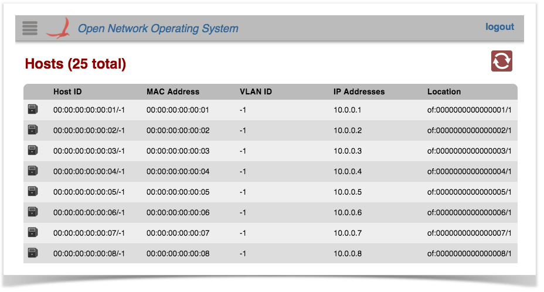

Applications can create (and inject into the GUI) their own view(s) of tabular data.

A [basic tabular view](../../guides/administrator-guide/interacting-with-onos/the-onos-web-gui/gui-tabular-view.md):

* Fits itself to the size of the window
* Has a fixed header and scrolling body
* Allows (static) customization of column widths
* Allows sorting via clickable column headers
* Allows SVG icons to be embedded in table cells

This tutorial will step you through the process of creating an application that does just that – injects a tabular view into the ONOS GUI.

A fictitious company, *"Meowster, Inc."* is used throughout the examples. This tutorial builds on top of the [Custom View tutorial](web-ui-tutorial-creating-a-custom-view.md), although you could choose to only have a table view in your app, if you wished.

Let's get started...

# Adding a Tabular View to our App

First of all, let's go back to the top level directory for our sample application:

```
$ cd ~/meow/sample
```

Let's add the table view template files by overlaying the ***uitab*** archetype:

```
$ onos-create-app uitab org.meowster.app.sample meowster-sample
```

When asked for the version, accept the suggested default: 1.0-SNAPSHOT, and press enter.

When asked to confirm the properties configuration, press enter.

Note that we already updated the *pom.xml* file in the previous tutorial, it should be good to go as is.

## New Files in the Project Structure

You should see a number of new files added to the project:

*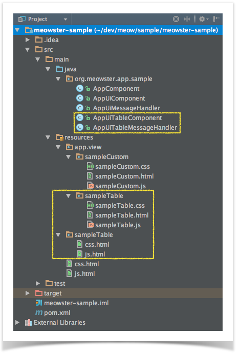*

Specifically:

* New Java classes *AppUiTableComponent* and *AppUiTableMessageHandler*
* New directory *~/resources/app/view/sampleTable*, containing*:*
  + *sampleTable.css*
  + *sampleTable.html*
  + *sampleTable.js*
* New directory *~/resources/sampleTable*, containing:
  + *css.html*
  + *js.html*

Building and Installing the App

From the top level project directory (the one with the *pom.xml* file) build the project:

```
$ cd meowster-sample
$ mvn clean install
```

Assuming that you have ONOS running on your local machine, you can install the app from the command line:

```
$ onos-app localhost install! target/meowster-sample-1.0-SNAPSHOT.oar
```

If you still have the app installed from the custom view tutorial, you can "reinstall" instead:

```
  $ onos-app localhost reinstall! target/meowster-sample-1.0-SNAPSHOT.oar
```

After refreshing the GUI in your web browser, the navigation menu should have an additional entry:

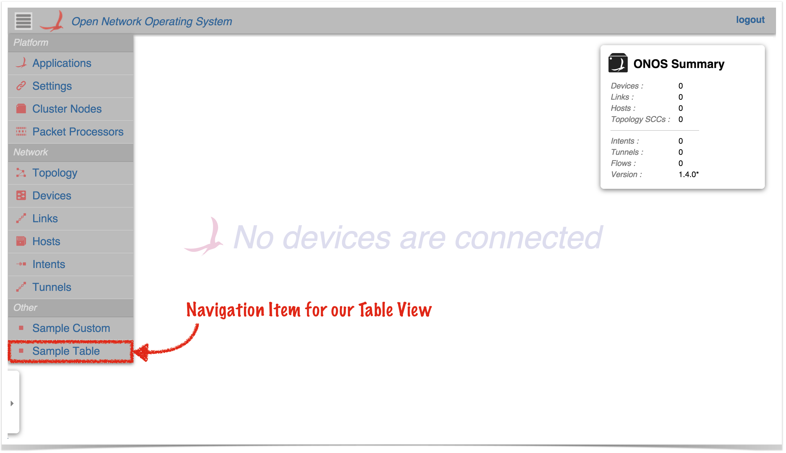

Clicking on this item should navigate to the injected *Sample Table* view:

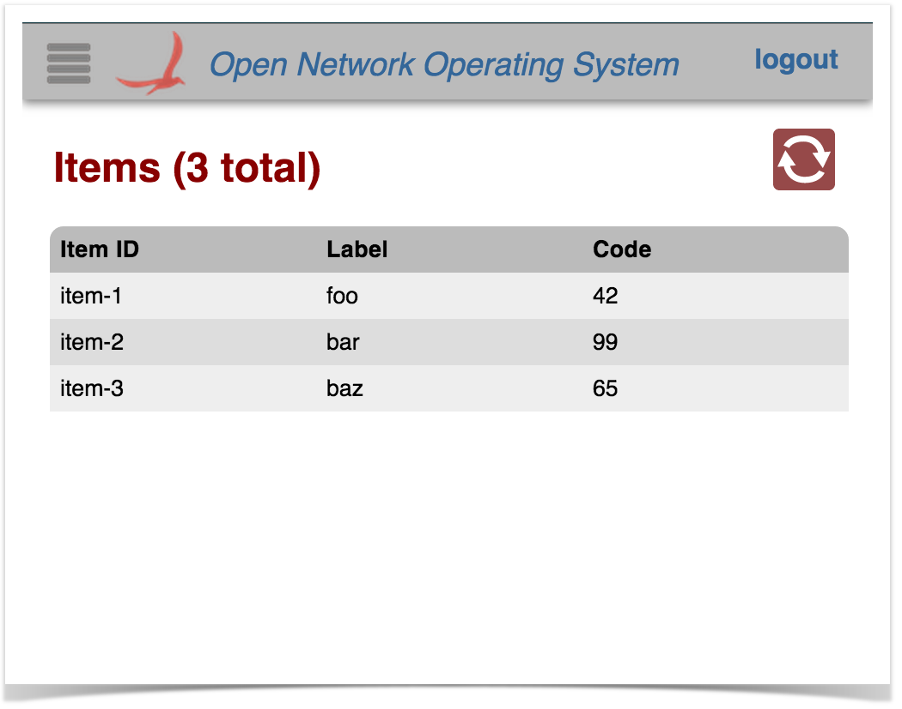

Selecting a row in the table should display a "details" panel for that item:

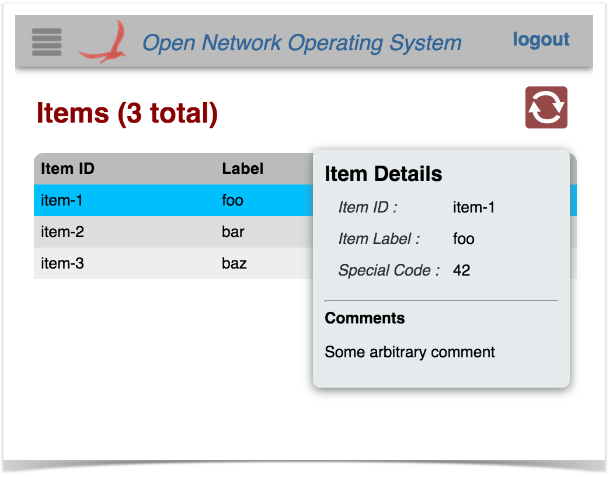

The row can be de-selected either by clicking on it again, or by pressing the *ESC* key.

Pressing the slash ( ***/*** ) or backslash ( ***\*** ) key will display the "Quick Help" panel. Press *Esc* to dismiss:

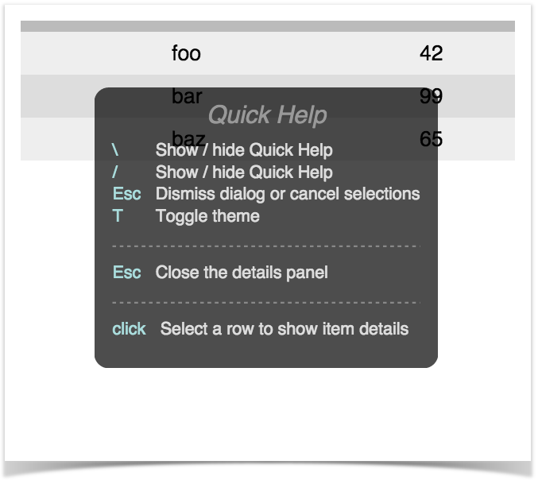

# Tabular Views in Brief

To create a tabular view requires both client-side and server-side resources; the client-side consists of HTML, JavaScript, and CSS files, and the server-side consists of Java classes.

* The HTML file defines the structure of the table view, and indicates to Angular where directives (behaviors) need to be injected.
* The JavaScript file creates the Angular controller for the view, delegates to the [TableBuilderService](../../guides/developer-guide/appendix-f-web-ui-framework-libraries/web-ui-client-side-framework-libraries/ui-service-tablebuilderservice.md) to build the table, and defines a directive for populating the details panel.
* The CSS file defines custom styling.
* The server-side Java code:
  + registers the view with the GUI framework
  + receives requests from the client, fetches the data, formats, sorts and sends the information back to the client.

# Description of Template Files - Server Side

This section describes the additional Java files generated by the *uitab* archetype.

To be able to use the archetype overlay mechanism such that we can add the *custom*, *table*, and *topology-overlay* samples incrementally, we actually create three separate *UiExtension* instances and register them with the *UiExtensionService* individually. If your ONOS application was indeed creating multiple views, it should define a single *UiExtension* instance and declare each of the views and message handlers in one place. See [UiExtensionManager.createCoreExtension()](https://github.com/opennetworkinglab/onos/blob/master/web/gui/src/main/java/org/onosproject/ui/impl/UiExtensionManager.java#L75-L120) for an example of how to do this. Also see the sample application [onos-app-uiref](https://github.com/opennetworkinglab/onos-app-samples/tree/master/uiref).

## AppUiTableComponent

This is the base class for UI functionality. Things to note:

(1) Reference to the [UiExtensionService](https://github.com/opennetworkinglab/onos/blob/master/core/api/src/main/java/org/onosproject/ui/UiExtensionService.java):

```
@Reference(cardinality = ReferenceCardinality.MANDATORY_UNARY)
protected UiExtensionService uiExtensionService;
```

Provides access to the *UI Extension Service*, so that we can register our "view".

(2) List of application view descriptors, defining which categories the views appear under in the GUI navigation pane, the internal identifiers for the views, and the corresponding display text:

```
private static final String VIEW_ID = "sampleTable";
private static final String VIEW_TEXT = "Sample Table";
...
private final List<UiView> uiViews = ImmutableList.of(
        new UiView(UiView.Category.OTHER, VIEW_ID, VIEW_TEXT)
);
```

*(Note that this extension in our application only contributes a single view; see note above.)*

(3) Declaration of a UiMessageHandlerFactory to generate message handlers on demand. The example factory generates a single handler each time, *AppUiTableMessageHandler*, described below:

```
private final UiMessageHandlerFactory messageHandlerFactory =
        () -> ImmutableList.of(
                new AppUiTableMessageHandler()
        );
```

Generally, there should be one message handler for each contributed view.

(4) Declaration of a [UiExtension](https://github.com/opennetworkinglab/onos/blob/master/core/api/src/main/java/org/onosproject/ui/UiExtension.java), configured with the previously declared UI view descriptors and message handler factory:

```
protected UiExtension extension =
        new UiExtension.Builder(getClass().getClassLoader(), uiViews)
                .resourcePath(VIEW_ID)
                .messageHandlerFactory(messageHandlerFactory)
                .build();
```

Note that in this case, (as opposed to the *Custom View* sample code), we also declare a "resource path" (relative to the *~/src/main/resources* directory) using the view ID as the subdirectory name. This tells the extension service that the *glue files* (see later) are located at *~/src/main/resources/sampleTable/\*.html*.

(5) Activation and deactivation callbacks that register and unregister the UI extension at the appropriate times:

```
@Activate
protected void activate() {
    uiExtensionService.register(extension);
    log.info("Started");
}

@Deactivate
protected void deactivate() {
    uiExtensionService.unregister(extension);
    log.info("Stopped");
}
```

## AppUiTableMessageHandler

This class extends [UiMessageHandler](https://github.com/opennetworkinglab/onos/blob/master/core/api/src/main/java/org/onosproject/ui/UiMessageHandler.java) to implement code that handles events from the (client-side) sample table view. Salient features of note:

(1) implement [createRequestHandlers()](https://github.com/opennetworkinglab/onos/blob/master/core/api/src/main/java/org/onosproject/ui/UiMessageHandler.java#L75) to provide request handler implementations for specific event types from our view.

```
@Override
protected Collection<RequestHandler> createRequestHandlers() {
    return ImmutableSet.of(
            new SampleTableDataRequestHandler(),
            new SampleTableDetailRequestHandler()
    );
}
```

(2) define *SampleTableDataRequestHandler* class to handle "sampleTableDataRequest" events from the client. Note that this class extends [TableRequestHandler](https://github.com/opennetworkinglab/onos/blob/master/core/api/src/main/java/org/onosproject/ui/table/TableRequestHandler.java), which implements most of the functionality required to support the table data model:

```
private static final String SAMPLE_TABLE_DATA_REQ = "sampleTableDataRequest";
private static final String SAMPLE_TABLE_DATA_RESP = "sampleTableDataResponse";
private static final String SAMPLE_TABLES = "sampleTables";
... 
 
private final class SampleTableDataRequestHandler extends TableRequestHandler {
    private SampleTableDataRequestHandler() {
        super(SAMPLE_TABLE_DATA_REQ, SAMPLE_TABLE_DATA_RESP, SAMPLE_TABLES);
    }
    ...
}
```

Note the call to the super-constructor, which takes three arguments:

1. request event identifier
2. response event identifier
3. "root" tag for data in response payload

To simplify coding (on the client side) the following convention is used for naming these entities:

* For a given table view, the table is identified by a "tag" (in this example, that tag is "sampleTable")
  + request event identifier is derived as: ***<tag> + "DataRequest"***
  + response event identifier is derived as: ***<tag> + "DataResponse"***
  + "root" tag is derived as: ***<tag> + "s"***

(2a) optionally override *defaultColumnId()*:

```
// if necessary, override defaultColumnId() -- if it isn't "id"
```

Typically, table rows have a unique value (row key) to identify the row (for example, in the Devices table it is the value of the *Device.id()* property). The default identifier for the column holding the row key is "id". If you want to use a different column identifier for the row key, your class should override *defaultColumnId()*. For example:

Expand source

```
private static final String MAC = "mac";
...
 
@Override
protected String defaultColumnId() {
    return MAC;
}
```

The sample table uses the default column identifier of "id", so can rely on the default implementation and does not need to override this method.

(2b) define column identifiers:

```
private static final String ID = "id";
private static final String LABEL = "label";
private static final String CODE = "code";

private static final String[] COLUMN_IDS = { ID, LABEL, CODE };

...
 
@Override
protected String[] getColumnIds() {
    return COLUMN_IDS;
}
```

Note that the column identifiers defined here must match the identifiers specified in the HTML snippet for the view (see *sampleTable.html* below).

(2c) optionally override *createTableModel()* to specify custom cell formatters / comparators.

```
// if required, override createTableModel() to set column formatters / comparators
```

The following example sets both a formatter and a comparator for the "code" column:

Expand source

```
@Override
protected TableModel createTableModel() {
    TableModel tm = super.createTableModel();
    tm.setFormatter(CODE, CodeFormatter.INSTANCE);
    tm.setComparator(CODE, CodeComparator.INSTANCE);
    return tm;
}
```

The above example code assumes that the classes *CodeFormatter* (implements *CellFormatter)* and *CodeComparator (*implements *CellComparator)* have been written.

See additional details about [table models, formatters, and comparators](web-ui-tutorial-creating-a-tabular-view/web-ui-table-models-formatters-and-comparators.md).

Our sample table relies on the default formatter and comparator, and so does not need to override the method.

(2d) implement *populateTable()* to add rows to the supplied table model:

```
@Override
protected void populateTable(TableModel tm, ObjectNode payload) {
    // ...
    List<Item> items = getItems();
    for (Item item: items) {
        populateRow(tm.addRow(), item);
    }
}
 
private void populateRow(TableModel.Row row, Item item) {
    row.cell(ID, item.id())
        .cell(LABEL, item.label())
        .cell(CODE, item.code());
}
```

Note the *payload* parameter; this allows contextual information to be passed in with the request, if desired.

The sample table uses fake data for demonstration purposes. A more realistic implementation would use one or more services to obtain the required data. The device table, for example, has an implementation something like this:

Expand source

```
@Override
protected void populateTable(TableModel tm, ObjectNode payload) {
    DeviceService ds = get(DeviceService.class);
    MastershipService ms = get(MastershipService.class);
    for (Device dev : ds.getDevices()) {
        populateRow(tm.addRow(), dev, ds, ms);
    }
}

private void populateRow(TableModel.Row row, Device dev,
                         DeviceService ds, MastershipService ms) {
    DeviceId id = dev.id();
    String protocol = dev.annotations().value(PROTOCOL);

    row.cell(ID, id)
        .cell(MFR, dev.manufacturer())
        .cell(HW, dev.hwVersion())
        .cell(SW, dev.swVersion())
        .cell(PROTOCOL, protocol != null ? protocol : "")
        .cell(NUM_PORTS, ds.getPorts(id).size())
        .cell(MASTER_ID, ms.getMasterFor(id));
    }
}
```

(3) define *SampleTableDetailRequestHandler* class to handle "sampleTableDetailRequest" events from the client. Note that this class extends the base [RequestHandler](https://github.com/opennetworkinglab/onos/blob/master/core/api/src/main/java/org/onosproject/ui/RequestHandler.java) class:

```
private static final String SAMPLE_TABLE_DETAIL_REQ = "sampleTableDetailsRequest";
...
 
private final class SampleTableDetailRequestHandler extends RequestHandler {
    private SampleTableDetailRequestHandler() {
        super(SAMPLE_TABLE_DETAIL_REQ);
    }
    ...
}
```

(3a) implement *process(...)* to return detail information about the "selected" row:

```
private static final String SAMPLE_TABLE_DETAIL_RESP = "sampleTableDetailsResponse";
private static final String DETAILS = "details";
...
private static final String COMMENT = "comment";
private static final String RESULT = "result";
...
 
@Override
public void process(long sid, ObjectNode payload) {
    String id = string(payload, ID, "(none)");

    // SomeService ss = get(SomeService.class);
    // Item item = ss.getItemDetails(id)

    // fake data for demonstration purposes...
    Item item = getItem(id);

    ObjectNode rootNode = objectNode();
    ObjectNode data = objectNode();
    rootNode.set(DETAILS, data);

    if (item == null) {
        rootNode.put(RESULT, "Item with id '" + id + "' not found");
        log.warn("attempted to get item detail for id '{}'", id);

    } else {
        rootNode.put(RESULT, "Found item with id '" + id + "'");

        data.put(ID, item.id());
        data.put(LABEL, item.label());
        data.put(CODE, item.code());
        data.put(COMMENT, "Some arbitrary comment");
    }

    sendMessage(SAMPLE_TABLE_DETAIL_RESP, 0, rootNode);
}
```

The sample code extracts an item identifier (id) from the payload, and uses that to look up the corresponding item. With the data in hand, it then constructs a JSON object node equivalent to the following structure:

```
{
  "details": {
    "id": "item-1",
    "label": "foo",
    "code": 42,
    "comment": "Some arbitrary comment" 
  },
  "result": "Found item with id 'item-1'"
}
```

After which, it sends the message on its way by invoking *sendMessage(...)*.

# Description of Template Files - Client Side

Note that the directory naming convention must be observed for the files to be placed in the correct location when the archive is built. Since our view has the unique identifier *"sampleTable"*, its client source files should be placed under the directory ***~/src/main/resources/app/view/sampleTable***.

| ~/src/main/resources/ | app/view/ | sampleTable/ |
| --- | --- | --- |
| client files | client files for UI views | client files for "sampleTable" view |

There are three files here:

* *sampleTable.html*
* *sampleTable.js*
* *sampleTable.css*

Note the convention to name these files using the identifier for the view; in this case "sampleTable".

## sampleTable.html

This is an HTML snippet for the sample table view, providing the view's structure. Note that this HTML markup is injected into the Web UI by [Angular](https://docs.angularjs.org/api), to make the view "visible" when the user navigates to it.

Tabular views use a combination of Angular directives and [factory services](../../guides/developer-guide/appendix-f-web-ui-framework-libraries/web-ui-client-side-framework-libraries.md) to create the behaviors of the table.

Let's describe the different parts of the file in sections...

### Outer Wrapper

```
<!-- partial HTML -->
<div id="ov-sample-table">
    ...
</div>
```

The outer *<div>* element defines the contents of your custom "view". It should be given the *id* of ***"ov-" + <view identifier>***, ("ov" standing for "**O**nos **V**iew"). Thus in this example the *id* is *"ov-sample-table"*.

### Table View Header <div>

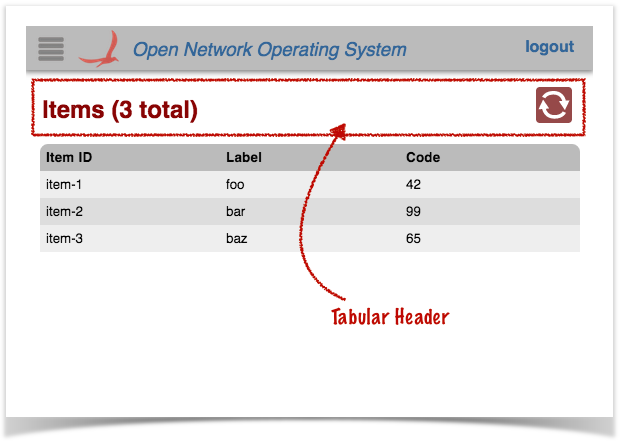

The <div> with class "tabular-header" defines the view's header:

```
<div class="tabular-header">
    <h2>Items ({{tableData.length}} total)</h2>
    <div class="ctrl-btns">
        ...
    </div>
</div>
```

The <h2> heading uses an Angular data binding {{`tableData.length`}}  to display the number of rows in the table.

The <div> with class "ctrl-btns" is a container for control buttons. Most tables have just an auto-refresh button here, but additional buttons can also be placed at this location.

```
 <div class="ctrl-btns">
        <div class="refresh" ng-class="{active: autoRefresh}"
             icon icon-id="refresh" icon-size="36"
             tooltip tt-msg="autoRefreshTip"
             ng-click="toggleRefresh()"></div>
 </div>
```

See the [tablular view directives](web-ui-tutorial-creating-a-tabular-view/web-ui-tabular-view-directives-and-variants.md) page for more details about the directives used to define the refresh button.

### Main Table <div>

The <div> with class "summary-list" defines the actual table.

```
<div class="summary-list" onos-table-resize>
    ...
</div>
```

The ***onos-table-resize*** directive dynamically resizes the table to take up the size of the window and to have a scrolling inner body. The column widths are also dynamically adjusted.

### Table Header <div>

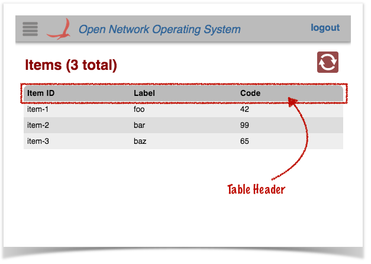

The <div> with class "table-header" provides a fixed header (i.e. it does not scroll with the table contents), with "click-to-sort" actions on the column labels.

```
<div class="table-header" onos-sortable-header>
    <table>
        <tr>
            <td colId="id" sortable>Item ID </td>
            <td colId="label" sortable>Label </td>
            <td colId="code" sortable>Code </td>
        </tr>
    </table>
</div>
```

See the [tabular view directives](web-ui-tutorial-creating-a-tabular-view/web-ui-tabular-view-directives-and-variants.md) page for more information on the ***onos-sortable-header*** and ***sortable*** directives.

The ***colId*** attributes of each column header cell must match the column identifier values defined in the *AppUiTableMessageHandler* class (see above).

### Table Body <div>

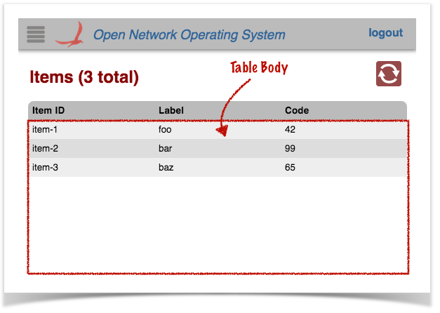

The <div> with class "table-body" provides a template row for Angular to use to format and populate the table data:

```
<div class="table-body">
    <table>
        ...
    </table>
</div>
```

There are two <tr> elements defined in the inner <table> element:

The first is displayed only if there is no table data (i.e. no rows to display). The ***colspan*** value should equal the number of columns in the table, so that the single cell spans the whole table width:

```
<tr ng-if="!tableData.length" class="no-data">
    <td colspan="3">
        No Items found
    </td>
</tr>
```

The second is used as a template to stamp out rows; one per data item:

```
<tr ng-repeat="item in tableData track by $index"
    ng-click="selectCallback($event, item)"
    ng-class="{selected: item.id === selId}">
    <td>{{item.id}}</td>
    <td>{{item.label}}</td>
    <td>{{item.code}}</td>
</tr>
```

The ***ng-repeat*** directive tells angular to repeat this structure for each item in the *tableData* array.

The ***ng-click*** directive binds the click handler to the *selectCallback()* function (defined in the view controller).

The ***ng-class*** directive sets the "selected" class on the element if needed (to highlight the row).

Note the use of Angular data-binding (double braces {{ ... }} ) to place the values in the cells.

### Details Panel Directive

Finally, a directive is defined to house the "fly-in" details panel, in which to display data about a selected item.

```
<ov-sample-table-item-details-panel></ov-sample-table-item-details-panel>
```

Following the naming convention, the prefix to this directive is ***ov-sample-table-***. More details on what this directive does is shown below.

## sampleTable.js

This file defines the view controller, invokes the *Table Builder Service* to do the grunt work in creating the table, and defines a directive to drive the "fly-in" details panel.

Again, we will define the different parts of the file in sections...

### Outer Wrapper

An anonymous function invocation is used to wrap the contents of the file, to provide private scope (keeping our variables and functions out of the global scope):

```
// js for sample app view
(function () {
    'use strict';
    ...
}());
```

### Variables

Variables are declared to hold injected references (console logger, scope, services), and configuration "constants":

```
// injected refs
var $log, $scope, fs, wss;

// constants
var detailsReq = 'sampleTableDetailsRequest',
    detailsResp = 'sampleTableDetailsResponse',
    pName = 'ov-sample-table-item-details-panel',

    propOrder = ['id', 'label', 'code'],
    friendlyProps = ['Item ID', 'Item Label', 'Special Code'];
```

### Helper Functions

Next come helper functions that we will examine in more detail in a bit:

```
function addProp(tbody, index, value) { 
    ...
}
 
function populatePanel(panel) { 
    ... 
}
```

### Detail Response Callback

Next we define the callback function to be invoked when a "sampleTableDetailsResponse" event arrives with details about a selected item:

```
function respDetailsCb(data) {
    $scope.panelDetails = data.details;
    $scope.$apply();
}
```

It's job is to take the data from the payload of the event (passed in as the *data* parameter) and store it in our scope, so that it is available for the details panel directive to reference.

### Defining the Controller

Next our view controller is defined. It might help to break this into pieces too...

```
angular.module('ovSampleTable', [])
    .controller('OvSampleTableCtrl'
    ['$log', '$scope', 'TableBuilderService',
        'FnService', 'WebSocketService',
 
        function (_$log_, _$scope_, tbs, _fs_, _wss_) {
            ...
        }])
```

The first line here registers our "ovSampleTable" module with angular, (the empty array states that our module is not dependent on any other module). Again, note the naming convention in play; the module name should start with "ov" (lowercase) followed by the identifier for our view, in continuing camel-case.

The *controller()* function is invoked on the module to define our controller. The first argument – *"OvSampleTableCtrl"* – is the name of our controller. Once again, the naming convention is to start with "Ov" (uppercase 'O') followed by the identifier for our view (continuing camel-case), followed by "Ctrl". The second argument is an array...

All the elements of the array (except the last) are the names of services to be injected into our controller function at run time. Angular uses these to bind the actual services to the specified parameters of the controller function (the last item in the array).

Inside our controller function, we start by saving injected references inside our closure, so that they are available to other functions:

```
$log = _$log_;
$scope = _$scope_;
fs = _fs_;
wss = _wss_;
```

We also initialize our state; our map of event handlers, and the cached data for the selected item (initially empty):

```
var handlers = {};
$scope.panelDetails = {};
```

Next, we need to tell the WebSocketService which callback function to invoke when a "sampleTableDetailsResponse" event arrives from the server:

```
handlers[detailsResp] = respDetailsCb;
wss.bindHandlers(handlers);
```

See the [Web Socket Service](../../guides/developer-guide/appendix-f-web-ui-framework-libraries/web-ui-client-side-framework-libraries/ui-service-websocketservice.md) for further details on event handler binding.

Note that we do not need to worry about handling the basic table event response ("sampleTableDataResponse" in our case), as that is handled behind the scenes by the table builder, which we will see shortly.

Next we define the row selection callback function; this is invoked when the user clicks on a row in the table:

```
function selCb($event, row) {
    if ($scope.selId) {
        wss.sendEvent(detailsReq, { id: row.id });
    } else {
        $scope.hidePanel();
    }
    $log.debug('Got a click on:', row);
}
```

Behind the scenes, the table builder code will set the ***selId*** property on our scope to the identity (value of the "id" column) of the selected row (or null if no row is selected). It then invokes our callback function, passing it a reference to the event object, as well as the data structure for the row in question.

Our function uses the *WebSocketService* (wss) to send the details request event to the server, embedding the item identifier in the event payload.

In the case where there is no longer an item selected, the behavior is to hide the details panel instead.

Now we delegate the bulk of the work to the *TableBuilderService* (tbs), providing it with the necessary references:

```
tbs.buildTable({
    scope: $scope,
    tag: 'sampleTable',
    selCb: selCb
}); 
```

The buildTable() function takes an options object as its single argument, to configure the table. The properties of the object used in our sample table are:

* ***scope***: a reference to our view's $scope (as injected into our controller by Angular)
* ***tag***: our table's "tag" used to derive the request and response event names and the "root" tag for the payload data (as described above; see *SampleTableDataRequestHandler*)
* ***selCb***: a reference to our row selection callback, described above

See the [Table Builder Service](../../guides/developer-guide/appendix-f-web-ui-framework-libraries/web-ui-client-side-framework-libraries/ui-service-tablebuilderservice.md) for more details, included additional parameters not used here.

When our view is destroyed (when the user navigates to some other view), we need to do some cleanup:

```
$scope.$on('$destroy', function () {
    wss.unbindHandlers(handlers);
    $log.log('OvSampleTableCtrl has been destroyed');
}); 
```

We unbind our event handlers, and log a message to the console.

The last thing the controller does when it is initialized is to log to the console:

```
$log.log('OvSampleTableCtrl has been created');
```

### Defining the Details Panel Directive

Chained onto the *.controller()* function call is a call to *.directive(...)* to define our details panel directive. Again, let's break the code down into chunks...

```
.directive('ovSampleTableItemDetailsPanel', ['PanelService', 'KeyService',
    function (ps, ks) {
    return {
        ...
    };
}]);
```

The two arguments to directive() are:

* the name of our directive
* an array

The name, once again, follows the naming convention of starting with our prefix, "ovSampleTable". The whole name – "ovSampleTableItemDetailsPanel" – is understood by Angular to relate to the HTML element <ov-sample-table-item-details-panel> that we saw at the bottom of the HTML file.

All elements of the array (except the last) are the names of services to inject into the directive function (the last element of the array). In this case we are injecting references to the [Panel Service](../../guides/developer-guide/appendix-f-web-ui-framework-libraries/web-ui-client-side-framework-libraries/ui-service-panelservice.md) and the [Key Service](../../guides/developer-guide/appendix-f-web-ui-framework-libraries/web-ui-client-side-framework-libraries/ui-service-keyservice.md).

Our function returns an object to allow Angular to configure our directive:

```
return {
    restrict: 'E', 
    link: function (scope, element, attrs) {
        ...
    }    
};
```

The restrict property is set to "E" to tell angular that this directive is an element.

The link function is invoked when Angular parses the HTML document and finds the <ov-sample-table-item-details-panel> element. Our function sets up the "floating panel" behaviors as follows:

```
var panel = ps.createPanel(pName, {
    width: 200,
    margin: 20,
    hideMargin: 0
});
panel.hide();
scope.hidePanel = function () { panel.hide(); };
```

First, use the *PanelService* to create the panel, and start with the panel hidden. Also store a *hidePanel()* function on our scope which we can invoke later.

Next we define a callback to hide the panel if it is visible; to be bound to the ESC keystroke:

```
function closePanel() {
    if (panel.isVisible()) {
        $scope.selId = null;
        panel.hide();
        return true;
    }
    return false;
} 
```

Note that escape key handlers should return ***true*** if they "consume" the event, or ***false*** otherwise.

See the [Panel Service](../../guides/developer-guide/appendix-f-web-ui-framework-libraries/web-ui-client-side-framework-libraries/ui-service-panelservice.md) for more details on creating and using "floating" panels.

Now we use the key service to bind our callback to the ESC key, and also provide hints for the *Quick Help* panel:

```
// create key bindings to handle panel
ks.keyBindings({
    esc: [closePanel, 'Close the details panel'],
    _helpFormat: ['esc']
});
ks.gestureNotes([
    ['click', 'Select a row to show item details']
]); 
```

See the [Key Service](../../guides/developer-guide/appendix-f-web-ui-framework-libraries/web-ui-client-side-framework-libraries/ui-service-keyservice.md) for more details on binding keys / configuring quick help.

Next, we set up a "watch" function to be triggered any time the ***panelDetails*** property on our scope is changed. If the object is non-empty, the function clears then populates the panel with data, and displays it.

```
// update the panel's contents when the data is changed
scope.$watch('panelDetails', function () {
    if (!fs.isEmptyObject(scope.panelDetails)) {
        panel.empty();
        populatePanel(panel);
        panel.show();
    }
}); 
```

Now would be a good time to revisit those helper functions we glossed over earlier. First, *populatePanel()*...

```
function populatePanel(panel) {
    var title = panel.append('h3'),
        tbody = panel.append('table').append('tbody');

    title.text('Item Details');

    propOrder.forEach(function (prop, i) {
        addProp(tbody, i, $scope.panelDetails[prop]);
    });

    panel.append('hr');
    panel.append('h4').text('Comments');
    panel.append('p').text($scope.panelDetails.comment);
}
```

This function is given a reference to the panel instance. It uses that API to build up the panel contents from the data stored in the ***panelDetails*** property of our scope.

Recall, ***propOrder*** was defined as an array (at the top of our script) listing the order in which the properties of the data should be added to the panel.

The *addProp()* function adds a property line item to the panel:

```
function addProp(tbody, index, value) {
    var tr = tbody.append('tr');

    function addCell(cls, txt) {
        tr.append('td').attr('class', cls).html(txt);
    }
    addCell('label', friendlyProps[index] + ' :');
    addCell('value', value);
} 
```

Recall, ***friendlyProps*** was defined as an array listing the "human readable" labels for each of the properties.

And finally... add a cleanup function for when our scope is destroyed (user navigates away from our view):

```
 // cleanup on destroyed scope
scope.$on('$destroy', function () {
    ks.unbindKeys();
    ps.destroyPanel(pName);
});
```

Unbind our ESC key handler and gesture notes and destroy the floating panel instance.

## sample.css

The last file in our client-side trio is the stylesheet for the sample view.

Expand source

```
/* css for sample app view */

#ov-sample-table h2 {
    display: inline-block;
}

/* Panel Styling */
#ov-sample-table-item-details-panel.floatpanel {
    position: absolute;
    top: 115px;
}

.light #ov-sample-table-item-details-panel.floatpanel {
    background-color: rgb(229, 234, 237);
}
.dark #ov-sample-table-item-details-panel.floatpanel {
    background-color: #3A4042;
}

#ov-sample-table-item-details-panel h3 {
    margin: 0;
    font-size: large;
}

#ov-sample-table-item-details-panel h4 {
    margin: 0;
}

#ov-sample-table-item-details-panel td {
    padding: 5px;
}
#ov-sample-table-item-details-panel td.label {
    font-style: italic;
    opacity: 0.8;
} 
```

It should be fairly self-explanatory. However, note:

* **`#ov-sample-table h2`** is displayed as inline-block, so that the view title and the control button block are displayed on the same line:  
    
  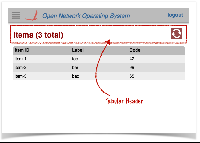

* the use of the `.light` and `.dark` classes to select appropriate colors for each of the GUI's themes.

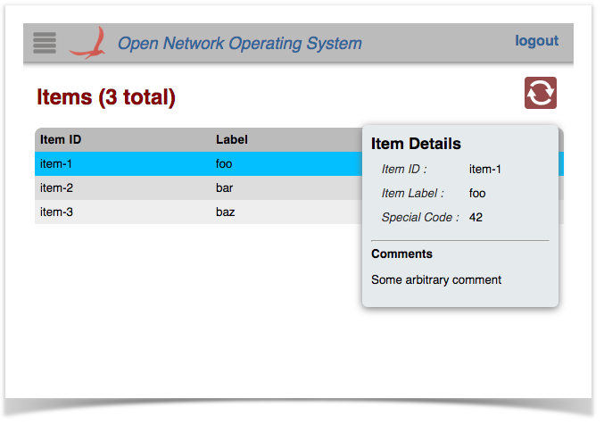           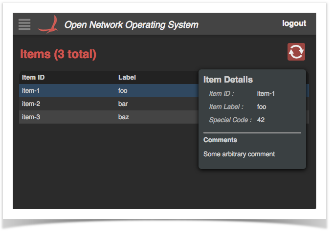

# Glue Files

The final piece to the puzzle are the two "glue" files used to patch references to our client-side source into *index.html*.

Recall in *AppUiTableComponent* we defined the resource path when building the *UiExtension* instance...

```
private static final String VIEW_ID = "sampleTable";
...
protected UiExtension extension = 
        new UiExtension.Builder(getClass().getClassLoader(), uiViews)
                .resourcePath(VIEW_ID)
                ...
```

This tells the framework to look in the directory `~src/main/resources/sampleTable/` for the glue files. *(As noted before, we did this so that the three archetype overlays could co-exist.)*

## css.html

This is a short snippet that is injected into *index.html*. It contains exactly one line:

```
<link rel="stylesheet" href="app/view/sampleTable/sampleTable.css">
```

## js.html

This is a short snippet that is injected into *index.html*. It contains exactly one line:

```
<script src="app/view/sampleTable/sampleTable.js"></script>
```

# Summary

Obviously, this sample table doesn't do anything useful, with hard-coded data, but it should serve as a template of how to stitch things together to create your own tabular views. Do remember to follow the naming convention – generally, using your view ID as a prefix to DOM element, event names, and other "public" identifiers.

Have fun creating tables!
