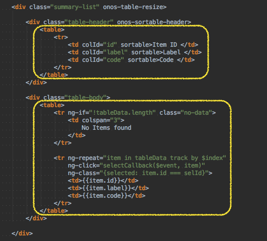

# Web UI -- Tabular View Directives and Variants

# Overview

The tabular views make heavy use of Angular directives, to keep the source code concise. However, it can be tricky to understand what all those non-standard-HTML attributes are for. This page sheds some light on the mystery. In addition, further configuration options / variants are described.

# Notes on Directives

## Refresh Button

The refresh button is declared something like this:

```
<div class="refresh" ng-class="{active: autoRefresh}"
     icon icon-size="36" icon-id="refresh"
     tooltip tt-msg="autoRefreshTip"
     ng-click="toggleRefresh()"></div>
```

### class="refresh"

The refresh class is defined in [table.css](https://github.com/opennetworkinglab/onos/blob/master/web/gui/src/main/webapp/app/fw/widget/table.css#L201-L215) to style the ***<div>*** element appropriately for *light* and *dark* themes, when *active* or *hovered-over*.

### ng-class="{active: autoRefresh}"

The ***ng-class*** directive is provided by Angular and adds the specified class to the element if the condition is true. In this case, if the ***autoRefresh*** boolean ([defined on our controller scope](https://github.com/opennetworkinglab/onos/blob/master/web/gui/src/main/webapp/app/fw/widget/tableBuilder.js#L59)) is true, then the ***active*** class is applied to the ***<div>*** element.

### icon icon-id="refresh" icon-size="36"

The ***icon*** directive injects an icon with the given ***icon-id*** into the ***<div>*** element. ***icon-size="36"*** is the recommended size for table button icons.

If you really want to get into the guts of the code, see the definition of the icon directive in [icon.js](https://github.com/opennetworkinglab/onos/blob/master/web/gui/src/main/webapp/app/fw/svg/icon.js#L237-L248).

### tooltip tt-msg="autoRefreshTip"

The ***tooltip*** directive uses the string [stored on the scope variable](https://github.com/opennetworkinglab/onos/blob/master/web/gui/src/main/webapp/app/fw/widget/tableBuilder.js#L60) ***autoRefreshTip*** to populate a tooltip when the mouse hovers over the button.

### ng-click="toggleRefresh()"

The ***ng-click*** directive, provided by Angular, invokes the ***toggleRefresh()*** function ([defined on our scope](https://github.com/opennetworkinglab/onos/blob/master/web/gui/src/main/webapp/app/fw/widget/tableBuilder.js#L131-L135)) when the user clicks on the ***<div>*** element.

# Notes on Main Table

### onos-table-resize

The ***onos-table-resize*** directive monitors the browser window and resizes the table elements whenever the window size changes. See [table.js](https://github.com/opennetworkinglab/onos/blob/master/web/gui/src/main/webapp/app/fw/widget/table.js#L141-L189) for the gory details.

Note that the table view makes use of two HTML *<table>* elements; the first for the (non-scrolling) table headers, and the second for the (scrolling) table contents:



## Table Header

### onos-sortable-header & sortable

The ***onos-sortable-header*** directive injects a click handler into every ***<td>*** element in the header that has a ***sortable*** attribute defined (see [table.js](https://github.com/opennetworkinglab/onos/blob/master/web/gui/src/main/webapp/app/fw/widget/table.js#L191-L213) for details).

The handler toggles the sort state between ascending and descending sort direction, as well as inserting the sort direction icons (up and down arrows) into the element. In addition, a sort request event is fired off to the server to re-fetch the table data, sorted with the new criteria.

### Table Column Options

The first thing to note about the table columns is that the column headers use ***td*** tags (not ***th*** tags).

Columns may be labeled, or have no label at all (e.g. for columns with icons). The following table lists the possible options to be applied to a column:

| Name | Usage | Description | Required for |
| --- | --- | --- | --- |
| `col-width` | attribute col-width with pixel value | Sets column to that specific width in pixels | `onos-table-resize` |
| `table-icon` | class | Sets column width to a good size for icons | `onos-table-resize` |
| `colId` | attribute colId with value | Used to identify columns for sorting in ascending or descending order | `onos-sortable-header` |
| `sortable` | attribute without value | Allows that column to be sortable | `onos-sortable-header` |

See the following code snippet for an example:

Expand source

```
<div class="table-header"
     onos-sortable-header sort-callback="sortCallback(requestParams)">
     <table>
         <tr>
             <td colId="active" class="table-icon" sortable></td>
             <td colId="id" sortable>Foo ID </td>
             <td colId="bar" sortable>Bar </td>
             <td colId="baz" sortable>Baz </td>
             <td colId="desc" col-width="475px">Description </td>
         </tr>
     </table>
</div>
```

## Table Body

A typical table body might look something like this:

Expand source

```
<div class="table-body">
    <table>
        <tr ng-if="!tableData.length" class="no-data">
            <td colspan="5">
                No Foos found :(
            </td>
        </tr>
 
        <tr ng-repeat="foo in tableData track by $index"
            ng-click="selectCallback($event, foo)"
            ng-class="{selected: foo === sel}">
            <td class="table-icon">
                <div icon icon-id="{{foo._iconid_active}}"></div>
            </td>
            <td>{{foo.id}}</td>
            <td>{{foo.bar}}</td>
            <td>{{foo.baz}}</td>
            <td>{{foo.desc}}</td>
        </tr>
    </table>
</div>
```

The first ***<tr>*** element is made visible only if there are no rows of table data.

The second ***<tr>*** element is a *pattern* that is used repeatedly by Angular to create a row for every element in the *tableData* variable (defined on our controller scope). Note the icon column <td> is classed with "table-icon" so that it is sized correctly.

### Table Row Options

If you wish to create a table where one item spans multiple rows, you can specify your data <tr> elements to look something like this:

Expand source

```
<tr ng-repeat-start="foo in tableData track by $index">
    <td>{{foo.id}}</td>
    <td>{{foo.bar}}</td>
    <td>{{foo.baz}}</td>
    <td>{{foo.zoo}}</td>
</tr>
<tr>
    <td class="desc" colspan="4">{{foo.desc}}</td>
</tr>
<tr ng-repeat-end>
    <td class="instructions" colspan="4">{{foo.instructions}}</td>
</tr>
```

Note the use of the ***ng-repeat-start*** directive in the first row, and the ***ng-repeat-end*** directive in the last.

With appropriate styling, the rows can be made to look as if they belong together. The [Intent View](../../../guides/administrator-guide/interacting-with-onos/the-onos-web-gui/gui-intent-view.md) makes use of this technique. (See [intent.html](https://github.com/opennetworkinglab/onos/blob/master/web/gui/src/main/webapp/app/view/intent/intent.html) and [intent.css](https://github.com/opennetworkinglab/onos/blob/master/web/gui/src/main/webapp/app/view/intent/intent.css) for more details)
