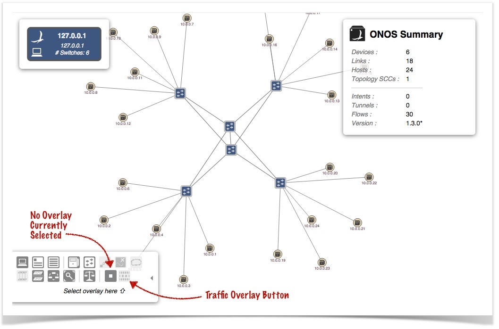
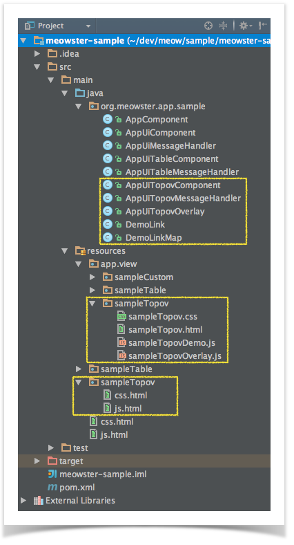
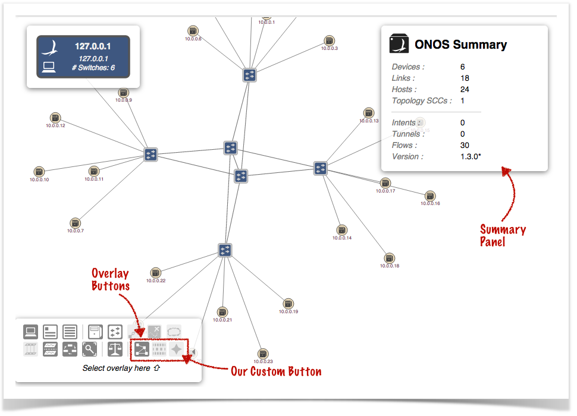
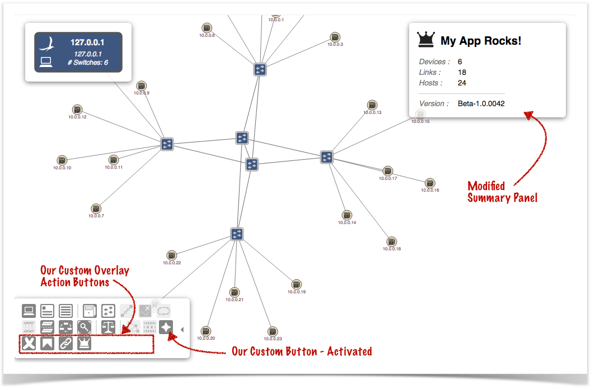
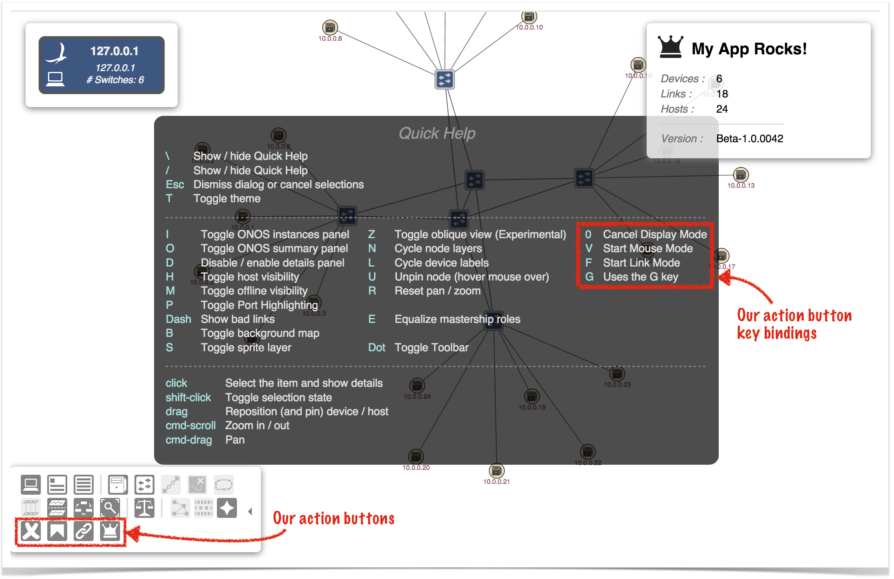
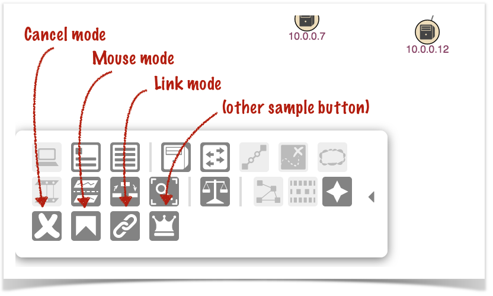
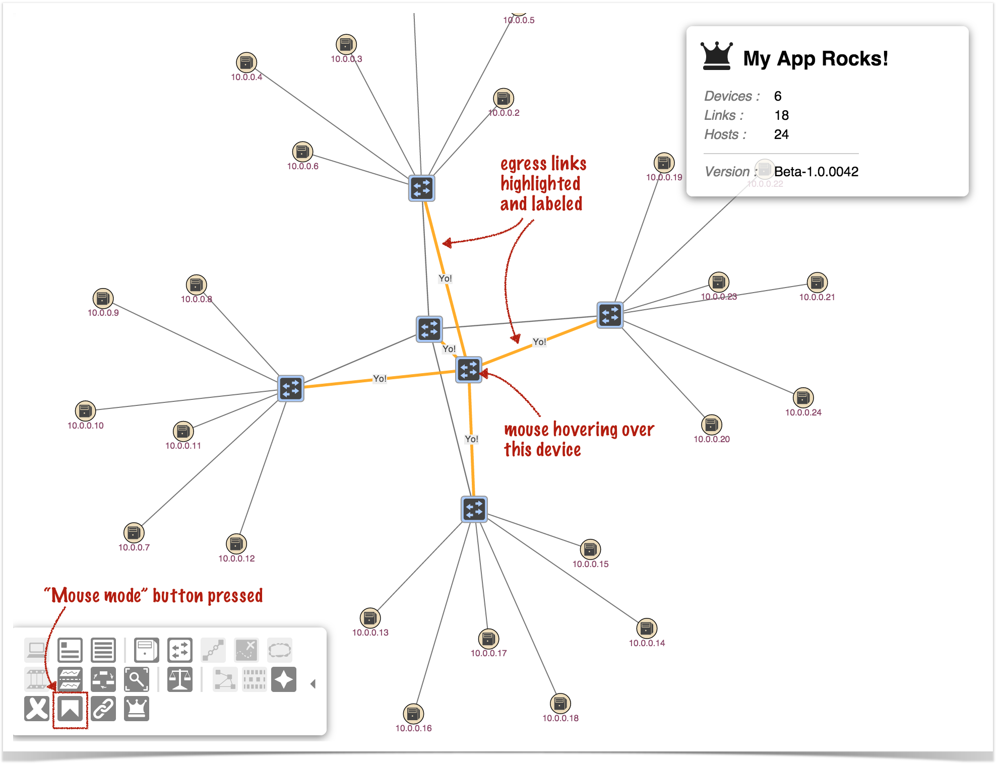
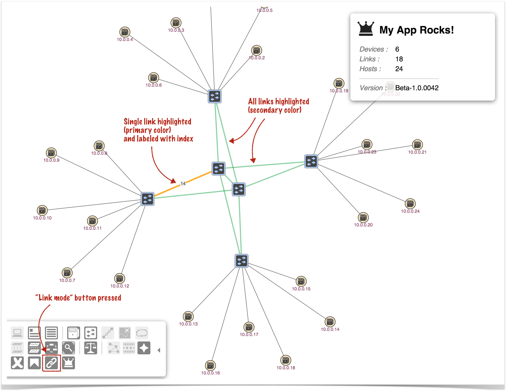
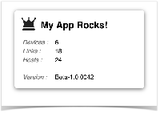
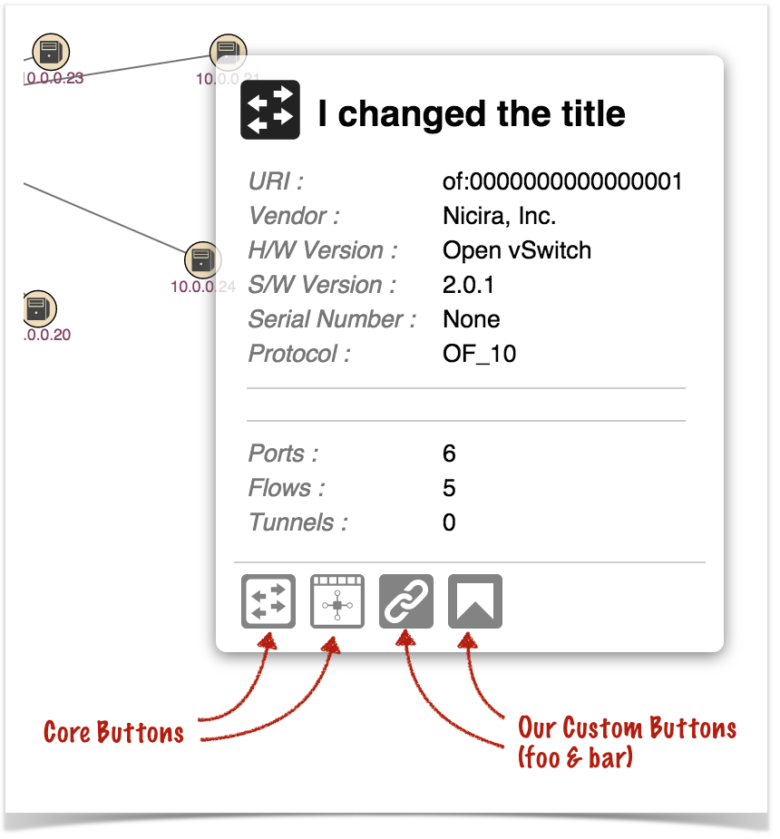

# Web UI Tutorial - Creating a Topology Overlay

# Overview

Applications may provide what we call a "Topology Overlay" – a component that provides new behaviors to the [GUI Topology View](../../guides/administrator-guide/interacting-with-onos/the-onos-web-gui/gui-topology-view.md).



An overlay can:

* augment or override the contents of the Summary Panel
* augment or override the contents of the Details Panel for a selected item
* cause links to be highlighted and/or labeled
* cause devices/hosts to be badged with numeric or iconic information
* provide toolbar buttons to allow the user to invoke new functions

This tutorial walks you through the steps of developing such a component.

A fictitious company, *"Meowster, Inc."* is used throughout the examples. This tutorial builds on top of the [Table View tutorial](web-ui-tutorial-creating-a-tabular-view.md), although you could choose to only provide a topology overlay in your app, if you wished.

Let's get started...

# Adding a Topology Overlay to our App

First of all, let's go back to the top level directory for our sample application:

```
$ cd ~/meow/sample
```

Now let's add the topology overlay template files by overlaying the ***uitopo*** archetype:

```
$ onos-create-app uitopo org.meowster.app.sample meowster-sample
```

When asked for the version, accept the suggested default: 1.0-SNAPSHOT, and press enter.

When asked to confirm the properties configuration, press enter.

Note that the *pom.xml* file should be ready to go (since we already edited it in the [Custom View tutorial](web-ui-tutorial-creating-a-custom-view.md)).

# New Files in the Project Structure

You should see a number of new files added to the project:



Specifically:

* New Java classes:
  + *AppUiTopovComponent*
  + *AppUiTopovMessageHandler*
  + *AppUiTopovOverlay*
  + *DemoLink*
  + *DemoLinkMap*
* New directory *~/resources/app/view/sampleTopov*, containing:
  + *sampleTopov.css*
  + *sampleTopov.html*
  + *sampleTopovDemo.js*
  + *sampleTopovOverlay.js*
* New directory *~/resources/sampleTopov*, containing:
  + *css.html*
  + *js.html*

# Building and Installing the App

From the top level project directory (the one with the *pom.xml* file) build the project:

```
$ cd meowster-sample
$ mvn clean install
```

Assuming that you have ONOS running on your local machine, you can install the app from the command line:

```
$ onos-app localhost install! target/meowster-sample-1.0-SNAPSHOT.oar
```

If you still have the app installed from the custom or table view tutorials, you can "reinstall" instead:

```
    $ onos-app localhost reinstall! target/meowster-sample-1.0-SNAPSHOT.oar
```

After refreshing the GUI in your web browser, the *Topology View* toolbar should have an additional overlay button:



Pressing our overlay button will *activate* the overlay (invoking "activate" callbacks both on the client side and server side) and insert our custom action buttons in the toolbar.



Pressing the slash ( / ) key will display the *Quick Help* panel, where we can see our action button key bindings are listed:



Pressing the *Esc* key will dismiss the panel.

Pressing an alternate overlay button will *deactivate* our overlay (invoking "deactivate" callbacks both on the client side and server side).

# The Sample Application

Our sample app installs a topology overlay that provides custom buttons:



Pressing the "Mouse mode" button and then moving the mouse over devices causes egress links on that device to highlight:



Pressing the "Link mode" button causes all the links in the topology to highlight in the secondary color, and each link in turn to highlight in the primary color, together with a label:



Pressing the "Cancel mode" button will put the topology view back into a quiescent state.

# Overlays in Brief

To create a topology overlay requires both client-side and server-side resources; the client-side consists of an HTML stub file, JavaScript files (and possibly CSS), and the server-side consists of Java classes.

* The HTML stub file is simply a "hidden view" placeholder.
* The JavaScript defines and registers the overlay code with the topology view, providing callback functions for when certain events take place.
* The CSS (if needed) can provide custom styling.
* The server-side Java code provides the back-end support for deciding how to highlight the topology when needed, and how to customize the summary and detail panels.

# Description of the Template Files - Server Side

These files are under the directory *~/src/main/java/org/meowster/app/sample*.

The exact path depends on the *groupId* (also used as the Java package) specified when the application was built with ***onos-create-app***.

The following subsections describe the salient features of each file...

## AppComponent

This is the base Application class and may be used for non-UI related functionality (not addressed in this tutorial).

## AppUiTopovComponent

This is the base class for UI functionality, tailored to support a topology overlay component. The code is similar to the [Custom View tutorial](web-ui-tutorial-creating-a-custom-view.md), but has a couple of subtle differences.

(1) Reference to the [UIExtensionService](https://github.com/opennetworkinglab/onos/blob/master/core/api/src/main/java/org/onosproject/ui/UiExtensionService.java):

```
@Reference(cardinality = ReferenceCardinality.MANDATORY_UNARY)
protected UiExtensionService uiExtensionService;
```

(2) List a single, hidden application view descriptor, defining the internal identifier:

```
private static final String VIEW_ID = "sampleTopov";
...
// List of application views
private final List<UiView> uiViews = ImmutableList.of(
        new UiViewHidden(VIEW_ID)
);
```

(3) Declaration of a [UiMessageHandlerFactory](https://github.com/opennetworkinglab/onos/blob/master/core/api/src/main/java/org/onosproject/ui/UiMessageHandlerFactory.java) to generate message handlers on demand. The sample factory generates a single handler each time, *AppUiTopovMessageHandler*, described below:

```
// Factory for UI message handlers
private final UiMessageHandlerFactory messageHandlerFactory =
        () -> ImmutableList.of(
                new AppUiTopovMessageHandler()
        );
```

(4) Declaration of a [UiTopoOverlayFactory](https://github.com/opennetworkinglab/onos/blob/master/core/api/src/main/java/org/onosproject/ui/UiTopoOverlayFactory.java) to generate topology overlays on demand. The sample factory generates a single overlay each time, *AppUiTopovOverlay*, described below:

```
// Factory for UI topology overlays
private final UiTopoOverlayFactory topoOverlayFactory =
        () -> ImmutableList.of(
                new AppUiTopovOverlay()
        );
```

(5) Declaration of a [UiExtension](https://github.com/opennetworkinglab/onos/blob/master/core/api/src/main/java/org/onosproject/ui/UiExtension.java), configured with the previously declared UI view descriptor, message handler factory, and topology overlay factory:

```
// Application UI extension
protected UiExtension extension =
        new UiExtension.Builder(CL, uiViews)
            .resourcePath(VIEW_ID)
            .messageHandlerFactory(messageHandlerFactory)
            .topoOverlayFactory(topoOverlayFactory)
            .build();
```

Note that we are, once again, declaring a "resource path" (relative to the *~/src/main/resources* directory) using the view ID as the subdirectory name. This tells the extension service that the *glue files* (see later) are located at *~/src/main/resources/sampleTopov/\*.html*.

(6) Activation and deactivation callbacks that register and unregister the UI extension at the appropriate times:

```
@Activate
protected void activate() {
    uiExtensionService.register(extension);
    log.info("Started");
}

@Deactivate
protected void deactivate() {
    uiExtensionService.unregister(extension);
    log.info("Stopped");
}
```

## AppUiTopovMessageHandler

This class extends [UiMessageHandler](https://github.com/opennetworkinglab/onos/blob/master/core/api/src/main/java/org/onosproject/ui/UiMessageHandler.java) to implement code that handles events from the client.

(1) override [init()](https://github.com/opennetworkinglab/onos/blob/master/core/api/src/main/java/org/onosproject/ui/UiMessageHandler.java#L123) to store references to the services we need:

```
@Override
public void init(UiConnection connection, ServiceDirectory directory) {
    super.init(connection, directory);
    deviceService = directory.get(DeviceService.class);
    hostService = directory.get(HostService.class);
    linkService = directory.get(LinkService.class);
}
```

Since we will be querying for devices, hosts and links, grab references to the corresponding service APIs.

(2) implement [createRequestHandlers()](https://github.com/opennetworkinglab/onos/blob/master/core/api/src/main/java/org/onosproject/ui/UiMessageHandler.java#L75) to provide request handler implementations for specific event types from our topology overlay.

```
@Override
protected Collection<RequestHandler> createRequestHandlers() {
    return ImmutableSet.of(
            new DisplayStartHandler(),
            new DisplayUpdateHandler(),
            new DisplayStopHandler()
    );
}
```

(3) define *DisplayStartHandler* class to handle "sampleTopovDisplayStart" events from the client:

```
private static final String SAMPLE_TOPOV_DISPLAY_START = "sampleTopovDisplayStart";
...
private final class DisplayStartHandler extends RequestHandler {
    public DisplayStartHandler() {
        super(SAMPLE_TOPOV_DISPLAY_START);
    }
    ...
}
```

(3a) implement *process()* to react to the *start* events, taking into account which "mode" we are in:

```
private static final String MODE = "mode";
...
@Override
public void process(long sid, ObjectNode payload) {
    String mode = string(payload, MODE);

    log.debug("Start Display: mode [{}]", mode);
    clearState();
    clearForMode();

    switch (mode) {
        case "mouse": 
            ...
        case "link":  
            ...
        default:      
            ...
    }
}
```

First of all, we clear our internal state:

```
private void clearState() {
    currentMode = Mode.IDLE;
    elementOfNote = null;
    linkSet = EMPTY_LINK_SET;
}
```

..and make sure that no links are highlighted on the topology:

```
private void clearForMode() {
    sendHighlights(new Highlights());
}
```

Then we deal with one of three modes: "mouse", "link", or "idle":

(3a.i) "mouse" mode reacts to which node in the UI the mouse is hovering over and returns data about the egress links for that node:

```
case "mouse":
    currentMode = Mode.MOUSE;
    cancelTask();
    sendMouseData();
    break;
```

Note that *cancelTask()* simply cancels the background timer, if it is running (it is used for the "link" mode only).

*sendMouseData()* looks to see if a device is being hovered over, and if so, finds and highlights the egress links from that device:

```
private void sendMouseData() {
    if (elementOfNote != null && elementOfNote instanceof Device) {
        DeviceId devId = (DeviceId) elementOfNote.id();
        Set<Link> links = linkService.getDeviceEgressLinks(devId);
        sendHighlights(fromLinks(links, devId));
    }
    // Note: could also process Host, if available
}
```

Note the use of the *fromLinks()* helper method that takes a set of links and generates a [Highlights](https://github.com/opennetworkinglab/onos/blob/master/core/api/src/main/java/org/onosproject/ui/topo/Highlights.java) object from them:

```
private Highlights fromLinks(Set<Link> links, DeviceId devId) {
    DemoLinkMap linkMap = new DemoLinkMap();
    if (links != null) {
        log.debug("Processing {} links", links.size());
        links.forEach(linkMap::add);
    } else {
        log.debug("No egress links found for device {}", devId);
    }

    Highlights highlights = new Highlights();

    for (DemoLink dlink : linkMap.biLinks()) {
        dlink.makeImportant().setLabel("Yo!");
        highlights.add(dlink.highlight(null));
    }
    return highlights;
}
```

See descriptions of ***DemoLink*** and ***DemoLinkMap*** below for more details.

(3a.ii) "link" mode uses a background timer to iterate across the set of links, highlighting each one in turn:

```
case "link":
    currentMode = Mode.LINK;
    scheduleTask();
    initLinkSet();
    sendLinkData();
    break;
```

*initLinkSet()* initializes an array of links to all active links in the topology, ready to iterate across them:

```
private void initLinkSet() {
    Set<Link> links = new HashSet<>();
    for (Link link : linkService.getActiveLinks()) {
        links.add(link);
    }
    linkSet = links.toArray(new Link[links.size()]);
    linkIndex = 0;
    log.debug("initialized link set to {}", linkSet.length);
}
```

*sendLinkData()* uses a ***DemoLinkMap*** (collection of ***DemoLink*** instances) to collate information about the links, to use as intermediate data to create highlighting information:

```
private void sendLinkData() {
    DemoLinkMap linkMap = new DemoLinkMap();
    for (Link link : linkSet) {
        linkMap.add(link);
    }
    DemoLink dl = linkMap.add(linkSet[linkIndex]);
    dl.makeImportant().setLabel(Integer.toString(linkIndex));
    log.debug("sending link data (index {})", linkIndex);

    linkIndex += 1;
    if (linkIndex >= linkSet.length) {
        linkIndex = 0;
    }

    Highlights highlights = new Highlights();
    for (DemoLink dlink : linkMap.biLinks()) {
        highlights.add(dlink.highlight(null));
    }

    sendHighlights(highlights);
}
```

First, all the links are added to the link map without "modification"; then the link from the set at the current index is added (again), but this time the demo link instance is marked as important and labeled with the index.

A highlights object is generated from the collection of demo links.

Note that the background task (invoked once a second, while active) also calls *sendLinkData()*.

(3a.iii) "idle" mode puts our service into a quiescent state:

```
default:
    currentMode = Mode.IDLE;
    cancelTask();
    break;
```

(4) define *DisplayUpdateHandler* class to handle "sampleTopovDisplayUpdate" events from the client:

```
private static final String SAMPLE_TOPOV_DISPLAY_UPDATE = "sampleTopovDisplayUpdate";
...
private final class DisplayUpdateHandler extends RequestHandler {
    public DisplayUpdateHandler() {
        super(SAMPLE_TOPOV_DISPLAY_UPDATE);
    }
    ...
}
```

(4a) implement *process()* to react to *update* events:

```
    @Override
    public void process(long sid, ObjectNode payload) {
        String id = string(payload, ID);
        log.debug("Update Display: id [{}]", id);
        if (!Strings.isNullOrEmpty(id)) {
            updateForMode(id);
        } else {
            clearForMode();
        }
    }
```

*updateForMode()* sets up the element for the identifier in the payload (if any), then invokes *sendMouseData()* or *sendLinkData()* if necessary:

```
private void updateForMode(String id) {
    log.debug("host service: {}", hostService);
    log.debug("device service: {}", deviceService);

    try {
        HostId hid = HostId.hostId(id);
        log.debug("host id {}", hid);
        elementOfNote = hostService.getHost(hid);
        log.debug("host element {}", elementOfNote);

    } catch (Exception e) {
        try {
            DeviceId did = DeviceId.deviceId(id);
            log.debug("device id {}", did);
            elementOfNote = deviceService.getDevice(did);
            log.debug("device element {}", elementOfNote);

        } catch (Exception e2) {
            log.debug("Unable to process ID [{}]", id);
            elementOfNote = null;
        }
    }

    switch (currentMode) {
        case MOUSE:
            sendMouseData();
            break;

        case LINK:
            sendLinkData();
            break;

        default:
            break;
    }
}
```

*Please note that this is not great coding (using exception handling to define control flow), but hopefully it gets the point across.*

(5) define *DisplayStopHandler* class to handle "sampleTopovDisplayStop" events from the client:

```
private static final String SAMPLE_TOPOV_DISPLAY_STOP = "sampleTopovDisplayStop";
...
private final class DisplayStopHandler extends RequestHandler {
    public DisplayStopHandler() {
        super(SAMPLE_TOPOV_DISPLAY_STOP);
    }
    ...
}
```

(5a) implement *process()* to react to *stop* events:

```
    @Override
    public void process(long sid, ObjectNode payload) {
        log.debug("Stop Display");
        cancelTask();
        clearState();
        clearForMode();
    }
```

## AppUiTopovOverlay

This class extends [UiTopoOverlay](https://github.com/opennetworkinglab/onos/blob/master/core/api/src/main/java/org/onosproject/ui/UiTopoOverlay.java) to implement server-side callbacks for modifying the summary and details panels. In the constructor, we provide a unique identifier against which our overlay will be registered. Note that the *same identifier* must be used in the client-side definition of our overlay also:

```
// NOTE: this must match the ID defined in sampleTopov.js
private static final String OVERLAY_ID = "meowster-overlay";
...
public AppUiTopovOverlay() {
    super(OVERLAY_ID);
}
```

What happens in the background is that when it is time to refresh the *Summary Panel*, the framework constructs a [PropertyPanel](https://github.com/opennetworkinglab/onos/blob/master/core/api/src/main/java/org/onosproject/ui/topo/PropertyPanel.java) instance, modeling the information to be shown in the summary panel. If there is an active topology overlay, that overlay is given the opportunity to tweak the model, before it is shipped back to the client.

To make alterations to the panel, we override the *modifySummary()* method:

```
import org.onosproject.ui.topo.TopoConstants.Glyphs;
...
import static org.onosproject.ui.topo.TopoConstants.Properties.*;
...
private static final String MY_TITLE = "My App Rocks!";
private static final String MY_VERSION = "Beta-1.0.0042";
...
@Override
public void modifySummary(PropertyPanel pp) {
    pp.title(MY_TITLE)
        .typeId(Glyphs.CROWN)
        .removeProps(
                TOPOLOGY_SSCS,
                INTENTS,
                TUNNELS,
                FLOWS,
                VERSION
        )
        .addProp(VERSION, MY_VERSION);
}
```

First we set a new title and change the glyph to display, then we remove standard line items that we don't care to show, finally adding our own version string.



Note that the *removeAllProps()* method can be used to delete all the properties in one fell swoop (if you don't want to use *any* of the default property values).

Alterations can also be made to the details panel. Here we override the *modifyDeviceDetails()*method:

```
import org.onosproject.ui.topo.TopoConstants.CoreButtons;
import static org.onosproject.ui.topo.TopoConstants.Properties.*;
...
private static final String MY_DEVICE_TITLE = "I changed the title";
private static final ButtonId FOO_BUTTON = new ButtonId("foo");
private static final ButtonId BAR_BUTTON = new ButtonId("bar");
...
@Override
public void modifyDeviceDetails(PropertyPanel pp) {
    pp.title(MY_DEVICE_TITLE);
    pp.removeProps(LATITUDE, LONGITUDE);

    pp.addButton(FOO_BUTTON)
        .addButton(BAR_BUTTON);

    pp.removeButtons(CoreButtons.SHOW_PORT_VIEW)
        .removeButtons(CoreButtons.SHOW_GROUP_VIEW);
}
```

Here we change the title, and remove a couple of properties. We also remove two of the four default (core) buttons, replacing them with two of our own.



## DemoLink

This class extends [BiLink](https://github.com/opennetworkinglab/onos/blob/master/core/api/src/main/java/org/onosproject/ui/topo/BiLink.java) to facilitate collation of information about links, prior to determining how the links should be highlighted. The constructor simply delegates to the super class:

```
public DemoLink(LinkKey key, Link link) {
    super(key, link);
}
```

To collect the pertinent data while iterating over links, we provide public methods to capture the data:

```
private boolean important = false;
private String label = null;
...
 
public DemoLink makeImportant() {
    important = true;
    return this;
}

public DemoLink setLabel(String label) {
    this.label = label;
    return this;
}
```

Note that the methods return a reference to ***this***, to facilitate chained calls.

Finally, we need to implement the *highlight()* method to generate a [LinkHighlight](https://github.com/opennetworkinglab/onos/blob/master/core/api/src/main/java/org/onosproject/ui/topo/LinkHighlight.java) for this particular instance, when requested:

```
@Override
public LinkHighlight highlight(Enum<?> anEnum) {
    Flavor flavor = important ? Flavor.PRIMARY_HIGHLIGHT
                              : Flavor.SECONDARY_HIGHLIGHT;
    return new LinkHighlight(this.linkId(), flavor)
            .setLabel(label);
}
```

The enumeration parameter is provided in the signature to allow parameterization of the highlight generation based on some user-defined state. We are not making use of that feature here.

## DemoLinkMap

This class extends [BiLinkMap<DemoLink>](https://github.com/opennetworkinglab/onos/blob/master/core/api/src/main/java/org/onosproject/ui/topo/BiLinkMap.java) to provide a concrete class for collating ***DemoLink*** instances. Here we simply need to override the *create()* method:

```
@Override
protected DemoLink create(LinkKey linkKey, Link link) {
    return new DemoLink(linkKey, link);
}
```

# Description of the Template Files - Client Side

Note that the directory naming convention must be observed for the files to be placed in the correct location when the archive is built. Since our view is using the unique identifier "sampleTopov", its client source files should be placed under the directory ***~/src/main/resources/app/view/sampleTopov***.

We need to define a "view" to store the resources under the *.../app/view/ directory*. However, the view will be marked as "hidden", so that it is not listed in the navigation pane; we only want to contribute a topology view overlay, not add another view.

| ~src/main/resources/ | app/view/ | sampleTopov/ |
| --- | --- | --- |
| client files | client files for UI views | client files for "sampleTopov" view |

There are four files here:

* *sampleTopov.html*
* *sampleTopovDemo.js*
* *sampleTopovOverlay.js*
* *sampleTopov.css*

Note the convention to name (or prefix) the files using our unique identifier, in this case "sampleTopov".

## sampleTopov.html

This HTML snippet is used simply as a placeholder:

```
<!-- partial HTML -->
<div id="ov-sample-topov">
    <p>This is a hidden view .. just a placeholder to house the javascript</p>
</div>
```

## sampleTopovDemo.js

This file implements our "Sample Demo Service" which provides an API for our topology view toolbar custom buttons to invoke. Let's break down the file and look at it in sections:

### Outer Wrapper

An anonymous function invocation is used to wrap the contents of the file, to provide private scope (keeping our variables and functions out of the global scope):

```
(function () {
    'use strict';
...
}());
```

### Variables

Variables are declared to hold injected references (console logger, various services), configuration "constants", and internal state:

```
// injected refs
var $log, fs, flash, wss;

// constants
var displayStart = 'sampleDisplayStart',
    displayUpdate = 'sampleDisplayUpdate',
    displayStop = 'sampleDisplayStop';

// internal state
var currentMode = null;
```

### Module and Demo Service Declaration

Towards the bottom of the file we declare both our angular module, and our Demo Service (factory):

```
angular.module('ovSampleTopov', [])
    .factory('SampleTopovDemoService', ... );
```

The first argument to the *module()* function call is the declared name of our module - again, we are using camel-cased identifier prefixed with "ov"; the second argument is an empty array, indicating that our module has no dependencies (on other modules).

The *factory()* function is invoked on the returned module instance to declare our "SampleTopovDemoService" :

```
.factory('SampleTopovDemoService',
['$log', 'FnService', 'FlashService', 'WebSocketService',

function (_$log_, _fs_, _flash_, _wss_) {
    ...
}]);
```

The first argument is the name of our service; the second argument is an array...

All elements in the array (except the last) are strings – the names of services on which our service depends. The last element of the array is a function that gets invoked to instantiate our service; note that the angular framework injects instances of the required services into the parameters of the function.

Our service simply stores the references in the outer scope (to be accessible to the other functions in the file) and returns its API – three functions for starting, updating and stopping our "display" application:

```
$log = _$log_;
fs = _fs_;
flash = _flash_;
wss = _wss_;

return {
    startDisplay: startDisplay,
    updateDisplay: updateDisplay,
    stopDisplay: stopDisplay
};
```

### Main API Functions

The first API function, *startDisplay()*, expects an argument to declare the mode to be either "mouse" or "link":

```
function startDisplay(mode) {
    if (currentMode === mode) {
        $log.debug('(in mode', mode, 'already)');
    } else {
        currentMode = mode;
        sendDisplayStart(mode);
        flash.flash('Starting display mode: ' + mode);
    }
}
```

The function remembers the current mode and then delegates to a function to send an event to the server, using the web socket service:

```
function sendDisplayStart(mode) {
    wss.sendEvent(displayStart, {
        mode: mode
    });
}
```

The first argument to the *sendEvent()* function is the name of the event; the second parameter is the event payload.

The second API function, *updateDisplay()*, takes an optional argument – *m*. This parameter should either be null (or undefined), or an object with an "id" property whose value is the identity of the node over which the mouse is currently hovering:

```
function updateDisplay(m) {
    if (currentMode) {
        sendDisplayUpdate(m);
    }
}
```

As long as we are in one of the modes ("mouse" or "link"), an update message is sent to the server, with the ID packed in the payload (if provided):

```
function sendDisplayUpdate(what) {
    wss.sendEvent(displayUpdate, {
        id: what ? what.id : ''
    });
}
```

The third API function, *stopDisplay()*, sends an event to the server to clear the "mode", if we are currently in one:

```
function stopDisplay() {
    if (currentMode) {
        currentMode = null;
        sendDisplayStop();
        flash.flash('Canceling display mode');
        return true;
    }
    return false;
}
...
function sendDisplayStop() {
    wss.sendEvent(displayStop);
}
```

Notice that the return value is *true* if the mode was cancelled and *false* otherwise; the function is written this way so that it can be used as an Escape key handler.

## sampleTopovOverlay.js

### Outer Wrapper

The *sampleTopovOverlay.js* file defines and configures our overlay. Again, we use an anonymous function invocation to cocoon our variables in their own scope:

```
(function () {
    'use strict';
    ...
}());
```

### Variables

Variables are declared for injected services, and for the definition of our overlay:

```
// injected refs
var $log, tov, stds;
 
// our overlay definition
var overlay = {
    ...
};
```

We'll come back to the overlay definition structure in a moment...

### Registering the Overlay

At the bottom of the file we get a reference to our module and immediately run an anonymous function (with dependency injection) to register our overlay with the topology framework:

```
// invoke code to register with the overlay service
angular.module('ovSampleTopov')
    .run(['$log', 'TopoOverlayService', 'SampleTopovDemoService',

    function (_$log_, _tov_, _stds_) {
        $log = _$log_;
        tov = _tov_;
        stds = _stds_;
        tov.register(overlay);
    }]);
```

Notice that we inject a reference to our "SampleTopovDemoService" so that our overlay code can access the API to send messages back to the server.

### The Overlay Object Structure

The topology overlay *register()* function takes a javascript object to configure a new "overlay":

**from sampleTopovOverlay.js**

```
var overlay = {
    // NOTE: this must match the ID defined in AppUiTopovOverlay
    overlayId: 'meowster-overlay',
    glyphId: '*star4',
    tooltip: 'Meowster Overlay', 
 
    ...  
};
```

#### Identity

Firstly, the ***overlayId*** property should be a unique identifying string that is defined both here and in the *UiTopologyOverlay* subclass (*AppUiTopovOverlay* in this example):

**from AppUiTopovOverlay.java** Expand source

```
// NOTE: this must match the ID defined in sampleTopov.js
private static final String OVERLAY_ID = "meowster-overlay";
...
public AppUiTopovOverlay() {
    super(OVERLAY_ID);
}
```

The ***glyphId*** property defines the identity of the glyph to use for the overlay button in the topology toolbar. If the ID starts with an asterisk, as it does in this case, it tells the overlay service that the glyph is defined locally in this overlay object. Alternatively, the name of a glyph (without the asterisk) indicates a glyph from the [standard glyph library](../../guides/developer-guide/appendix-f-web-ui-framework-libraries/web-ui-client-side-framework-libraries/ui-service-glyphservice.md) should be used.

The ***tooltip*** property defines the text of the tooltip for when the mouse hovers over our overlay button in the toolbar. For consistency with other overlays, the form should be "<something> Overlay". Examples of other overlay tooltips are:

* Traffic Overlay
* Path Painter Overlay

#### Custom Glyphs

The ***glyphs*** property (optional) defines custom glyphs to be installed into the glyph library so that they can be used in the topology view:

```
// These glyphs get installed using the overlayId as a prefix.
// e.g. 'star4' is installed as 'meowster-overlay-star4'
// They can be referenced (from this overlay) as '*star4'
// That is, the '*' prefix stands in for 'meowster-overlay-'
glyphs: {
    star4: {
        vb: '0 0 8 8',
        d: 'M1,4l2,-1l1,-2l1,2l2,1l-2,1l-1,2l-1,-2z'
    },
    banner: {
        vb: '0 0 6 6',
        d: 'M1,1v4l2,-2l2,2v-4z'
    }
},
```

For each glyph property:

* the key is used as the glyph ID (prefixed with the overlay ID, as noted)
* the ***vb*** property defines the "view box"
* the ***d*** property defines the SVG "data" (with respect to the view box)

#### Lifecycle Callbacks

The ***activate*** and ***deactivate*** properties define functions that will be invoked when our overlay is activated (user clicks on *our* overlay button) and deactivated (user clicks on *some other* overlay button).

#### Buttons

The ***buttons*** property (optional) binds button IDs (the object keys) to a glyph ID, tooltip, and callback function. These are our own custom buttons that can be injected into the details panel:

```
// detail panel button definitions
buttons: {
    foo: {
        gid: 'chain',
        tt: 'A FOO action',
        cb: function (data) {
            $log.debug('FOO action invoked with data:', data);
        }
    },
    bar: {
        gid: '*banner',
        tt: 'A BAR action',
        cb: function (data) {
            $log.debug('BAR action invoked with data:', data);
        }
    }
},
```

The keys should match the button IDs defined in *AppUiTopoOverlay*:

**from AppUiTopovOverlay.java**

```
private static final ButtonId FOO_BUTTON = new ButtonId("foo");
private static final ButtonId BAR_BUTTON = new ButtonId("bar");
```

#### Keybindings

Custom buttons for our overlay are added to the third row of the toolbar, when our overlay is activated. The ***keyBindings*** property defines the keys to bind to, along with the glyph to use, the button tooltip, and the callback function for when the button is pressed:

```
// Key bindings for our overlay buttons
// NOTE: fully qual. button ID is derived from overlay-id and key-name
keyBindings: {
    0: {
        cb: function () { stds.stopDisplay(); },
        tt: 'Cancel Display Mode',
        gid: 'xMark'
    },
    V: {
        cb: function () { stds.startDisplay('mouse'); },
        tt: 'Start Mouse Mode',
        gid: '*banner'
    },
    F: {
        cb: function () { stds.startDisplay('link'); },
        tt: 'Start Link Mode',
        gid: 'chain'
    },
    G: {
        cb: buttonCallback,
        tt: 'Uses the G key',
        gid: 'crown'
    },

    _keyOrder: [
        '0', 'V', 'F', 'G'
    ]
},
```

The ***\_keyOrder*** property should be an array which defines the order in which the keys should be added to the button row in the toolbar.

The ***keyBindings*** property names are taken from the list of logical key names defined in the [Key Service](../../guides/developer-guide/appendix-f-web-ui-framework-libraries/web-ui-client-side-framework-libraries/ui-service-keyservice.md); they should be selected from the following subset (since the other keys are used by the core topology view):

```
Function Keys :  F7 - F12
Number Keys   :  0 - 9
Alpha Keys    :  A C F J K Q V W Y
 
'        quote
`        backqoute
;        semicolon
,        comma
=        equals
[        openBracket
]        closeBracket

<del>      delete
<tab>      tab
<enter>    enter
<ctrl>     ctrl
<space>    space


<arrow-L>  leftArrow
<arrow-U>  upArrow
<arrow-R>  rightArrow
<arrow-D>  downArrow
```

#### Callback Hooks

The hooks property defines a number of callback functions that get invoked as various user interaction events occur. Note that every hook function is optional – if your overlay does not require it, simply omit it from the *hooks* structure. (If you don't use *any* callbacks, you can omit the *hooks* structure altogether).

```
hooks: {
    // hook for handling escape key
    // Must return true to consume ESC, false otherwise.
    escape: function () {
        // Must return true to consume ESC, false otherwise.
        return stds.stopDisplay();
    },

    // hooks for when the selection changes...
    empty: function () {
        selectionCallback('empty');
    },
    single: function (data) {
        selectionCallback('single', data);
    },
    multi: function (selectOrder) {
        selectionCallback('multi', selectOrder);
        tov.addDetailButton('foo');
        tov.addDetailButton('bar');
    }
 
    // mouse hooks
    mouseover: function (m) {
        // m has id, class, and type properties
        $log.debug('mouseover:', m);
        stds.updateDisplay(m);
    },
    mouseout: function () {
        $log.debug('mouseout');
        stds.updateDisplay();
    },
 
    // intent visualization hooks
    acceptIntent: function (type) {
        var canHandle = {
            HostToHostIntent: 1,
            PointToPointIntent: 1
        };
        return canHandle[type];
    },
    showIntent: function (info) {
        stds.selectIntent(info);
    }
}
```

* ***escape***:
  + invoked when the *Esc* key is pressed
  + the function should return *true* if the event was "consumed", *false* otherwise
  + typically the function in the business logic will maintain state as to whether there is anything to "clear" / "reset", and use that to decide whether *Esc* should be consumed or not
  + Some example code:
    - Expand source

      ```
      // Sample code in the Business Logic
       
      // "constants"
      var startDisplay = 'sampleDemoStartDisplay',
          stopDisplay = 'sampleDemoStopDisplay';
       
      // internal state
      var active = false;
       
      ...
       
      function startDisplay() {
          if (!active) {
              active = true;
              wss.sendEvent(startDisplay);
          }
      }
       
      // returns true if display was stopped; false if already stopped
      function stopDisplay() {
          if (!active) {
              return false;
          }
          active = false;
          wss.sendEvent('stopDisplay');
          return true;
      }
      ```
* ***empty***: invoked when the topology node selection changes to "nothing selected"
* ***single***: invoked when the topology node selection changes to "a single node selected" (either a device or a host)
  + the ***data*** parameter is the data model for the selected device
* ***multi***: invoked when the topology node selection changes to "more than one node selected" (may be a combination of devices and hosts)
  + the ***selectOrder*** parameter is an array of node IDs in the order that they were selected by the user

* ***mouseover***: invoked when the mouse hovers over a node (device or host)
  + the ***m*** parameter is a small object with the node ID, class and type
* ***mouseout***: invoked when the mouse moves away from a node

* ******acceptIntent***:*** a filter function that the overlay uses to declare which intent types it can visualize on the topology view
  + the **type** parameter is the simple class name of the selected intent
  + the function should return *true* for intent types that it can handle, *false* otherwise
* ***showIntent***: a special callback invoked if the user selects an intent from the table on the Intent View, and selects this overlay to visualize it
  + the **info** parameter is a small object containing the identity of the selected intent, *(appId, appName, key, intentType)*
  + the function should pass this parameter to the business logic, which typically sends an event to the server
  + the server-side code locates the appropriate intent, and generates an appropriate "showHighlights" response to send back to the topology view
  + Refer to the traffic overlay for sample code:
    - [message handling](https://github.com/opennetworkinglab/onos/blob/master/web/gui/src/main/java/org/onosproject/ui/impl/TopologyViewMessageHandler.java#L615-L630)
    - [monitoring of the intent](https://github.com/opennetworkinglab/onos/blob/master/web/gui/src/main/java/org/onosproject/ui/impl/TrafficMonitor.java#L234-L241)
    - [sending data back to the client](https://github.com/opennetworkinglab/onos/blob/master/web/gui/src/main/java/org/onosproject/ui/impl/TrafficMonitor.java#L350-L353)
    - [compiling the highlights object](https://github.com/opennetworkinglab/onos/blob/master/web/gui/src/main/java/org/onosproject/ui/impl/TrafficMonitor.java#L444-L458)

## sampleTopov.css

For our sample code we do not define any custom styling; should we need to, this would be the place to do it.

# Glue Files

The final piece to the puzzle are the two "glue" files used to patch references to our client-side source into *index.html*. These files are located in the *~src/main/resources directory*.

## css.html

This is a short snippet that is injected into *index.html*. It contains exactly one line:

```
<link rel="stylesheet" href="app/view/sampleTopov/sampleTopov.css">
```

## js.html

This is a short snippet that is injected into *index.html*. It contains exactly two lines:

```
<script src="app/view/sample/sampleTopovDemo.js"></script>
<script src="app/view/sample/sampleTopovOverlay.js"></script>
```

# Summary

It's pretty obvious that this is a contrived example, but hopefully you can see how to put the pieces in place to have user gestures on the topology view interact with server-side code to retrieve, process, and return data to be displayed on the topology view.
