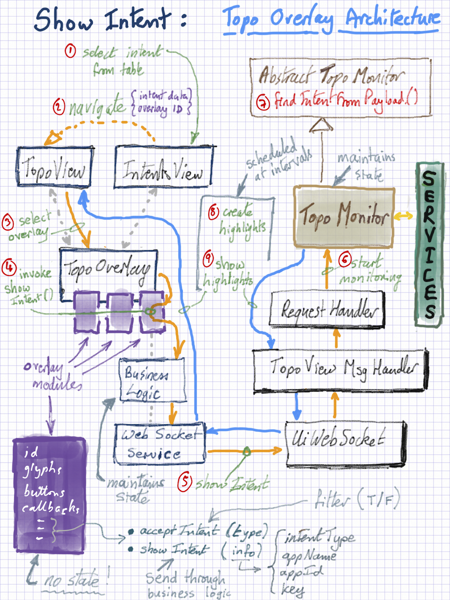

# Show Intent on Topology View - Architecture

The [Intent View](../../../guides/administrator-guide/interacting-with-onos/the-onos-web-gui/gui-intent-view.md) includes a button that the user can press to display the selected intent on the [Topology View](../../../guides/administrator-guide/interacting-with-onos/the-onos-web-gui/gui-topology-view.md).

The following schematic shows how this behavior is architected.

(1) From the Intents View, the user selects an intent from the table.

(2) Pressing the "show on topology view" button will cause navigation to the topology view, parameterized with the intent information. (Note that if more than one overlay registers its ability to show intents of that type, a mini dropdown will appear so that the user can select which overlay to use).

(3) The topology view will activate the appropriate overlay.

(4) The call will be routed to that overlay and its *showIntent*() method invoked, with the intent information passed as a parameter. That method should call a method on the business logic service of the overlay.

(5) The business logic sends a message to the server, via the web socket service.

(6) The message is picked up by the appropriate request-handler, which will instruct the "Monitor" to start monitoring the selected intent.

(7) A reference to the Intent object is located from the parameters in the request payload

(8) / (9)  In a scheduled task, the Intent is used to generate a Highlights object, which is then transmitted back to the topology view.

See also the [UI Topology Overlay tutorial](../web-ui-tutorial-creating-a-topology-overlay.md).
